# 幸运礼物 1.0 客户端需求文档（正式精简版）

> 文档范围：幸运礼物 1.0 客户端。  
> 需求依据：`幸运礼物1.0_功能结构图_细化版.xmind`、`幸运礼物1.0_业务建模_脑图主导版.md`、客户端原型图。  
> 写作原则：公共规则唯一维护；页面章节只保留本页面字段、交互、状态、反馈和特有异常。  
> 本文不写后台概率、RTP 与阈值配置、对账和人工补发页面，但保留客户端必须承接的支付、开奖、发奖、退款、幂等和恢复边界。

## 一、产品目标与范围

### 1.1 产品目标

1. 用户送出幸运礼物后，能明确感知送礼是否成功、是否中奖、奖励类型、奖励数量及到账状态。
2. 通过礼物动画、房间消息、房间/主页/全服飘屏和高价值表现，放大真实中奖事件的房间传播感。
3. 非双边幸运只反馈送礼方金币结果；双边幸运在送礼方未中奖后，才允许进入收礼方幸运钻石开奖。
4. 幸运卡牌承接连续未中奖用户的非现金体验补偿，为用户提供虚拟权益抽取体验。
5. 网络异常、切房、切后台、资源失败或奖励延迟时，先保证业务结果和资产状态正确，再保证动效完整。

### 1.2 客户端范围

- 礼物栏幸运礼物分组、标签、礼物选择、选中礼物说明图与玩法说明；
- 房间内单次赠送、数量赠送、连送按钮、连送批次及麦位动画；
- 非双边和双边幸运的过程状态、开奖结果与奖励状态；
- 房间、主页及全服中奖表现，公屏消息与飘屏关闭；
- 幸运卡牌获得动画、房间缩略入口、抽卡弹窗、H5 规则说明、抽奖动画和结果弹窗；
- 房间设置中的幸运礼物震动和礼物特效控制；
- 客户端结果恢复、重复操作保护、退款后的余额/权益刷新与异常反馈。

### 1.3 角色与精确入口

| 角色 | 可见内容 | 可执行操作 |
|---|---|---|
| 送礼用户 | 礼物栏、送礼状态、本人动效、金币开奖结果、卡牌入口与抽卡结果 | 选礼物、选对象、选数量、赠送/连送、抽卡、关闭表现 |
| 收礼用户/主播 | 基础收礼表现；双边玩法下的幸运钻石结果 | 查看收礼与幸运结果；不参与送礼方金币开奖操作 |
| 房间观众 | 麦位动画、房间中奖动画、公屏消息、符合门槛的飘屏 | 可上滑移除当前单条飘屏；不能改变开奖结果 |
| 首页用户 | 符合主页曝光门槛的真实幸运事件 | 可移除当前飘屏；跳转目标待确认 |

客户端入口限定为：首页幸运礼物飘屏、房间礼物栏“幸运礼物”分组、房间内幸运卡牌缩略入口、房间设置。本文不新增未在脑图或原型中定义的独立“开奖记录”入口。

### 1.4 不包含范围

- 策略组、概率模板、RTP、期望值与阈值的后台配置；
- 大盘、用户、策略、开奖、退款和对账监控后台；
- 人工补发、人工冲正、工资调整后台操作；
- 客户端本地计算用户策略、概率、RTP、期望值或资格；
- 伪造中奖事件、重复播放同一事件虚增中奖频次；
- 双边幸运双方同时中奖；
- 结果未知时重新随机。

## 二、全局公共规则

### 2.1 业务对象与玩法类型

| 对象 | 业务定义 | 客户端要求 |
|---|---|---|
| 幸运礼物 | 被配置为非双边或双边幸运的特殊礼物 | 展示礼物图标、名称、实际金币单价、玩法标识与可用状态 |
| 非双边幸运 | 单份礼物只判定送礼方金币结果 | 展示送礼方金币中奖或未中奖，不展示主播幸运钻石阶段 |
| 双边幸运 | 先判定送礼方金币；送礼方明确未中后，再判定主播幸运钻石 | 两阶段顺序固定，两个中奖方向互斥 |
| 连送批次 | 用户一次明确提交形成的一组送礼计划 | 批次内每份礼物独立开奖；追加数量形成新批次 |
| 幸运卡牌 | 幸运礼物触发的虚拟抽卡权益 | 仅展示系统确认的可用数量；不直接兑换可提现资产 |
| 幸运结果 | 金币、幸运钻石、幸运卡牌或未中奖 | 结果、发奖和到账状态分开表达 |

### 2.2 礼物可用状态

| 状态 | 展示 | 操作与结果 |
|---|---|---|
| 可用 | 正常展示 | 可选择并赠送，按幸运玩法处理 |
| 维护中 | 入口或礼物卡可见并显示维护状态 | 不允许发起幸运送礼；提示“当前幸运礼物维护中” |
| 已停用 | 按版本隐藏，或在需要保留说明时置灰 | 不允许送礼 |
| 降级普通礼物 | 礼物仍可见，明确提示当前不参与幸运 | 只走普通礼物链路，不展示等待开奖、中奖、卡牌和幸运动效 |

礼物状态、活动状态或地区版本变化，只影响尚未创建的新送礼事件；已受理事件继续按受理时规则完成。

MVP 阶段所有策略组均不建立独立额度池。每次新事件在扣费前，由系统以当前概率模板的理论 RTP、策略/礼物组/总盘 RTP，以及单笔、单用户周期、期望值等阈值统一判断是否受理、降级或停止；客户端只承接最终可用状态和结果，不参与本地计算。

### 2.3 客户端统一状态

| 状态 | 定义 | 客户端表现 |
|---|---|---|
| 送礼请求处理中 | 已点击赠送，系统尚未确认是否受理 | 禁止同一次操作重复提交；展示处理中 |
| 等待开奖 | 送礼已受理，幸运结果尚未返回 | 展示等待结果，不提前显示中奖/未中奖 |
| 中奖 | 最终确认命中金币或幸运钻石 | 展示奖励类型、最终倍率/数量及发奖状态 |
| 未中奖 | 最终确认本次没有对应幸运奖励 | 明确展示未中奖；不能用无反馈代替 |
| 结果恢复中 | 原事件结果暂不可确认 | 保持恢复中；查询原事件，不重新抽取 |
| 奖励发放中 | 结果已确定，奖励尚未最终入账 | 保留中奖结果并展示发放中 |
| 奖励到账 | 奖励已最终入账 | 展示到账完成，刷新余额或权益 |
| 奖励失败待处理 | 结果已确定但奖励未成功入账 | 展示待处理；后续恢复成功后更新为奖励到账 |
| 退款处理中 | 原扣费进入退款处理，但尚未确认退回 | 保留原结果，单独展示退款处理中 |
| 已退款 | 实际扣费已按最终口径退回 | 刷新金币并展示已退款；不篡改原开奖结果 |
| 奖励撤销处理中 | 已发奖励正在回滚 | 保留原中奖事实，同时展示资产回滚中 |
| 奖励已撤销 | 原奖励已完成扣回或撤销 | 刷新资产；不得继续显示为当前“奖励到账” |
| 部分回滚待处理 | 部分资产或已使用权益无法自动完成回滚 | 展示已完成部分与待处理部分，直至最终状态返回 |

各页面只能引用本状态表，不另建同义但含义不同的状态。

### 2.4 支付、开奖、发奖三段分离

1. “送礼已受理”统一表示：唯一送礼事件已创建，且本次金币扣费已确认成功。请求已收到但扣费尚未确认时，仍属于“送礼请求处理中/结果恢复中”，不得进入开奖、展示中奖结果或允许用户重复提交。
2. 送礼扣费成功只表示礼物送出成功，不代表中奖；扣费最终失败时，本次事件终止并恢复可操作状态。
3. 礼物存在折扣、活动价或价格版本变化时，本次扣费与结果展示使用受理时的实际支付价格；客户端不得用当前价格重算历史事件。
4. 开奖结果为“中奖”只表示结果已确定，不代表奖励已经到账。
5. 奖励到账后，客户端才可展示最终到账状态并刷新金币、钻石或虚拟权益。
6. 发奖失败时不得伪装为到账；中奖结果仍保留，状态进入“奖励失败待处理”。
7. 幸运卡牌抽奖成功后立即生成并发放奖励；“收下”按钮只关闭结果弹窗，不是领取或发奖触发器。
8. 公共动画、飘屏或公屏消息只能读取已确认的真实结果；表现失败不改变开奖结果。

### 2.5 唯一事件、重复操作与并发

1. 每份幸运礼物对应一个不可重复的幸运事件；同一事件重试返回原处理状态或原结果，不重复发奖。
2. 用户首次发起送礼或抽卡时，客户端必须生成并持久化唯一请求身份；同一次操作的超时重试、断线重连和结果恢复必须复用原请求身份，不得重新生成。连送批次使用“批次身份 + 批次内序号”唯一对应每份礼物；十连抽使用“抽卡请求身份 + 第 1～10 次抽取序号”唯一对应每次抽取及奖励。只有用户重新主动发起的新操作才生成新身份。
3. 送礼按钮在请求处理中进入防重复状态；重复点击不得重复扣费、重复开奖或重复发奖。
4. 网络重试、断线重连和页面恢复不得生成第二个随机结果。
5. 同一已确认事件的震动、房间动画、主页/全服飘屏按对应等级最多触发一次；恢复页面时以文字结果和状态为主，不强制重播。
6. 双边幸运中，送礼方结果未知或执行中时，不允许先行创建收礼方开奖；恢复后按原单一方向继续。
7. 幸运卡牌抽奖请求处理中，抽卡按钮不可重复触发；恢复时按原抽卡结果返回，不重复扣卡或发奖。

### 2.6 连送批次

1. 用户一次明确提交的计划份数形成一个批次；客户端在提交前显示并确认数量。
2. 批次中的每份幸运礼物分别形成事件并独立开奖，不把整批合成一次开奖。
3. 当前批次开始后，用户继续点击或追加数量形成新批次，不并入旧批次。
4. 连送批次是送礼规则版本的最小切换边界。批次受理成功时固化本批次规则版本；批次内所有成功受理份数均使用同一版本，不因单份事件创建、开奖或发奖跨越版本生效点而切换。新版本只影响生效后新受理的批次；未受理份数再次提交时形成新批次并使用届时有效版本。
5. 连送过程可合并视觉表现，但不能丢失单份送礼结果和奖励状态。
6. 断线恢复时恢复原批次已受理份数、各份结果和发奖状态；不重复扣费、不新增份数。
7. 批次中仅部分份数提交成功时，只对成功受理的份数生成结果；未受理份数不得伪装成功。
8. **连送动画聚合单元不等于连送批次。**同一送礼用户、同一礼物、同一收礼对象范围在连续 5 秒内的已受理事件合并为 1 条连送动画；该动画可承接一个或多个连送批次，但不改变各批次的规则版本、单份事件或结果归属。
9. 连送动画中的 `xN` 只累计该聚合单元内**成功受理的礼物总份数**；未受理、扣费失败或已退款取消的份数不得计入。`xN` 不按金币中奖份数、钻石中奖份数或未中奖份数拆分。
10. 双边幸运的单份事件仍只能产生送礼方金币或收礼方幸运钻石其中一个中奖方向；但同一连送动画聚合单元可因不同单份事件同时累计金币和钻石结果。具体动画字段、头像和更新时机见 6.3.2。

### 2.7 失败、退款与恢复

| 场景 | 客户端处理 |
|---|---|
| 扣费前校验失败 | 停止送礼，展示明确原因；不进入等待开奖 |
| 扣费结果未知 | 展示处理中/恢复中，查询原事件；不得引导用户用重复点击确认 |
| 扣费成功、结果暂未生成 | 优先恢复原事件；无法恢复且系统决定退款时，按受影响事件的实际扣费金额退款，展示退款状态并刷新金币 |
| 结果已生成、奖励未到账 | 保留原中奖结果并优先恢复发奖；系统最终决定退款时，取消尚未发放的奖励，展示退款/奖励取消状态；不得重新开奖 |
| 金币奖励已到账后发生退款/冲正 | 刷新实际扣回金币；余额不足时展示待处理/受限状态，不得仍显示本次净奖励已完整保留 |
| 主播幸运钻石已到账后发生退款/冲正 | 刷新实际扣回钻石和最终状态；已进入后续结算的调整不篡改原中奖事实 |
| 卡牌或虚拟权益到账后发生退款/冲正 | 根据系统最终处理刷新卡牌或权益，并保留用户可理解的原结果和当前回滚状态 |
| 未使用卡牌被撤销 | 刷新卡牌数量；数量低于 1 时隐藏房间缩略入口 |
| 已使用卡牌对应权益无法自动回滚 | 不本地伪造回滚结果；展示系统返回的最终处理状态 |
| 动画/图片资源失败 | 使用文字、金额、倍率和状态保底，不吞掉业务结果 |

恢复优先级：先保结果，再保动效；先保状态一致，再保表现完整。

### 2.8 公开表现与格式

1. 所有由金币或钻石**中奖结果**驱动的表现元素，统一以“已确认中奖事件的中奖倍数 ≥ 该元素配置的指定倍数门槛”作为触发条件；房间飘屏、主页飘屏、全服飘屏、本房间高倍动画、金币/钻石送礼动画及金币/钻石公屏消息分别维护各自门槛，客户端不写死数值。
2. 同一已确认中奖事件可分别命中多个表现元素的指定倍数门槛，并在各自范围展示；未达到某元素门槛时，仅不触发该元素，不影响开奖结果、发奖状态、本人结果或其他已命中的元素。
3. 幸运卡牌公屏消息以“系统确认获得幸运卡牌”为触发条件，不适用中奖倍数门槛；它是连续未中奖体验承接，不得强行改为中奖倍数展示。
4. 动画与飘屏共 5 个表现档位，具体门槛、素材和时长待 UI/运营配置确认；客户端按系统返回档位展示，不本地推断。
5. 用户可上滑移除当前单条飘屏；移除只影响本端当前展示，不撤销事件，也不影响其他用户。
6. 用户名称在公屏消息中最多展示 10 个字符，超出部分显示 `...`。
7. 金币/钻石数量：`abs(value) >= 1,000,000,000` 时使用 `B`；否则 `abs(value) >= 1,000,000` 时使用 `M`；低于 1,000,000 显示完整值。换算结果保留两位小数并截断，不四舍五入。
8. 倍率使用“`N倍`”或现有视觉规范的等价形式；同一页面不得同时出现互相矛盾的倍率和奖励金额。
9. 公共文案只展示用户可公开信息，不展示策略组、概率、RTP、期望值、阈值或资格等内部判断。

### 2.9 本端表现控制

1. “关闭幸运礼物震动”只关闭当前用户本端震动，不影响开奖、发奖和其他用户表现。
2. “关闭礼物特效”关闭当前用户本端礼物/高价值表现，但仍保留文字结果、公屏结果和资产状态。
3. 用户设置、设备性能降级和防打扰策略同时命中时，取更弱表现；不得因此隐藏结果。
4. 关闭设置对后续新表现立即生效；已出现的单条飘屏仍可由用户上滑移除。

## 三、核心业务流程

### 3.1 幸运礼物送礼总流程

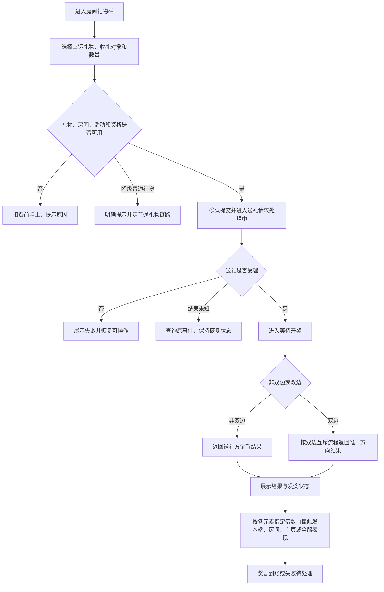
```mermaid
flowchart TD
    A[进入房间礼物栏] --> B[选择幸运礼物、收礼对象和数量]
    B --> C{礼物、房间、活动和资格是否可用}
    C -->|否| C1[扣费前阻止并提示原因]
    C -->|降级普通礼物| C2[明确提示并走普通礼物链路]
    C -->|是| D[确认提交并进入送礼请求处理中]
    D --> E{送礼是否受理}
    E -->|否| E1[展示失败并恢复可操作]
    E -->|结果未知| E2[查询原事件并保持恢复状态]
    E -->|是| F[进入等待开奖]
    F --> G{非双边或双边}
    G -->|非双边| H[返回送礼方金币结果]
    G -->|双边| I[按双边互斥流程返回唯一方向结果]
    H --> J[展示结果与发奖状态]
    I --> J
    J --> K[按各元素指定倍数门槛触发本端、房间、主页或全服表现]
    K --> L[奖励到账或失败待处理]
```

### 3.2 非双边幸运流程

```text
送礼受理 → 等待开奖 → 送礼方金币中奖 / 未中奖 / 结果恢复中
→ 中奖时展示最终倍率、金币数量与发奖状态
→ 奖励到账后刷新金币；失败时保留中奖结果并展示待处理。
```

客户端不得展示用户命中的策略组、目标 RTP、期望值阈值和概率版本。新用户、普通用户、大 R、连续未中奖用户的差异只体现在系统返回的真实结果与对应表现档位，不在本地决定中奖。

### 3.3 双边幸运流程

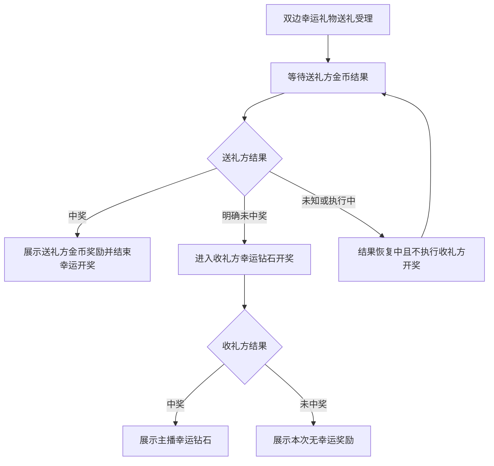
```mermaid
flowchart TD
    A[双边幸运礼物送礼受理] --> B[等待送礼方金币结果]
    B --> C{送礼方结果}
    C -->|中奖| D[展示送礼方金币奖励并结束幸运开奖]
    C -->|明确未中奖| E[进入收礼方幸运钻石开奖]
    C -->|未知或执行中| F[结果恢复中且不执行收礼方开奖]
    E --> G{收礼方结果}
    G -->|中奖| H[展示主播幸运钻石]
    G -->|未中奖| I[展示本次无幸运奖励]
    F --> B
```

基础礼物收益与幸运钻石是两类结果。主播获得基础收益不等于主播幸运钻石中奖。

### 3.3.1 收到幸运礼物的收礼方钻石金额承接

收礼方钻石金额由服务端按已受理事件、实际支付金币单价和最终开奖结果计算后下发；客户端仅展示最终钻石数量、来源和到账状态，不得用送礼方中奖倍数、动画状态或本地概率重新计算。

- **非双边幸运：**收礼方基础钻石 = 汇总收到的非双边幸运礼物数量 × 该礼物金币价值 ÷ 10；送礼方中奖倍数不参与该公式。
- **双边幸运：**收礼方幸运钻石 = 汇总本次每份双边幸运礼物的（收礼方最终概率倍率 × 该礼物金币价值 ÷ 10）；仅送礼方明确未中奖的单份可进入收礼方开奖，送礼方中奖或收礼方未中奖的份额按 0 计。
- 非双边基础钻石与双边幸运钻石在页面和记录中使用不同来源标识；退款、撤销或补发以服务端返回的最终资产状态刷新，客户端不自行重算或补差。

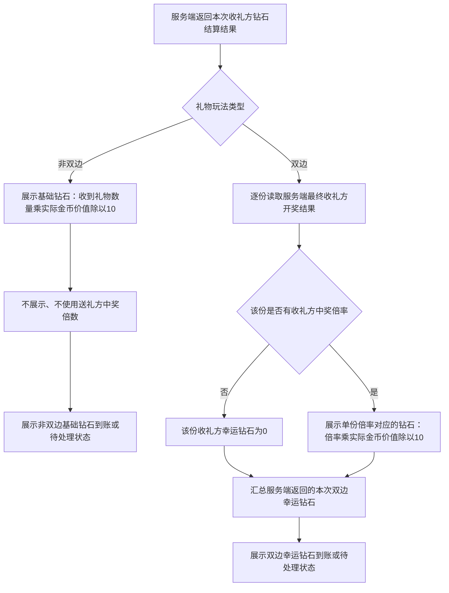
```mermaid
flowchart TD
    A[服务端返回本次收礼方钻石结算结果] --> B{礼物玩法类型}
    B -->|非双边| C[展示基础钻石：收到礼物数量乘实际金币价值除以10]
    C --> D[不展示、不使用送礼方中奖倍数]
    D --> E[展示非双边基础钻石到账或待处理状态]
    B -->|双边| F[逐份读取服务端最终收礼方开奖结果]
    F --> G{该份是否有收礼方中奖倍率}
    G -->|否| H[该份收礼方幸运钻石为0]
    G -->|是| I[展示单份倍率对应的钻石：倍率乘实际金币价值除以10]
    H --> J[汇总服务端返回的本次双边幸运钻石]
    I --> J
    J --> K[展示双边幸运钻石到账或待处理状态]
```

### 3.4 幸运卡牌资格、发放与抽卡流程

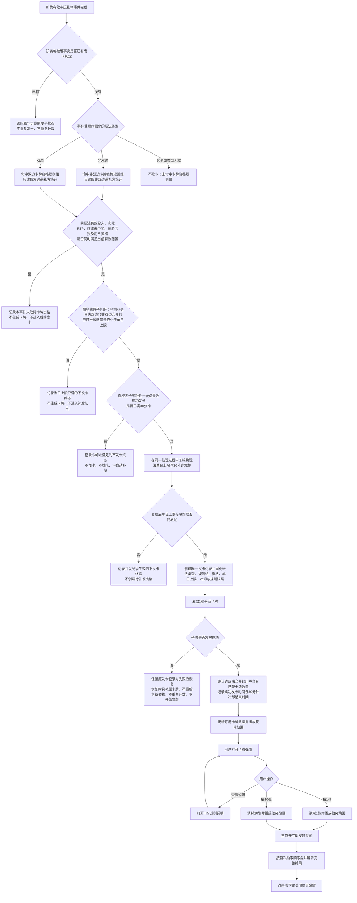
```mermaid
flowchart TD
    A[新的有效幸运礼物事件完成] --> B{该资格触发事实是否已有发卡判定}
    B -->|已有| C[返回原判定或原发卡状态<br/>不重复发卡、不重复计数]
    B -->|没有| D{事件受理时固化的玩法类型}
    D -->|非双边| E[命中非双边卡牌资格规则组<br/>只读取非双边送礼方统计]
    D -->|双边| F[命中双边卡牌资格规则组<br/>只读取双边送礼方统计]
    D -->|其他或类型无效| G[不发卡：未命中卡牌资格规则组]
    E --> H{同玩法有效投入、实际RTP、连续未中奖、体验亏损及用户资格<br/>是否同时满足当前有效配置}
    F --> H
    H -->|否| I[记录本事件未取得卡牌资格<br/>不生成卡牌、不进入后续发卡]
    H -->|是| J{服务端原子判断：当前业务日内双边和非双边合并的<br/>已获卡牌数量是否小于单日上限}
    J -->|否| K[记录当日上限已满的不发卡终态<br/>不生成卡牌、不进入补发队列]
    J -->|是| L{首次发卡或距任一玩法最近成功发卡<br/>是否已满30分钟}
    L -->|否| M[记录冷却未满足的不发卡终态<br/>不加卡、不排队、不自动补发]
    L -->|是| N[在同一处理过程中复核跨玩法单日上限与30分钟冷却]
    N --> O{复核后单日上限与冷却是否仍满足}
    O -->|否| P[记录并发竞争失败的不发卡终态<br/>不创建待补发资格]
    O -->|是| Q[创建唯一发卡记录并固化玩法类型、规则组、资格、单日上限、冷却与规则快照]
    Q --> R[发放1张幸运卡牌]
    R --> S{卡牌是否发放成功}
    S -->|否| T[保留原发卡记录为失败待恢复<br/>恢复时只补原卡牌，不重新判断资格、不重复计数、不开始冷却]
    S -->|是| U[确认跨玩法合并的用户当日已获卡牌数量<br/>记录成功发卡时间与30分钟冷却结束时间]
    U --> V[更新可用卡牌数量并播放获得动画]
    V --> W[用户打开卡牌弹窗]
    W --> X{用户操作}
    X -->|查看说明| Y[打开 H5 规则说明]
    Y --> W
    X -->|抽1张| Z[消耗1张并播放抽奖动画]
    X -->|抽10张| AA[消耗10张并播放抽奖动画]
    Z --> AB[生成并立即发放奖励]
    AA --> AB
    AB --> AC[按首次抽取顺序合并展示完整结果]
    AC --> AD[点击收下仅关闭结果弹窗]
```

客户端只承接服务端确认的发卡结果和可用卡牌数量：不展示内部体验阈值、玩法规则组或送礼方 RTP 上限，不本地计算资格、跨玩法日上限或冷却，也不因冷却结束自动增加卡牌。

### 3.5 异常裁决顺序

1. 先判断送礼/抽卡是否已经受理，再决定是否允许用户重试。
2. 已受理事件先恢复原结果；禁止重新随机。
3. 结果已确定时先展示真实结果，再展示奖励处理中或待处理。
4. 表现资源失败时降级文字；资产与结果不可降级成“无事发生”。
5. 房间、主页和全服可按各自曝光范围分发；同一客户端、同一展示范围只执行一次对应档位，避免重复叠加播放。

## 四、礼物栏与幸运礼物入口

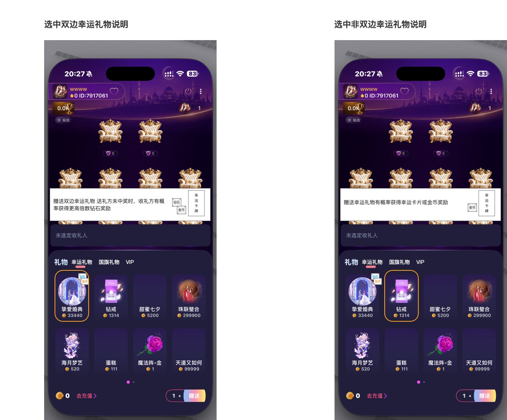

### 4.1 页面定位与原型阅读顺序

用户在房间底部打开礼物栏后，可在礼物分组中切换至“幸运礼物”。礼物栏可包含 VIP 礼物、国旗礼物、幸运礼物和普通礼物；当前版本是否展示幸运礼物分组由正式版本配置决定，不展示时不得保留空白 Tab。

原型当前显示“礼物 / 幸运礼物 / 国旗礼物 / VIP”四个 Tab，最终顺序沿用礼物栏统一规范；本文只新增幸运礼物分组及其内容，不改造其他分组。

本模块按原型阅读顺序聚拢为：分组切换 → 选中礼物说明图 / 玩法说明 → 礼物卡与标签 → 余额与数量 → 赠送按钮。这样读者在看礼物栏原型时，就能在同一处把入口、选中说明、标签和提交前交互读完，不必跳到后文再回找。

### 4.2 选中礼物说明图与玩法说明


幸运礼物说明区以**当前选中的礼物**为唯一来源，不再以首次进入“幸运礼物”分组时的统一说明作为内容。说明区位于座位区下方、收礼对象栏上方；礼物切换后，选中态、说明文案和说明图必须在同一次页面刷新中同步切换。

“玩法”入口保留为统一规则入口，用于查看完整玩法、概率和版本规则；它不替代当前选中礼物的说明区，也不能使说明区固定显示上一件礼物的信息。

#### 4.2.1 选中礼物类型与说明区联动

| 当前选中礼物类型 | 说明区文案 | 说明图 | 同步规则 |
|---|---|---|---|
| 非双边幸运礼物 | `赠送幸运礼物有概率获得幸运卡片或金币奖励` | 展示“幸运卡牌”和“金币”奖励示意；不展示“钻石”标识 | 礼物卡选中态、非双边玩法标识、说明文案和说明图同时生效 |
| 双边幸运礼物 | `赠送双边幸运礼物 送礼方未中奖时，收礼方有概率获得更高倍数钻石奖励` | 展示“幸运卡牌”“金币”“钻石”奖励示意 | 礼物卡选中态、双边玩法标识、说明文案和说明图同时生效；“钻石”仅说明收礼方第二阶段可能获得的奖励 |
| 无有效选中礼物、礼物下架或类型未知 | 不展示上一件礼物的说明文案 | 不展示上一件礼物的说明图 | 说明区随选中状态清空；类型未确认的礼物不可按幸运礼物提交 |

1. 原型中的双边示例选中“挚爱婚典”，非双边示例选中“钻戒”；礼物名称与价格属于原型示例，客户端以当前有效礼物配置为准。
2. 双边说明中的“送礼方未中奖时”是触发条件，不表示送礼方和收礼方可同时中奖，也不表示送礼方可获得钻石奖励。
3. 双边切换为非双边时，必须立即移除双边文案和“钻石”说明图元素；非双边切换为双边时，必须先完成礼物类型和可用状态校验，再展示双边文案和“钻石”说明图元素。

#### 4.2.2 原型可见字段

| 区域 | 字段/文案 | 展示规则 |
|---|---|---|
| 分组栏 | 幸运礼物 | 选中时显示选中态下划线 |
| 选中礼物说明区 | 见 4.2.1 对应文案 | 仅在存在当前有效选中幸运礼物时展示；不以进入分组时机决定内容 |
| 双边说明图 | 幸运卡牌、金币、钻石 | 仅当前选中礼物为双边幸运时展示；钻石对应收礼方第二阶段可能奖励 |
| 非双边说明图 | 幸运卡牌、金币 | 仅当前选中礼物为非双边幸运时展示；不得出现钻石标识 |
| 玩法说明入口 | 玩法/说明 | 打开统一玩法说明，不在每张礼物卡重复长规则 |
| 双边标签 | 钻石奖励 | 配置为双边奖励的幸运礼物右上展示；非双边礼物不展示该标签 |
| 礼物卡布局 | 当前原型同屏 2 行×4 列 | 实际分页与卡片尺寸沿用礼物栏统一规范 |
| 分页圆点 | 当前页粉色圆点、其他页灰色圆点 | 礼物超过单页容量时展示并同步当前页 |

统一玩法说明至少覆盖：

1. 幸运礼物可能产生金币、幸运钻石或幸运卡牌结果；
2. 支付成功、中奖和奖励到账是三个不同阶段；
3. 非双边礼物只判定送礼方金币结果；
4. 双边礼物先判定送礼方金币，送礼方明确未中后才判定主播幸运钻石，双方不会同时中奖；
5. 中奖倍率和奖励数量以本次实际结果为准；
6. 礼物维护、停用或降级普通礼物时的处理；
7. 概率、奖励范围、有效期等需要公开的内容，以当前地区和正式版本规则为准。

### 4.3 礼物卡、余额与提交前交互

#### 4.3.1 页面字段

| 区域 | 字段/文案 | 展示规则 |
|---|---|---|
| 收礼对象 | 未选定收礼人/已选收礼对象 | 未选定时不可直接完成赠送 |
| 礼物卡 | 礼物图标、礼物名称、实际金币单价 | 价格为空或无效时不允许送礼 |
| 玩法标识 | 非双边幸运/双边幸运 | 每个幸运礼物须由当前有效配置明确玩法类型；当前选中类型驱动 4.2 说明区 |
| 奖励类型说明 | 非双边：幸运卡牌、金币；双边：幸运卡牌、金币、收礼方可能获得的钻石 | 以当前选中礼物的 4.2 说明文案和说明图呈现，不承诺每次获得 |
| 余额区 | 当前金币余额、去充值 | 余额不足时提供现有充值入口 |
| 数量区 | 当前赠送数量 | 支持选择数量；提交前以当前显示数量为准 |
| 主按钮 | 赠送 | 需同时选定礼物、收礼对象和有效数量 |

#### 4.3.2 关键交互

1. 进入幸运礼物分组后加载当前可用礼物；默认选中礼物由当前有效配置确定，并立即展示其对应说明区。
2. 点击礼物卡选中礼物；切换礼物后同步刷新单价、双边标签、玩法类型、说明文案、说明图、可用状态和数量可选范围。
3. 从双边切到非双边时，立即清除“送礼方未中奖时”的双边文案和“钻石”说明图元素；从非双边切到双边时，校验当前礼物类型和可用状态后再展示双边说明。
4. 配置为双边奖励的礼物显示“钻石奖励”标签；标签表示收礼方可能参与第二阶段开奖，不表示主播必中奖，也不表示送礼方可获得钻石。
5. 用户选择收礼对象、数量后点击“赠送”，进入第 5 章送礼流程。
6. 余额不足时阻断提交并显示余额不足提示，保留“去充值”入口。
7. 维护中礼物置为不可送状态；已停用礼物按版本隐藏或置灰；降级普通礼物必须在提交前明确提示。
8. 客户端缓存与提交时状态不一致时，以提交前最终校验为准，并刷新礼物卡、选中态和说明区。

### 4.4 异常与反馈

| 场景 | 反馈 |
|---|---|
| 礼物列表加载失败 | 展示加载失败和重试；不可用空列表冒充玩法关闭 |
| 单价加载失败 | 不允许赠送；提示刷新后重试 |
| 当前选中礼物类型未知或说明配置缺失 | 不保留上一件礼物的文案或说明图；刷新当前礼物配置，未恢复前不可按幸运礼物提交 |
| 切换礼物时说明区刷新失败 | 保留当前有效选中态；优先展示同类型静态说明图，无法展示时保留对应文字并隐藏说明图，不得使用另一类型的说明图兜底 |
| 未选择收礼人 | 提示先选择收礼人 |
| 数量无效 | 提示重新选择有效数量 |
| 余额不足 | 提示余额不足并提供充值入口 |
| 礼物刚进入维护/停用 | 停止提交并刷新状态；若当前选中礼物失效，清空对应说明区 |
| 幸运玩法降级 | 提交前明确提示按普通礼物送出；用户确认后才进入普通链路 |

## 五、房间送礼与连送

### 5.1 送礼操作与前置校验

用户在礼物栏完成礼物、收礼对象和数量选择后发起赠送。系统在扣费前返回以下业务结论，客户端按结论处理：

| 结论 | 客户端处理 |
|---|---|
| 礼物、房间、活动和用户资格均可用 | 进入送礼请求处理中 |
| 礼物不可用 | 提示当前礼物不可用并刷新礼物状态 |
| 房间不可用 | 提示当前房间不支持或暂不可使用该玩法 |
| 活动不可用 | 提示当前活动暂不可参与 |
| 用户暂不满足参与条件 | 使用通用资格提示，不暴露内部判断 |
| 幸运玩法关闭 | 提示当前幸运玩法已关闭 |
| 降级普通礼物 | 展示明确降级提示；按普通礼物处理后不再展示幸运结果 |

送礼请求发出后，按钮进入处理中，直至返回“未受理、已受理或结果待恢复”中的一种状态。

### 5.2 连送按钮、入口与本人视角原型

本节按“本人视角送礼原型”聚拢阅读：先看用户点击幸运礼物后出现的连送按钮与剩余金币，再看连送礼物图标如何从按钮顶部起飞并落到目标麦位。按钮 5 秒消失、热区外关闭、批次形成、同一送礼飘窗唯一性等规则与该原型放在一起说明，避免读者在多个小节之间来回跳。

本节中的按钮显隐、热区外关闭、切换对象重置和单一飘窗等规则来自 XMind 业务交互，不是由单张静态原型反推；动效稿需按本节补齐。

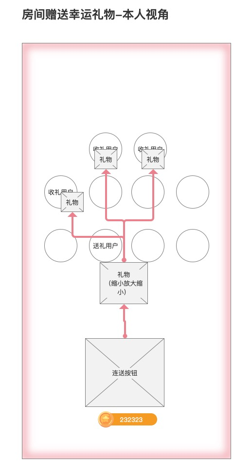

#### 5.2.1 页面字段

| 字段 | 展示规则 |
|---|---|
| 送礼用户麦位 | 当前送礼用户在麦时，以其所在麦位作为本人动效关系起点 |
| 收礼用户麦位 | 对每个已选收礼对象展示目标位置 |
| 连送礼物图标 | 从连送按钮顶部出现 |
| 连送按钮 | 可连送礼物赠送后展示 |
| 当前剩余金币 | 与连送按钮同时展示，按成功扣费结果刷新 |

#### 5.2.2 按钮与批次交互

1. 赠送被配置为可连送的幸运礼物后，自动收起礼物栏房间展示连送按钮和当前剩余金币数。
2. 连送按钮停止操作 5 秒后自动消失。
3. 点击连送按钮热区以外，关闭连送按钮。
4. 连送按钮消失只结束当前连送入口展示，不取消已提交批次，也不改变已生成结果。
5. 每次点击或一次明确数量提交形成一个批次；后续继续点击形成新批次。
6. 批次内每份礼物独立开奖；客户端可按 2.6 和 6.3 合并连送动画，但 `xN` 必须累计已受理总份数，奖励只累计对应方向的已确认中奖结果。
7. 在同一对象范围、同一礼物下 5 秒内继续连送，持续更新同一条连送动画的 `xN`；不得因金币中奖、钻石中奖或未中奖将其拆成多条连送动画。
8. 连送中切换收礼对象范围或切换礼物时，立即销毁原送礼飘窗和连送动画聚合单元，重置新动画 `xN` 并从 0 开始累计；同一送礼用户同一时刻只保留 1 个送礼飘窗。

### 5.3 本人视角动效

#### 5.3.1 关键交互

1. 礼物图标从连送按钮顶部出现，执行“缩小 → 放大 → 缩小”后飞向所选收礼用户当前所在目标麦位。
2. 同批次选择多个收礼用户时，按实际收礼对象展示目标动效；不得向未选择用户播放收礼结果。
3. 动画过程中收礼用户换麦时，终点自动更新到其最新麦位。
4. 用户离开麦位但仍在房间且送礼关系有效时，按最新可定位位置完成或降级动效；业务结果不受影响。
5. 最终倍率、金币/钻石数量和发奖状态只使用真实结果；原型未定义的视觉位置由 UI 补齐，不得省略结果反馈。

### 5.4 观众视角：送礼方在麦位

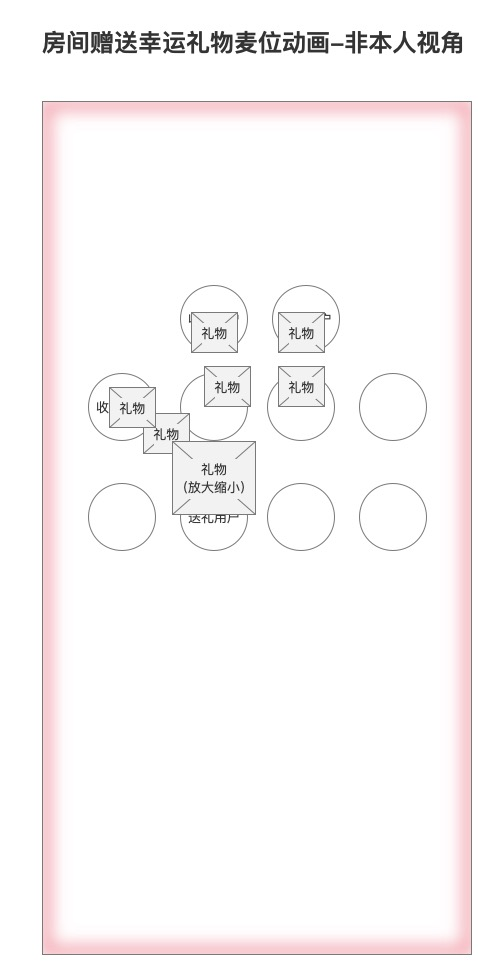

#### 5.4.1 页面字段

| 字段 | 展示规则 |
|---|---|
| 送礼用户麦位 | 送礼方当前所在麦位 |
| 收礼用户麦位 | 实际收礼对象所在麦位 |
| 礼物图标 | 从送礼方麦位出现并飞向目标 |
| 缩放表现 | 原型要求放大、缩小 |

#### 5.4.2 关键交互

1. 礼物从送礼方当前麦位出现，放大、缩小后飞向所选收礼用户的目标麦位。
2. 收礼用户中途换麦时，终点自动更新。
3. 送礼方中途离麦时，不撤销已提交送礼；后续未完成动效可切换为“送礼方不在麦位”的起点方案或直接完成当前段，具体过渡不影响结果。
4. 高倍或特殊幸运结果可在基础麦位动画结束后衔接房间公共表现。

### 5.5 观众视角：送礼方不在麦位

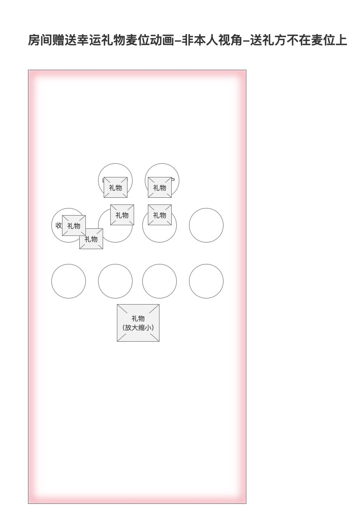

#### 5.5.1 页面字段

| 字段 | 展示规则 |
|---|---|
| 通用起点 | 最后一排麦位底部位置 |
| 收礼目标 | 所选收礼用户当前麦位 |
| 礼物图标 | 在通用起点出现并执行放大、缩小 |

#### 5.5.2 关键交互

1. 送礼方不在麦位时，礼物从最后一排麦位底部位置出现。
2. 礼物放大、缩小后飞向所选收礼用户当前麦位。
3. 收礼用户中途换麦时，终点自动更新。
4. 不因送礼方不在麦位而取消幸运礼物动画；仅调整起点。

### 5.6 送礼异常

| 场景 | 处理 |
|---|---|
| 送礼按钮重复点击 | 复用原提交状态，不新增扣费或开奖 |
| 网络中断且是否受理未知 | 展示恢复中并查询原事件；不可直接恢复按钮让用户盲点 |
| 批次部分份数失败 | 成功份数正常开奖；失败份数明确提示，数量和余额按实际结果刷新 |
| 收礼对象离房 | 若尚未受理则阻止；已受理事件按原事实完成，表现可降级 |
| 麦位信息延迟 | 先完成业务结果；动效使用最新可用位置或降级为房间文字表现 |
| 连送按钮或动效资源失败 | 不影响已提交批次；展示送礼结果和余额变化 |
| 连送动画仍展示但某单份事件结果迟到 | `xN` 保持已受理总份数；仅在真实结果确认后增量更新对应金币或钻石，不预填奖励数值 |
| 连送动画已结束后某单份事件才恢复结果 | 不重新拉起或重播连送动画；本人结果、收礼方结果、资产状态和符合门槛的事件级公开表现按原事件恢复 |

## 六、中奖表现、房间与首页曝光

### 6.1 首页幸运礼物飘屏

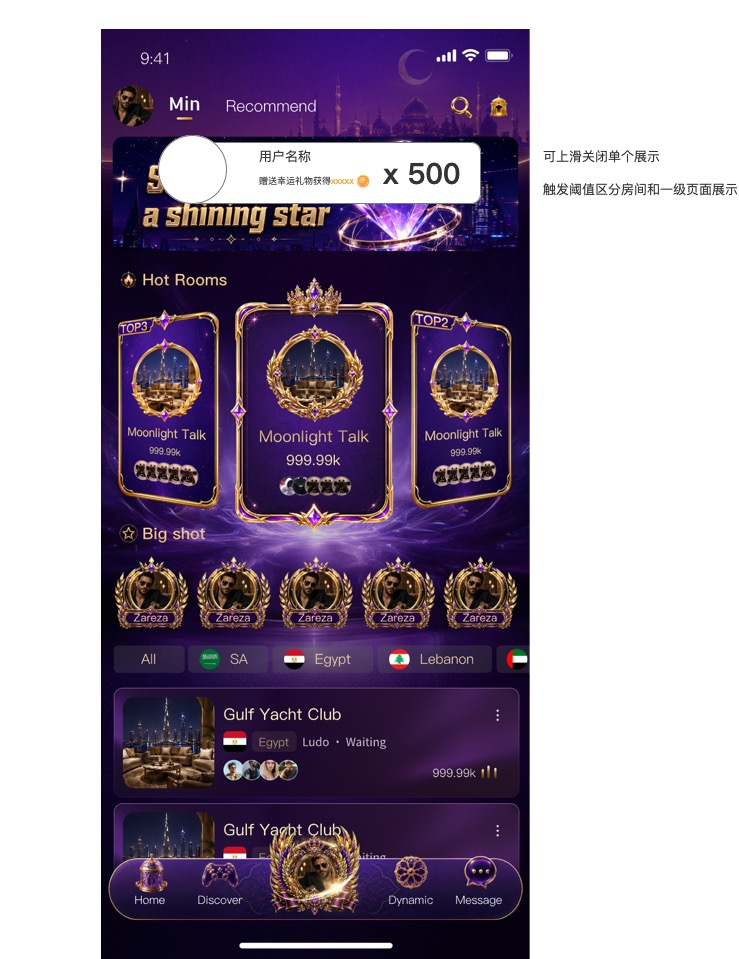

#### 6.1.1 页面定位与原型阅读顺序

首页原型只展示一条覆盖在首页内容上方的幸运礼物飘屏卡片。阅读这张原型时，应按“谁触发了事件 → 飘屏展示什么 → 哪些事件能进首页 → 用户能做什么”理解；因此把首页字段、进入首页的业务前提和用户交互放在同一模块中说明。

首页只承接符合主页或全服曝光门槛的真实幸运事件，不展示本地模拟事件。飘屏覆盖在首页内容上方，不改变首页原有推荐、房间列表和导航结构。

#### 6.1.2 原型可见字段

| 字段 | 展示规则 |
|---|---|
| 用户头像/名称 | 使用可公开信息 |
| 事件文案 | 表达用户赠送幸运礼物并获得的结果 |
| 右侧强调图标与数值 | 原型可见橙色图标和 `×500`；其含义是倍率、奖励数量还是其他指标待产品/UI 确认，确认前不拆成两个确定字段 |
| 上滑关闭提示 | 明确提示用户可上滑移除当前单条飘屏 |

#### 6.1.3 进入首页的业务前提

1. 已确认中奖事件的中奖倍数达到主页飘屏或全服飘屏各自配置的指定倍数门槛时，才允许进入首页对应飘屏；仅达到房间元素门槛的事件不进入首页飘屏。
2. 同一事件可同时达到主页飘屏与全服飘屏的指定倍数门槛，并在各自范围展示；具体门槛值、5 档表现资源和全屏跑马灯等全局表现规则统一维护在 6.3.1 和 6.3.4。
3. 首页飘屏只消费系统已确认的真实结果，不预演、不猜测、不本地补造中奖事件。

#### 6.1.4 用户交互

1. 用户上滑移除当前单条飘屏；后续新事件仍可按门槛展示。
2. 主页飘屏和全服飘屏分别使用各自配置门槛，不在客户端写死倍率。
3. 飘屏点击后的目标尚未定版；在跳转方案确认前，不得默认承诺进入活动页或房间。
4. 跳转方案确认前，首页飘屏只支持展示和上滑关闭，不响应页面跳转。

### 6.2 房间承载区

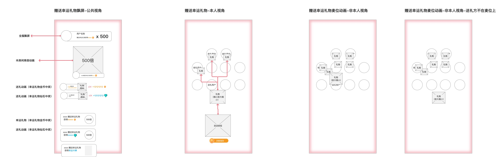

房间同时承载麦位动画、送礼飘窗、高倍房间动画、公屏中奖消息、符合门槛的房间/全服飘屏，以及幸运卡牌缩略入口。各层级不得长期遮挡麦位和核心房间操作。

### 6.3 公共视角表现与连送中奖动画

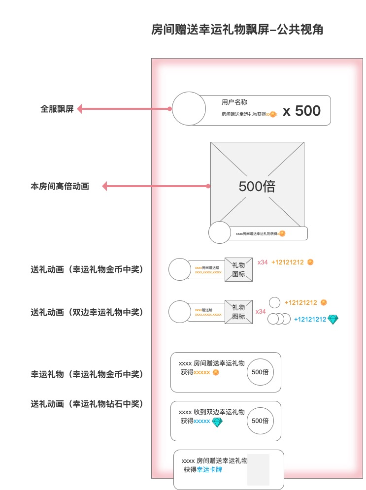


#### 6.3.1 表现类型

除“公屏卡牌消息”外，本表全部中奖表现元素均遵循同一触发概念：**系统已确认中奖结果，且该事件的中奖倍数 ≥ 当前元素配置的指定倍数门槛。** 每个元素独立配置、独立比较、独立触发；客户端仅消费返回的是否命中结果和表现档位，不本地计算倍率门槛。

| 表现 | 指定倍数门槛与触发逻辑 | 展示范围 | 核心字段 |
|---|---|---|---|
| 房间飘屏 | 已确认中奖事件的中奖倍数 ≥ 房间飘屏指定倍数门槛时触发 | 当前房间 | 用户、礼物、奖励、倍率 |
| 主页飘屏 | 已确认中奖事件的中奖倍数 ≥ 主页飘屏指定倍数门槛时触发 | 首页 | 用户、事件文案、奖励、倍率 |
| 全服飘屏 | 已确认中奖事件的中奖倍数 ≥ 全服飘屏指定倍数门槛时触发 | 全站指定场景 | 用户、房间、奖励、倍率 |
| 本房间高倍动画 | 已确认中奖事件的中奖倍数 ≥ 本房间高倍动画指定倍数门槛时触发；系统同时返回对应表现档位 | 当前房间 | 高倍数字、用户、结果文案 |
| 幸运礼物金币中奖送礼动画 | 非双边幸运礼物送礼方金币中奖，且该中奖事件的中奖倍数 ≥ 金币中奖送礼动画指定倍数门槛时触发 | 当前房间 | 主体送礼信息、`xN`、送礼方累计金币数、金币图标 |
| 双边幸运礼物连送动画 | 双边幸运礼物连送聚合单元内，任一已确认金币或钻石中奖事件的中奖倍数 ≥ 双边幸运礼物连送动画指定倍数门槛时触发；进入动画后按 6.3.2 汇总 | 当前房间 | 主体送礼信息、唯一 `xN`、送礼方累计金币行、收礼方累计钻石行 |
| 公屏金币消息 | 已确认送礼方金币中奖事件的中奖倍数 ≥ 公屏金币消息指定倍数门槛时触发 | 当前房间公屏 | 用户名、金币数、中奖倍数 |
| 公屏钻石消息 | 已确认收礼方幸运钻石中奖事件的中奖倍数 ≥ 公屏钻石消息指定倍数门槛时触发 | 当前房间公屏 | 用户名、钻石数、中奖倍数 |
| 公屏卡牌消息 | 系统确认获得幸运卡牌时触发；该消息不以中奖倍数为条件，不能按金币/钻石中奖表现门槛拦截 | 当前房间公屏 | 用户名、获得幸运卡牌 |

#### 6.3.2 连送中奖动画聚合

1. 同一送礼用户连续向同一批对象范围赠送同一礼物时，保留 1 条连送动画；其聚合范围、5 秒窗口与批次关系以 2.6 第 8 条为准。
2. 两种动画共用主体信息区：送礼方头像 → 送礼对象文案 → 礼物图标；`xN` 固定展示在礼物图标右侧。送礼对象文案格式为：`送礼用户名称 给 收礼用户1、收礼用户2… / 全麦 赠送 礼物名称`。
3. `xN` 是当前连送动画聚合单元内已成功受理礼物的总份数。即使其中分别出现送礼方金币中奖、收礼方钻石中奖和未中奖，仍只展示 1 个总数量，不按奖励方向拆动画或拆数量。
4. 非双边幸运礼物连送只展示送礼方金币尾部：橙色 `+金币数量` 与金币图标；不展示钻石尾部或收礼方头像组。
5. 双边幸运礼物连送在同一条主体动画右侧分别汇总两类真实结果：①送礼方头像 + 橙色 `+累计金币数量` + 金币图标；②实际钻石中奖收礼方头像组 + 蓝色 `+累计钻石数量` + 钻石图标。两类结果可同时存在，但只能来自不同的单份幸运事件。
6. 双边金币尾部只累计当前聚合单元内送礼方**已确认金币中奖**的数量；钻石尾部只累计当前聚合单元内收礼方**已确认幸运钻石中奖**的数量。未中奖、结果未知、发奖中的未确认资产不得预先计入任何奖励尾部。
7. 钻石头像组只展示实际获得幸运钻石的收礼方：单人显示 1 个头像；多人按实际中奖收礼方展示，最多展示前 3 个横向重叠头像。不得使用所有被选收礼对象、未中奖收礼对象或送礼方头像代替。
8. 某奖励方向在当前动画聚合单元内没有已确认中奖结果时，不展示该方向的奖励数值或头像；不得显示 `+0`，不得用另一币种或上一条动画的结果补位。
9. 收礼对象范围或礼物发生变化时，立即结束原动画聚合单元，创建新动画并将 `xN` 从 0 开始累计。合并只影响房间内连送动画展示；每份幸运事件仍独立保留结果、发奖和恢复状态，不能用汇总数覆盖单份事实。
10. 房间连送动画的汇总不改变公屏、房间飘屏、主页飘屏和全服飘屏的事件事实；这些公开表现仍只消费各自已确认的真实事件及其门槛结果。
11. 指定倍数门槛只决定连送动画元素是否创建；一旦当前聚合单元已因任一命中事件进入展示，`xN` 和金币/钻石尾部仍按本节既定口径累计该聚合单元内全部已确认真实结果，不按触发门槛再次过滤或拆分。

#### 6.3.3 公屏字段与格式

| 字段 | 规则 |
|---|---|
| 用户名称 | 最多 10 个字符，超出显示 `...` |
| 中奖金币/钻石数 | `abs(value) >= 1,000,000,000` 用 B；否则 `>= 1,000,000` 用 M；保留两位小数并截断 |
| 中奖倍数 | 展示最终倍数 |
| 连送动画送礼数量 | 连送动画只展示 1 个 `xN`，按已受理礼物总份数累计；不得改为金币中奖份数或钻石中奖份数 |
| 奖励币种 | 金币和钻石用不同图标及颜色，不得混用；双边连送可在同一条动画中使用金币、钻石两条独立奖励尾部 |

#### 6.3.4 表现等级与防打扰

5 档表现、用户名长度、M/B 截断、全屏跑马灯及各元素指定倍数门槛来自 XMind 业务规则和正式配置，不是静态原型可完整证明的视觉细节；UI/动效需补齐各档素材和队列稿，但不得删除已确定的业务形态。

1. 动画和飘屏共有 5 个表现档位；每个中奖表现元素配置自己的指定倍数门槛。系统以已确认中奖事件的中奖倍数与该元素门槛比较，并返回命中元素及对应表现档位；客户端不本地推断。
2. 高价值结果可触发震动和高价值全屏跑马灯表现；震动受“关闭幸运礼物震动”控制，跑马灯/特效受“关闭礼物特效”这一防打扰开关控制。
3. 用户关闭表现后仍显示公屏文字结果、本人结果和资产状态。
4. 资源加载失败时降级为公屏或文字结果；不得重复触发较低档动画补播造成一笔事件多次曝光。
5. 动画强调中间倍率和最终奖励，但不得展示与真实结果不同的数字。

### 6.4 非双边结果展示

| 结果状态 | 客户端内容 |
|---|---|
| 中奖 | 礼物信息、最终倍率、金币奖励数量、发奖状态 |
| 未中奖 | 明确的未中奖结论 |
| 结果恢复中 | 原事件恢复提示，不显示猜测结果 |
| 奖励发放中 | 已确认中奖内容 + 发放中 |
| 奖励到账 | 已确认中奖内容 + 到账完成，并刷新金币 |
| 奖励失败待处理 | 已确认中奖内容 + 待处理，不撤销中奖结论 |

非双边用户体验可因新用户、普通用户、大 R 或连续未中奖状态获得不同真实反馈，但客户端不展示这些内部标签，也不承诺固定中奖频率。

体验目标如下；目标用于约束真实结果返回后的客户端感知，不表示客户端本地决定结果，也不构成固定中奖承诺：

| 用户体验状态 | 客户端感知目标 |
|---|---|
| 新用户 | 在系统返回对应真实结果时，形成中低倍率反馈，帮助理解玩法 |
| 普通用户 | 保持稳定、连续且可理解的结果反馈，避免送礼后无明确结论 |
| 大 R 用户 | 在系统返回高倍率真实结果时，使用对应高价值表现强化刺激感 |
| 连续未中奖用户 | 通过明确未中奖反馈、体验缓和结果或幸运卡牌承接连续未中奖体验 |

### 6.5 公共表现异常

| 场景 | 处理 |
|---|---|
| 同一事件重复推送 | 只展示一次对应档位表现 |
| 用户主动上滑移除 | 关闭当前单条，不影响后续事件 |
| 房间切换 | 旧房间表现不带入新房间；本人未读结果按恢复规则承接 |
| 用户关闭特效/震动 | 仅本端降级，其他用户按各自设置展示 |
| 用户信息不可公开 | 使用允许公开的替代信息或不进入公开飘屏 |
| 数值超长 | 按 M/B 规则截断显示，详情结果仍以完整资产值为准 |
| 双边连送内分别出现金币、钻石中奖 | 保留 1 条双边连送动画和 1 个 `xN`；按不同单份事件分别累计金币、钻石尾部，不拆成两条连送动画 |
| 旧动画尾部结果被新结果覆盖 | 仅向当前同一聚合单元追加对应已确认奖励；礼物/收礼对象范围变更后不得继续写入旧动画 |

## 七、双边幸运体验

### 7.1 业务规则

1. 双边幸运礼物先执行送礼方金币开奖。
2. 送礼方中奖后，幸运流程立即结束，不再执行主播幸运钻石开奖。
3. 仅当送礼方结果为明确未中奖时，才执行主播幸运钻石开奖。
4. 送礼方结果未知或执行中时，保持结果恢复中，不创建主播开奖。
5. 主播阶段存在“中奖”和“未中奖”两个终态；主播阶段不是必中奖。
6. 同一份礼物中，送礼方金币奖励与主播幸运钻石互斥；双方同时中奖必须为 0。
7. 礼物基础收益始终与幸运奖励分开理解和展示，不能把基础钻石写成幸运钻石。

### 7.2 分角色结果

| 当前用户身份 | 结果方向 | 本人可见内容 |
|---|---|---|
| 送礼用户 | 送礼方金币中奖 | 最终倍率、金币数量、发奖/到账状态；不出现主播开奖 |
| 送礼用户 | 送礼方未中、主播中奖 | 送礼方未中奖结论、主播获得幸运钻石的公共结果 |
| 送礼用户 | 双方未中 | 本次无幸运奖励 |
| 收礼主播 | 送礼方金币中奖 | 基础收礼表现；不展示本人幸运钻石中奖 |
| 收礼主播 | 送礼方未中、主播中奖 | 幸运钻石数量及到账状态，并与基础收益区分 |
| 房间观众 | 单一幸运事件的任一公开结果 | 该中奖事件的中奖倍数达到对应表现元素指定倍数门槛时，展示该事件的单一中奖方向；双边连送动画聚合单元内可汇总不同单份事件的金币、钻石尾部，不能将其误判为单一事件双方同时中奖 |

### 7.3 状态迁移

| 前置状态 | 条件 | 下一状态 |
|---|---|---|
| 等待送礼方结果 | 送礼方中奖 | 送礼方中奖 → 奖励发放中/到账/失败待处理 → 结束 |
| 等待送礼方结果 | 送礼方明确未中奖 | 等待主播开奖结果 |
| 等待送礼方结果 | 结果未知 | 结果恢复中；恢复前不进入主播阶段 |
| 等待主播结果 | 主播中奖 | 主播中奖 → 奖励发放中/到账/失败待处理 → 结束 |
| 等待主播结果 | 主播未中奖 | 本次无幸运奖励 → 结束 |
| 等待主播结果 | 结果未知 | 恢复原主播阶段；不得重跑送礼方开奖 |

### 7.4 公共表现

1. 送礼方金币中奖时，使用金币图标、金币数量和送礼方结果文案。
2. 主播幸运钻石中奖时，使用钻石图标、钻石数量和主播结果文案。
3. 同一单份双边幸运事件不得同时产生或播放金币、钻石两条中奖表现；同一双边连送动画聚合单元可汇总不同单份事件的金币、钻石尾部，具体展示按 6.3.2 执行。
4. 主播幸运钻石的公共表现不替代主播本人到账状态；表现成功但发奖失败时，本人仍显示“奖励失败待处理”。
5. 双方未中奖属于正常业务终态，不得展示成奖励发放失败。

### 7.5 异常与恢复

| 场景 | 处理 |
|---|---|
| 送礼方结果超时 | 保持恢复中，禁止进入主播开奖 |
| 送礼方结果恢复为中奖 | 展示送礼方金币结果并结束 |
| 送礼方结果恢复为未中奖 | 从原事件继续主播阶段 |
| 主播开奖超时 | 只恢复主播阶段，不重跑送礼方阶段 |
| 同一单份事件同时收到两个中奖方向 | 以原事件最终互斥结果为准，丢弃冲突表现并刷新本人状态 |
| 同一双边连送动画收到来自不同单份事件的金币、钻石结果 | 按 6.3.2 分别累计至同一条动画的两个奖励尾部；不得按“同一事件冲突”丢弃 |
| 主播幸运钻石发放失败 | 保留主播中奖结果，展示奖励失败待处理 |

## 八、幸运卡牌

> 客户端用户文案统一使用“幸运卡牌”。部分原型文件名使用“幸运卡片”，两者指同一玩法，不作为两个对象。

### 8.1 原型总览与完整交互

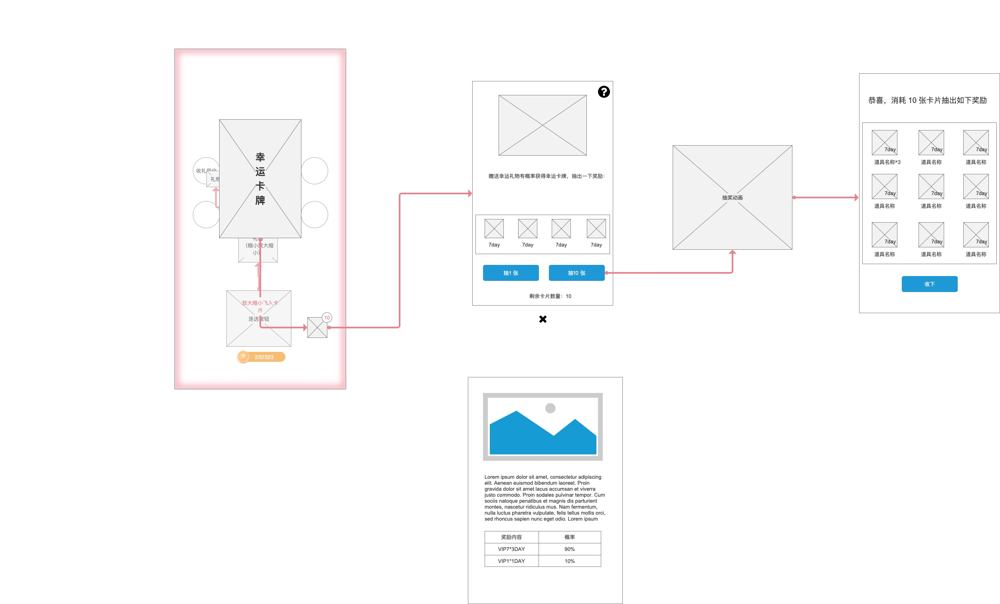

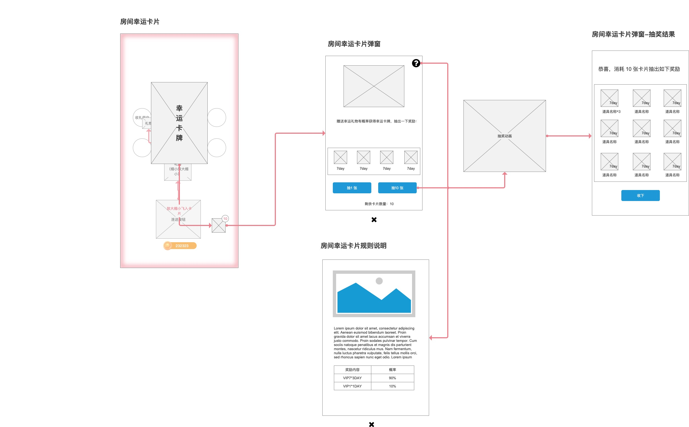

完整交互链：

```text
获得卡牌资格
→ 卡牌放大后缩小并滑入房间右下缩略入口
→ 入口显示未使用卡牌数量
→ 点击入口打开幸运卡牌弹窗
→ 查看 H5 规则说明，或选择抽1张/抽10张
→ 播放抽奖动画
→ 系统生成结果并立即发放奖励
→ 结果弹窗按抽取顺序完整展示
→ 点击“收下”关闭结果弹窗。
```

### 8.2 获得资格与卡牌入口

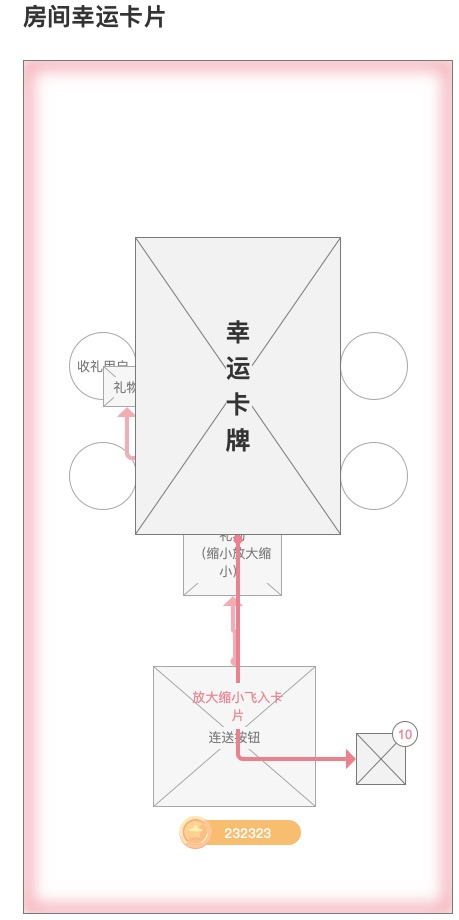

#### 8.2.1 资格与发卡判定规则

幸运卡牌用于改善连续未中奖用户体验。客户端只承接系统最终结果；玩法规则组选择、资格条件、当日计数、30 分钟冷却和发卡判定均由服务端完成，客户端不展示内部阈值、不本地计算，也不承诺满足某一项条件必得卡牌。

**一、按玩法类型选择资格规则组**

1. 同一有效幸运礼物事件必须按事件受理时固化的玩法类型选择唯一的卡牌资格规则组：非双边事件命中非双边规则组，双边事件命中双边规则组。
2. 非双边规则组只使用非双边送礼方的有效投入、实际 RTP、连续未中奖和体验亏损统计；双边规则组只使用双边送礼方对应统计。不得把一种玩法的低 RTP、亏损或未中奖历史用于另一种玩法的卡牌资格判断。
3. 双边规则组的送礼方实际 RTP 上限低于非双边对应上限，以承接双边玩法中收礼主播可能获得幸运钻石带来的额外成本空间；具体阈值与规则组版本仅由服务端配置，客户端不展示。

**二、资格条件：判断该事件是否进入发卡判定**

事件命中对应玩法规则组后，必须按当前有效配置依次满足以下条件，才进入后续发卡判断：

- 对应玩法最近 X 日有效投入达到门槛；
- 对应玩法最近 X 日送礼方实际 RTP 低于阈值；
- 对应玩法最近连续未中奖次数达到门槛；
- 对应玩法体验亏损金额达到最低要求；
- 用户资格有效。

以上为体验资格条件，用于判断该事件能否参与幸运卡牌发放；它们不改变已确认的礼物开奖结果、奖励发放或历史事件事实，客户端也不得展示或本地推算相关阈值。

**三、唯一成本控制：跨玩法合并的单用户单日获得卡牌数量上限**

1. 当前虚拟物料**不设置库存上限、全服卡牌总量上限、库存扣减或库存返还**。不得以虚拟物料库存是否可用作为不发卡条件。
2. 幸运卡牌的全部成本控制仅来自“单用户在当前业务日内获得卡牌数量上限”。双边和非双边成功获得的卡牌合并计数、共用同一上限；上限数值和业务日口径由当前有效配置提供，客户端不得写死数值或自行判断跨日。
3. 服务端在同一原子判定中读取该用户跨玩法合并的当前业务日已获卡牌数量与单日上限。仅当“已获数量 < 单日上限”时，才进入发卡记录创建；并发触发必须以该原子判定最终结果为准，不能突破上限。
4. 若已达到单日上限，系统为该资格触发事实记录“不发卡—当日上限已满”终态：双边、非双边均不增加卡牌、不进入补发队列。新业务日仅允许**新的有效幸运礼物事件**重新进入完整资格判断；同一触发事实的重复请求或断线恢复仍返回原终态。

**四、跨玩法共用的发卡节奏、幂等与恢复**

1. 首次发卡不受冷却限制；每次成功发放 1 张幸运卡牌后，服务端从成功发卡时间起计算 30 分钟冷却。双边或非双边任一玩法的成功发卡都会开始该冷却；客户端动画、通知到达、打开卡牌入口或抽卡时间不得作为冷却起点。
2. 冷却未结束时，即使用户持续满足任一玩法的体验资格且当日上限未满，也不生成新资格、不增加卡牌、不排队、不自动补发；只有后续新的有效幸运礼物事件才可重新触发完整判断。
3. 在同一用户冷却窗口内的跨玩法并发触发最多成功发放 1 张卡牌；复核失败的其他请求不形成待补发资格。
4. 单用户每日上限按业务日独立统计；跨业务日只重置跨玩法合并的当日已获卡牌次数，不清空仍未结束的 30 分钟冷却。
5. 同一资格触发事实只创建一次发卡记录；重复提交、重试和通知恢复不得创建第二张卡牌或重复计入当日数量。
6. 发卡成功后，才增加跨玩法合并的用户当日已获卡牌数量、记录成功发卡时间并刷新可用卡牌数量。发卡失败保留原发卡记录为“失败待恢复”；恢复只补原卡牌，不重新判断资格、不重新随机、不重复计数，也不开始新的冷却。
7. 礼物退款、卡牌撤销或权益回滚不得清空已开始的冷却，也不得绕过跨玩法合并的单用户每日上限。

幸运卡牌奖励范围为虚拟权益，可包括 VIP 时长、头像框、气泡、座驾或主题卡牌。业务建模提出“首期 4 个主题”的建议，但尚未形成正式发布结论，主题数量列入待确认；客户端不得据此写死 4 个。幸运卡牌不直接发放可提现资产，实际奖励以当前正式规则为准。

#### 8.2.2 获得动画

1. 卡牌发放成功后，在房间播放卡牌获得动画。
2. 卡牌先放大，再缩小并滑行至房间右下幸运卡牌缩略入口。
3. 动画完成后刷新入口数量；动画失败时直接刷新数量并给出文字提示，不重复生成卡牌。
4. 同一资格触发事实只允许产生一张卡牌和一次获得动画；网络重试、断线恢复或同一事件重复到达不得生成新卡牌，也不得重复播放为新的获得事件。

#### 8.2.3 缩略入口字段与状态

| 字段/状态 | 规则 |
|---|---|
| 卡牌缩略图 | 固定展示幸运卡牌入口视觉 |
| 未使用数量角标 | 叠加在幸运卡牌缩略图上并展示当前可用数量；XMind 称为“红点”，当前原型只确认数字角标，红点样式及 `99+` 尺寸由 UI 补齐 |
| 数量 1～99 | 显示实际数字 |
| 数量大于 99 | 显示 `99+` |
| 数量大于等于 1 | 显示入口 |
| 数量小于 1 | 隐藏入口 |
| 数量恢复中 | 保留当前可信数量或显示加载状态；不得本地猜测新增数量 |

点击缩略入口打开幸运卡牌弹窗。打开弹窗本身不消耗卡牌。

### 8.3 幸运卡牌弹窗：预览与抽卡入口

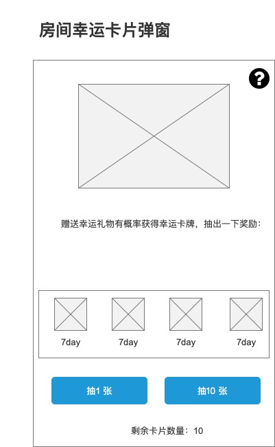

本模块按原型阅读顺序聚拢为：先看弹窗主界面字段，再看右上角 `?` 打开的 H5 规则说明，最后看“抽1张 / 抽10张”进入的结果弹窗。这样阅读幸运卡牌原型时，不需要在第 8 章里来回跳找。

#### 8.3.1 页面字段

| 区域 | 字段/文案 | 规则 |
|---|---|---|
| 主视觉 | 幸运卡牌活动图 | 由正式活动素材配置 |
| 说明入口 | 右上角 `?` | 打开 H5 幸运卡牌规则说明 |
| 玩法说明 | `赠送幸运礼物有概率获得幸运卡牌，抽出以下奖励：` | 原型“抽出一下奖励”按正确产品文案修正为“以下” |
| 奖励预览 | 奖励图标、奖励天数 | 当前原型显示 1 行 4 格；XMind 要求跑马灯展示，正式动效稿需补齐轮播方向、节奏和超过 4 项时的承载方式 |
| 单抽按钮 | 抽1张 | 可用数量大于等于 1 时可点击 |
| 十连抽按钮 | 抽10张 | 可用数量大于等于 10 时可点击 |
| 剩余数量 | `剩余卡片数量：N` | 与缩略入口使用同一可用数量 |
| 关闭按钮 | `×` | 关闭弹窗；不消耗卡牌、不触发发奖 |

关闭按钮 `×` 来自综合原型和全交互原型；单页弹窗截图未单独画出，不得因此漏实现关闭能力。

#### 8.3.2 关键交互

1. 奖励预览按 XMind 要求使用跑马灯展示奖励图标和奖励天数；当前静态图只证明 1 行 4 格，UI 需补齐连续轮播稿。
2. 页面打开时只展示可抽取奖励范围，不代表用户已获得对应奖励。
3. 点击右上角 `?` 进入 8.4 的 H5 规则说明；关闭 H5 后返回当前弹窗。
4. 点击“抽1张”消耗 1 张卡牌，点击“抽10张”消耗 10 张卡牌。
5. 卡牌数量不足时，对应按钮不可发起请求；数量为 0 时关闭弹窗后房间入口隐藏。
6. 抽卡请求发出后，两个抽卡按钮进入处理中，防止重复点击。
7. 点击抽卡后依次进入“抽奖动画 → 结果弹窗”；抽奖动画资源失败时可直接展示已确认结果。
8. 点击关闭按钮只关闭弹窗；已受理的抽卡请求继续按原请求恢复，不能因弹窗关闭而丢失结果或退回已正确消耗的卡牌。

### 8.4 从弹窗进入 H5 规则说明

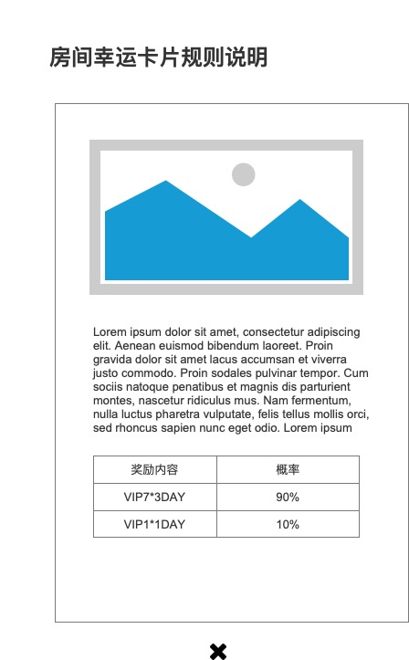

#### 8.4.1 页面定位

这是 8.3 弹窗右上角 `?` 的展开页。点击幸运卡牌弹窗右上角 `?`，在客户端内打开 H5 规则说明；关闭后返回幸运卡牌弹窗，不消耗卡牌。

#### 8.4.2 页面字段

| 字段 | 规则 |
|---|---|
| 规则头图 | 当前活动/玩法说明图 |
| 规则正文 | 当前版本正式规则，不使用原型 Lorem ipsum 占位文案 |
| 奖励内容 | 奖励名称、数量/时长等用户可理解信息 |
| 概率 | 依法规和正式产品口径公开当前有效概率 |
| 关闭按钮 | 关闭 H5 并返回上一层 |

#### 8.4.3 规则正文至少说明

1. 幸运卡牌来源；不同幸运玩法按各自正式资格规则判定；双边和非双边合并的单用户单日获得卡牌数量上限及业务日口径、成功发卡后的 30 分钟冷却规则；虚拟物料不设置库存上限；
2. 抽1张、抽10张的卡牌消耗；
3. 奖励类型、数量和有效期；
4. 重复获得同一虚拟权益时采用叠加、覆盖或其他规则；
5. 奖励在抽奖成功后立即发放，“收下”仅关闭结果弹窗；
6. 奖励发放失败、卡牌数量恢复和退款撤销规则；
7. 活动版本、地区、开始/结束时间及存量卡牌影响。

原型中的 `VIP7*3DAY 90%`、`VIP1*1DAY 10%` 和正文占位文字只用于版式示意，不得直接当作生产奖励与概率。

### 8.5 从弹窗进入抽奖结果

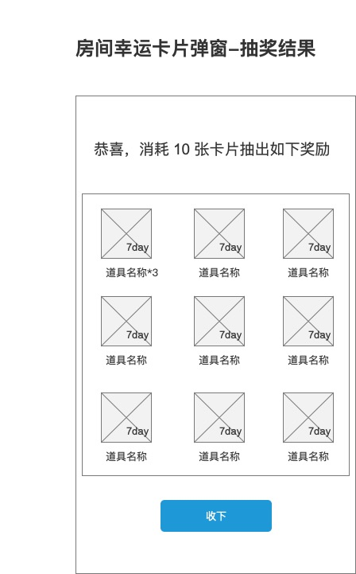

#### 8.5.1 抽奖过程

这是 8.3 中“抽1张 / 抽10张”按钮的下一屏。立即发奖、失败恢复和“收下”不触发领取属于业务建模与 XMind 资产规则；结果原型只提供可见字段和按钮证据。

1. 单抽受理成功后，按本次请求消耗 1 张卡牌；十连抽受理成功后消耗 10 张。
2. 同一抽卡请求只生成一次结果；超时或重试恢复原结果，不再次扣卡。
3. 抽奖动画只承担表现；结果以系统确认结果为准。
4. 结果生成后立即发放虚拟奖励；用户退出房间、关闭弹窗或不点击“收下”均不影响已生成奖励的发放。
5. 发奖失败时保留结果和待处理状态；不得把卡牌重新随机成另一份奖励。
6. 单抽复用同一抽奖动画与结果弹窗模板，结果标题中的 `N=1`，只展示本次 1 条抽取结果；该规则来自 XMind 完整流程，当前结果原型只画出十连场景，UI 需补单抽状态稿。
7. 十连抽保存 10 次独立抽取结果及各自发奖状态；结果页可按同类结果合并展示，但不得合并、覆盖或丢失原始抽取序号和原始发奖状态。部分到账或部分失败时，只补发未到账的原结果，不重抽任何一项。

#### 8.5.2 结果字段

| 字段 | 展示规则 |
|---|---|
| 结果标题 | `恭喜，消耗 N 张卡片抽出如下奖励` |
| 奖励图标 | 展示本次中奖物料图标 |
| 奖励天数/有效期 | 展示物料对应时长；永久类按正式文案展示；有效期类型或有效期值不同不得合并 |
| 奖励名称 | 展示物料名称 |
| 奖励数量 / 合并次数 | 单抽展示该次结果数量；十连抽同类结果合并时展示 `×N`，`N` 为该合并项包含的独立抽取结果次数，不表示单次奖励数量 |
| 发奖状态 | 单抽展示该结果状态；十连抽原始结果逐项保留发放中、已到账、失败待处理。合并项中存在不同状态时展示“部分到账/部分待处理”及各状态对应次数，不得因状态不同丢失原始结果 |
| 收下按钮 | 收下按钮只关闭结果弹窗 |

#### 8.5.3 展示顺序与同类结果合并

1. 十连抽的 10 次独立抽取结果均为原始事实；结果页按同类结果合并展示，不按数量、天数或配置顺序二次重排。
2. “同类结果”限定为**同一奖励物料、同一有效期类型、同一有效期值**的结果；发奖状态不是合并条件。有效期类型或有效期值不同，即使奖励名称相同也必须分别展示。
3. 合并项展示 `×N`，`N` 等于该同类奖励包含的原始抽取次数；例如同一奖励在第 1、4、8 次抽中时，结果页展示 1 项 `×3`，不表示其中任意单次抽取发放 3 份奖励。
4. 合并项按其最早原始抽取序号排序；不同同类项的相对顺序按各自最早抽取序号稳定展示。
5. 合并只改变结果页展示，不改变 10 次独立抽取、独立发奖、补发、退款/撤销及原始抽取序号。合并项中的原始结果必须可反推；状态不一致时按 8.5.2 汇总展示状态与对应次数。
6. 结果展示必须完整承接本次 10 次抽取；合并后同类项仍超过 9 项时，结果区域必须以滚动、分页或扩展格子完整承载，9 宫格不得作为结果上限。

#### 8.5.4 十连抽原型与同类结果合并

当前原型同时存在：

- 文案“消耗 10 张卡片”；
- 结果区仅 3×3，共 9 个可见奖励位；
- 第一项示例带 `*3`。

**确定口径：第一项 `*3` 表示同类结果合并，即同一奖励类别命中了 3 次独立抽取结果；不表示任意单次抽取一次发放 3 份奖励。**

落地规则：

1. 十连抽必须对 10 次抽取全部形成结果，不允许按 9 次实现。
2. 结果页固定采用 8.5.3 定义的同类结果合并口径；同类项展示 `×N`，并保留全部原始抽取次数、原始发奖状态和可反推关系。
3. 合并后的同类项数量不保证必然小于等于 9；若仍超过 9 项，必须采用滚动、分页或扩展格子完整承载，不能丢失第 10 次或任何其他结果。
4. 原型 9 宫格只表达当前可见区域，不得视为抽取次数或结果项数量上限。

### 8.6 卡牌数量、有效期与退款

| 场景 | 处理 |
|---|---|
| 卡牌发放成功 | 数量增加，入口按 1～99/99+ 规则刷新 |
| 卡牌发放失败 | 不本地增加数量；展示失败待处理或等待恢复 |
| 抽卡受理成功 | 扣减对应卡牌数量并进入原请求恢复链路 |
| 抽卡未受理 | 不扣卡，按钮恢复可用 |
| 抽卡是否受理未知 | 保持处理中并查询原请求；禁止重复抽 |
| 抽卡已受理并扣卡，但最终确认未生成任何可恢复结果 | 请求终止，按原请求退回实际扣除卡牌；退卡不得生成新的抽奖记录 |
| 十连抽仅部分结果生成且其余结果最终不可恢复 | 已生成结果继续发奖，不整单重抽；未生成的抽取次数逐次退回对应卡牌 |
| 礼物退款且卡牌未使用 | 按最终退款规则撤销可撤销卡牌并刷新数量 |
| 卡牌已使用 | 保留已抽结果；后续权益回滚按系统最终状态展示，不重新生成抽卡结果 |
| 虚拟奖励发放失败 | 结果保留，进入失败待处理，后续补发原奖励 |
| 卡牌/权益到期 | 从可用数量和可用权益中移除，并按正式规则提示 |

卡牌有效期、虚拟权益有效期、重复权益叠加/覆盖方式必须在正式版本发布前确定，并同步到 H5 规则说明。

## 九、房间设置与表现控制

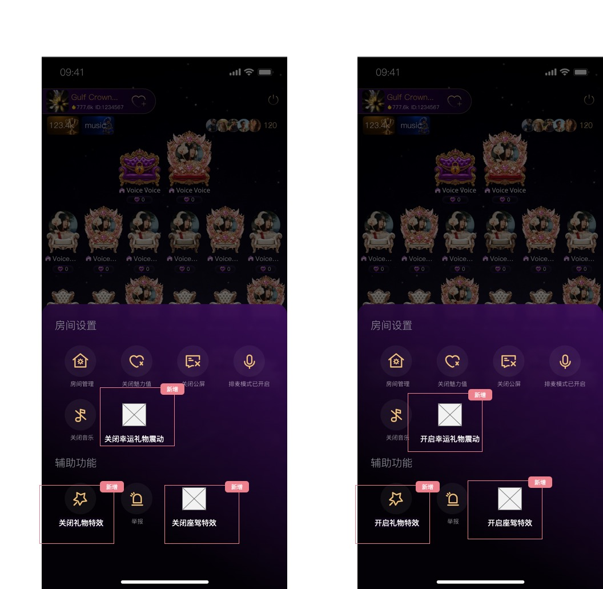

### 9.1 页面定位

幸运礼物相关设置复用现有房间设置面板，不新增独立设置页。原型中的“关闭幸运礼物震动”“关闭礼物特效”为本需求相关项；“关闭座驾特效”虽在同图标注为新增，但不属于本需求范围，由对应座驾需求承接。房间管理、音乐、魅力值、排麦和举报不在本文调整。

### 9.2 页面字段

| 设置项 | 当前文案状态 | 关闭后的影响 | 不影响内容 |
|---|---|---|---|
| 幸运礼物震动 | 开启时显示“关闭幸运礼物震动” | 本端后续幸运礼物震动不再触发 | 开奖、奖励、动画、公屏、其他用户震动设置 |
| 礼物特效 | 开启时显示“关闭礼物特效” | 本端后续礼物动画和高价值特效降级 | 文字结果、公屏消息、余额/权益、其他用户表现 |

设置控件沿用房间设置现有点击式状态切换规范。切换后文案与图标需能明确表达当前状态，不能始终只显示“关闭”而无法判断是否已关闭。

### 9.3 关键交互

1. 点击“关闭幸运礼物震动”后立即关闭本端后续震动；再次开启后仅影响新事件，不补播历史震动。
2. 点击“关闭礼物特效”后，本端未开始的礼物动画和高价值特效不再播放；已经出现的结果仍保留文字与资产反馈。
3. 两项设置可独立生效：关闭震动不等于关闭特效，关闭特效不等于隐藏中奖结果。
4. 低性能设备自动降级与用户设置同时生效时，取更弱表现。
5. 设置保存失败时恢复原状态并提示，不能视觉显示已关闭但实际未生效。

### 9.4 页面异常

| 场景 | 处理 |
|---|---|
| 设置读取失败 | 使用上次已确认状态；无法确认时按现有房间默认值并提示加载失败 |
| 设置保存失败 | 恢复切换前状态并提示重试 |
| 灰度版本不支持设置项 | 不展示对应入口；不保留空位 |
| 特效已关闭但收到结果 | 展示文字、公屏和资产状态，不播放被关闭表现 |

## 十、结果恢复与跨页面一致性

### 10.1 恢复触发场景

- 送礼后网络中断；
- 等待开奖时切后台或杀进程；
- 房间切换或房间关闭；
- 抽卡后关闭弹窗、切房或退出；
- 动画资源加载失败；
- 中奖结果已出但奖励发放延迟；
- 同一请求因超时被客户端重试。

### 10.2 恢复规则

1. 客户端按原送礼或抽卡事件恢复，不创建新事件。
2. 送礼是否受理未知时，保持“送礼请求处理中/结果恢复中”，直至获得可信状态。
3. 已确认未中奖时恢复未中奖；不得因未播放动画而重新开奖。
4. 已确认中奖时恢复奖励类型、最终倍率/数量和当前发奖状态。
5. 已确认奖励到账时刷新金币、钻石、卡牌或虚拟权益。
6. 奖励失败待处理时保留原中奖结果；后续补发成功只更新到账状态，不改变原奖励。
7. 同一事件在房间弹层、公屏、卡牌结果和余额/权益上的状态必须一致。
8. 对仍处于“扣费结果未知、结果恢复中、奖励发放中、奖励失败待处理、退款处理中、奖励撤销处理中或部分回滚待处理”的事件，客户端必须通过现有系统消息/通知能力提供持久化状态通知，不依赖用户返回原房间或原弹窗。
9. 通知至少展示事件类型、处理状态、最终结果、奖励类型与数量；点击后通过现有通知落地能力恢复该事件最新状态。到达未中奖、奖励到账、已退款或奖励已撤销等终态后更新原通知，不重复生成结果、奖励或新的通知事件。
10. 本期不新增独立“开奖记录”页面；跨页面追踪复用现有通知能力，不得直接把后台审计字段搬到客户端。
11. 原中奖结果与资产处理状态分开保存和展示。发生退款或撤销时保留原开奖结果，但当前状态必须更新为已退款、奖励已撤销或部分回滚待处理，不能继续显示为当前奖励已到账。

### 10.3 一致性禁止项

- 房间本人结果显示已到账，但余额未刷新且无处理中说明；
- 公共表现显示主播中钻石，本人状态却显示送礼方中金币；
- 抽卡结果已生成，关闭弹窗后卡牌又被退回并允许重抽；
- 资源失败被错误展示为未中奖；
- 同一事件在网络恢复后再次震动、再次全服飘屏或再次发奖；
- 降级普通礼物仍出现等待开奖或幸运中奖结果。

## 十一、客户端异常矩阵

| 场景 | 用户可见状态/提示 | 可否重试 | 业务结果 |
|---|---|---:|---|
| 礼物/活动/房间不可用 | 明确不可用原因 | 条件恢复后可重试 | 未受理，不扣费、不开奖 |
| 用户暂不满足资格 | 通用资格提示 | 条件恢复后可重试 | 未受理 |
| 余额不足 | 余额不足 + 充值入口 | 充值后可重试 | 未受理 |
| 送礼请求处理中 | 处理中 | 不可重复提交 | 待确认 |
| 送礼明确失败 | 失败原因 | 可重新操作 | 不生成幸运结果 |
| 扣费状态未知 | 结果恢复中 | 不允许盲目重送 | 查询原事件 |
| 等待开奖超时 | 结果恢复中 | 不重新开奖 | 恢复原事件 |
| 动画失败 | 文字结果/等待结果 | 可重试加载表现，不重试开奖 | 原结果不变 |
| 用户切房/切后台 | 无需强制重播动画 | 返回后恢复原状态 | 原结果不变 |
| 奖励发放中 | 奖励发放中 | 不可重复领取 | 原奖励继续处理 |
| 奖励发放失败 | 奖励失败待处理 | 不由用户重新抽取 | 补发原奖励 |
| 双边送礼方结果未知 | 结果恢复中 | 不进入主播阶段 | 恢复送礼方阶段 |
| 主播阶段结果未知 | 结果恢复中 | 不重跑送礼方阶段 | 恢复主播阶段 |
| 卡牌数量不足 | 对应抽卡按钮不可用/数量不足 | 获得足够卡牌后可操作 | 不创建抽卡结果 |
| 抽卡请求处理中 | 抽卡中 | 不可重复点击 | 待确认 |
| 卡牌结果已出、弹窗关闭 | 再次进入时恢复结果或最终权益 | 不可重抽同一请求 | 奖励按原结果发放 |
| 礼物退款 | 刷新实际退回金币及受影响权益 | 不可重放原事件 | 按原事件回滚/冲正 |
| 抽卡已扣卡但最终无可恢复结果 | 退回实际扣除卡牌并通知 | 不可按原请求重抽 | 请求终止，不生成结果 |
| 十连部分结果不可恢复 | 展示已生成结果和退卡数量 | 不可整单重抽 | 已生成项继续发奖，未生成项逐次退卡 |
| 退款/撤销处理中 | 展示原结果 + 当前资产处理状态 | 不可重复发起 | 等待原事件终态 |
| 部分回滚待处理 | 展示已完成部分和待处理部分 | 不可本地重算 | 等待最终处理 |
| 玩法版本关闭 | 隐藏入口或展示已关闭状态 | 新版本开启后可操作 | 已受理事件继续完成 |

## 十二、统一文案与显示口径

### 12.1 状态文案

| 业务状态 | 推荐用户文案 |
|---|---|
| 送礼请求处理中 | 送礼处理中，请稍候 |
| 等待开奖 | 礼物已送出，等待幸运结果 |
| 结果恢复中 | 正在恢复本次结果，请稍候 |
| 未中奖 | 本次未获得幸运奖励 |
| 奖励发放中 | 已中奖，奖励发放中 |
| 奖励到账 | 奖励已到账 |
| 奖励失败待处理 | 已中奖，奖励暂未到账，系统正在处理 |
| 退款处理中 | 正在退回本次实际支付金币，请稍候 |
| 已退款 | 本次实际支付金币已退回 |
| 奖励撤销处理中 | 本次奖励正在撤销，请稍候 |
| 奖励已撤销 | 本次奖励已撤销 |
| 部分回滚待处理 | 部分资产仍在处理中，请稍候 |
| 礼物维护中 | 当前幸运礼物维护中 |
| 幸运玩法关闭 | 当前幸运玩法已关闭 |
| 降级普通礼物 | 当前礼物按普通礼物送出，不参与幸运玩法 |
| 卡牌不足 | 幸运卡牌数量不足 |
| 抽卡处理中 | 抽奖中，请稍候 |

最终多语言文案由客户端文案表统一维护，语义不得弱化为“失败”或“成功”而丢失具体阶段。

### 12.2 金币、钻石与倍率

1. 金币、钻石必须使用不同图标和颜色。
2. 送礼方幸运金币、主播幸运钻石、礼物基础收益分别表述。
3. 对外展示的倍率、数量和币种必须来自同一最终结果。
4. 单位换算只改变显示，不改变资产精度和最终到账值。
5. `M/B` 显示按第 2.8 节执行；两位小数采用截断，不四舍五入。

## 十三、版本、生效与历史边界

1. 幸运礼物分组、礼物状态、双边标签、表现档位、各中奖表现元素的指定倍数门槛、卡牌奖励和 H5 规则均按正式版本生效。
2. 新版本只影响生效后新受理的送礼批次或抽卡请求；处理中事件继续按原受理规则完成。连送批次的版本边界按 2.6 执行。
3. 指定 iOS 版本或指定用户 ID 需要隐藏幸运玩法时，按第十四章隐藏对应功能点；已受理事件继续按原规则完成。
4. 概率或奖励配置变化时，客户端只展示当前事件的最终结果，不把新规则反向套到历史事件。
5. 已发放且未过期的存量卡牌在版本切换后继续保留，不得静默清零。卡牌抽奖使用抽卡请求受理时正在生效的奖励规则版本，并将该版本固化到抽卡事件；处理中发生版本切换时仍按原受理版本完成。
6. 客户端抽卡弹窗、H5 规则和奖励预览必须展示本次抽卡实际使用的有效版本。若运营必须提前终止存量卡牌，应在生效前明确过期时间和补偿方案，不得直接作废。
7. H5 规则、客户端入口和实际奖励必须同时切换到同一有效版本，避免规则页与实际抽奖不一致。

## 十四、iOS 幸运礼物功能隐藏配置

| 功能点 | 指定 iOS 版本命中时 | 指定用户 ID 命中时 | 命中后的处理 |
|---|---|---|---|
| 幸运礼物 Tab / 分组 | 隐藏 | 隐藏 | 不展示幸运礼物入口，不保留空白占位 |
| 幸运礼物卡片、“钻石奖励”标签 | 隐藏 | 隐藏 | 不展示幸运礼物卡片和幸运标签 |
| 选中礼物说明区、玩法入口、玩法 H5 | 隐藏 | 隐藏 | 不展示对应说明图、玩法按钮和玩法说明入口 |
| 幸运礼物赠送、连送按钮 | 隐藏 | 隐藏 | 不允许创建新的幸运送礼或连送事件 |
| 等待开奖、双边幸运、幸运中奖结果 | 隐藏新事件表现 | 隐藏新事件表现 | 不创建新的开奖、双边幸运和幸运结果表现 |
| 本人动效、观众动效、震动 | 隐藏 | 隐藏 | 不播放新的幸运礼物动效和震动 |
| 房间公屏、房间飘屏、首页/主页/全服飘屏、跑马灯 | 隐藏 | 隐藏 | 不产生新的幸运礼物公共曝光 |
| 幸运卡牌获得动画、缩略入口、红点 | 隐藏 | 隐藏 | 不产生新卡牌资格，不展示无存量用户的入口 |
| 幸运卡牌弹窗、单抽、十连抽 | 隐藏 | 隐藏 | 不允许创建新的抽卡事件 |
| 幸运礼物专属设置项 | 隐藏 | 隐藏 | 不展示幸运礼物震动、特效等专属设置项 |
| 深链、Push、活动位、缓存页面 | 拦截新玩法 | 拦截新玩法 | 不进入新幸运玩法；历史通知仅恢复原事件状态 |
| 配置使用限制 | 不按审核身份区分 | 用户 ID 仅用于正式灰度名单 | 不得按审核账号、审核设备、审核网络等身份做特殊隐藏 |

## 十五、待确认项

| 待确认项 | 当前约束 | 负责方向 |
|---|---|---|
| 首页飘屏点击目标 | 当前仅确认可展示和可上滑移除；不可预设跳房间或活动页 | 产品/UI |
| 首页右侧 `×500` 含义 | 原型只确认一个强调数值，需明确表示倍率、奖励数量还是其他指标 | 产品/UI |
| 房间、主页、全服门槛 | 三类门槛独立配置，生产值不得写死 | 产品/运营/数据 |
| 5 档动画与飘屏方案 | 需明确每档门槛、素材、时长、队列与遮挡上限 | 产品/UI/客户端 |
| 高价值全屏跑马灯规则 | 表现形态已由 XMind 确定为全屏跑马灯；待确认门槛、素材、时长、队列及与普通房间动画的互斥/覆盖顺序 | 产品/UI |
| 幸运卡牌正式 H5 | 替换 Lorem ipsum 和示例概率，明确地区/版本规则 | 产品/法务/运营 |
| 卡牌及虚拟权益有效期 | 必须明确起算点、到期提示和存量影响 | 产品/运营 |
| 幸运卡牌首期主题数 | 业务建模仅提出 4 个主题建议，发布前确认最终数量与素材 | 产品/运营/UI |
| 重复虚拟权益处理 | 必须明确叠加、覆盖或转换规则 | 产品/运营 |
| 十连抽结果布局 | 必须完整承接 10 次结果；解决当前 9 宫格冲突 | 产品/UI |
| 结果中同类物料合并 | 若合并，需明确“同物料+同有效期”等合并条件 | 产品 |
| 玩法关闭后的存量卡牌 | 默认保留未过期卡牌；若提前终止，需明确过期时间与补偿方案 | 产品/运营 |
| 双边公共表现门槛 | 送礼方金币与主播钻石分别使用何种门槛待定 | 产品/运营 |
| 设置项开启态视觉 | 原型只展示“关闭…”文案，需补齐关闭后的文案/图标状态 | UI/客户端 |
| 处理中通知落地形态 | 必须复用现有系统消息/通知持续追踪；需确认点击后的具体落地样式，不新增独立开奖记录页 | 产品/UI/客户端 |

## 十六、原型与需求映射

| 原型 | 对应章节 | 纳入结论 |
|---|---|---|
| `首页.jpg` | 6.1 首页幸运礼物飘屏 | 纳入 |
| `房间.jpg` | 6.2 房间承载区 | 纳入 |
| `礼物栏.jpg` | 4 礼物栏与幸运礼物入口 | 纳入 |
| `幸运礼物_双边与非双边礼物栏说明.jpg` | 4.2 选中礼物说明图与玩法说明 | 纳入 |
| `房间赠送幸运礼物-本人视角.jpg` | 5.3 本人视角 | 纳入 |
| `房间赠送幸运礼物麦位动画-非本人视角.jpg` | 5.4 送礼方在麦位 | 纳入 |
| `房间赠送幸运礼物麦位动画-非本人视角-送礼方不在麦位上.jpg` | 5.5 送礼方不在麦位 | 纳入 |
| `房间赠送幸运礼物飘屏-公共视角.jpg` | 6.3 公共视角表现与连送中奖动画 | 纳入 |
| `幸运礼物_连送中奖动画_双边汇总.png` | 6.3 公共视角表现与连送中奖动画 | 纳入；以当前聊天更新原型落盘 |
| `幸运卡牌.jpg` | 8.1 卡牌综合原型 | 纳入 |
| `幸运卡牌_全交互流程.jpg` | 8.1 卡牌完整交互 | 纳入 |
| `房间幸运卡片.jpg` | 8.2 房间卡牌入口 | 纳入 |
| `房间幸运卡片弹窗.jpg` | 8.3 卡牌弹窗 | 纳入 |
| `房间幸运卡片规则说明.jpg` | 8.4 H5 规则说明 | 纳入 |
| `房间幸运卡片弹窗-抽奖结果.jpg` | 8.5 抽奖结果 | 纳入，保留 9 宫格冲突 |
| `房间设置.jpg` | 9 房间设置 | 纳入 |
| `后台-幸运礼物数据.jpg`（顶层及 `后台/` 目录副本） | 不属于客户端 | 两份均排除；分辨率极小且为后台范围 |

## 十七、源材料模块映射

| XMind APP 端模块 | 本文唯一维护章节 |
|---|---|
| 礼物栏与入口 | 第 4 章 |
| 房间送礼 | 第 5 章；公共批次规则见 2.6 |
| 非双边幸运体验 | 3.2、6.4 |
| 双边幸运体验 | 第 7 章；公共互斥流程见 3.3 |
| 幸运卡牌与体验补偿 | 第 8 章 |
| 中奖表现与曝光 | 第 6 章；公共格式见 2.8 |
| 首页 | 6.1 |
| 房间 | 4、5、6、8、9 章按页面归属拆分 |

业务建模中的策略路由、概率、RTP、期望值、阈值、成本、对账和后台记录仅作为客户端状态来源，不在页面规格中复写。客户端必须承接的互斥、退款、恢复、幂等和版本边界已集中维护在第 2、3、7、8、10、13 章。

指定 iOS 版本或指定用户 ID 的幸运礼物功能隐藏范围，统一以第十四章配置表为准。
