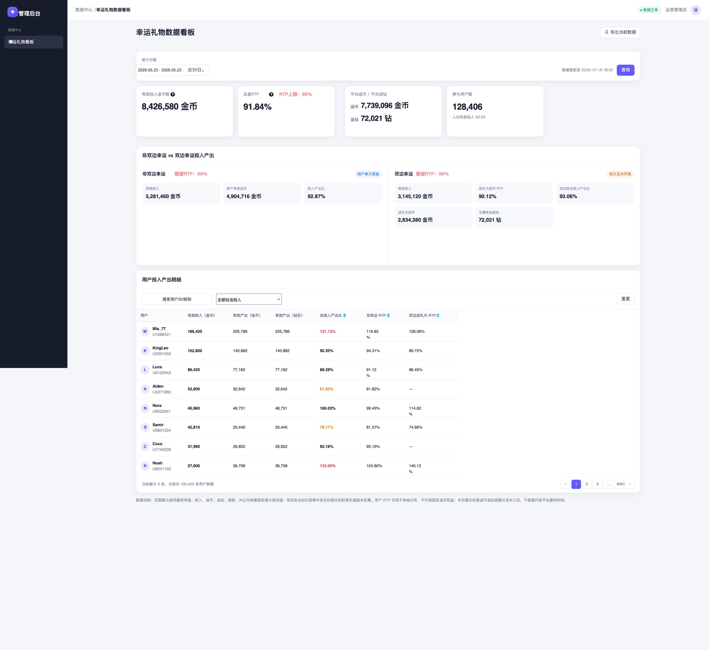
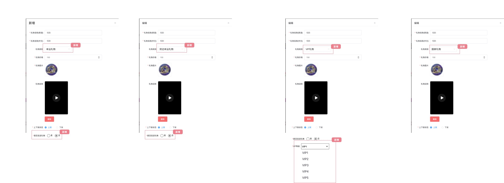
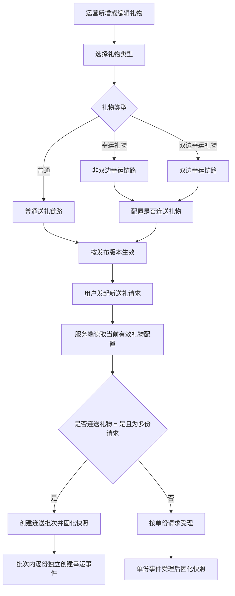

# 幸运礼物 1.0 数据后台需求文档

> **文档范围：** 幸运礼物后台包含“数据中心 → 幸运礼物数据看板”和“礼物配置”两个模块。  
> **对应原型：** 数据看板 `../幸运礼物1.0原型图/后台/后台-幸运礼物数据.jpg`；礼物配置 `../幸运礼物1.0原型图/后台/礼物配置.jpg`。  
> **规则优先级：** 当前已确认的《幸运礼物 1.0 核心逻辑需求文档》> 当前原型图 >《幸运礼物 1.0 业务建模（脑图主导版）》> XMind。  
> **页面边界：** 数据看板描述查询、展示与导出；礼物配置描述礼物类型、是否连送礼物及其发布、快照和送礼准入规则。本文不包含概率/策略配置、预算管理、事件审计、奖励补发、退款执行和工资冲正操作页。

---

## 一、页面目标与范围

### 1.1 页面目标

运营人员通过统一的统计时间、玩法维度和最终净值口径，查看幸运礼物的参与规模、总盘 RTP、非双边与双边玩法的实际 RTP 与期望值 RTP，以及用户实际体验分布。

页面只提供数据分析、运营观察和导出能力。**送礼方 RTP 是体验分析指标；总盘 RTP、RTP 上限和期望值 RTP 用于成本观察与概率配置评估，均不构成用户固定返还、补差或奖励承诺。**

### 1.2 页面承接的业务事实

| 业务事实 | 看板承接方式 |
|---|---|
| 非双边幸运 | 统计送礼方有效投入、最终有效金币奖励、实际非双边 RTP 与非双边期望值 RTP |
| 双边幸运 | 统计送礼方有效投入、送礼方有效金币奖励、主播实际幸运钻石、主播额外幸运钻石成本、双边平台 RTP 与双边期望值 RTP |
| 双边 A/B 分流开奖 | 只读取最终确认事件；送礼方中奖后收礼方使用配置 A，送礼方明确未中奖后使用配置 B；同一单份的双中奖可同时计入对应资产与成本 |
| 退款、撤销与冲正 | 原始事实永久保留；卡片、对比区和用户明细默认读取最终净值 |
| 资产价值折算 | 涉及钻石/虚拟权益的价值型指标，读取事件发生时固化的价值换算版本 |
| 配置与版本 | 本页不展示概率、策略命中或阈值；导出与对账须保留事件版本信息 |

### 1.3 本期不包含

- 在看板直接修改概率、RTP、阈值、策略、预算或礼物配置；
- 在看板执行奖励补发、退款、资产扣回或工资冲正；
- 将新用户、大 R、连续未中奖等内部画像展示为页面字段或筛选项；
- 以当前实时配置反向覆盖历史事件价值、概率或政策；
- 将原型样例用户名、金额、页码或日期作为生产默认值。

---

## 二、数据口径总则

### 2.1 统计时间与事件归属

1. 页面按幸运事件的**扣币确认成功时间**归属统计日期。扣币未成功、最终无可恢复结果且已退款的事件不计入有效投入。
2. 日期范围采用左闭右开：开始日 `00:00:00` 至结束日次日 `00:00:00`；页面、导出和离线汇总必须使用后台统一配置时区。
3. 日期范围为空时默认查询当前业务日。快捷周期选择后自动回填起止日期；用户手动选择日期范围后取消快捷周期选中态。
4. 原型中“近30日”与单日日期同时出现仅作版式示意；生产页面不得形成两套相互冲突的查询范围。
5. 已受理事件跨越配置生效点、用户转会或后续资产价格变化时，仍按受理时固化的玩法、实付价格、归属及价值快照统计。

### 2.2 原始值、回滚值与最终净值

| 数据层 | 定义 | 页面使用规则 |
|---|---|---|
| 原始值 | 事件初始成功扣费、初始结果及初始发放金额 | 不因退款、撤销或冲正删除 |
| 回滚值 | 已退款金额、已扣回金币/钻石、已冲正工资及待处理回滚金额 | 用于解释原始值与最终净值差异 |
| 最终净值 | 原始值扣除已确认退款、撤销及冲正后的最终有效值 | 看板卡片、对比区和明细默认使用 |

1. 退款处理中、奖励撤销处理中或部分回滚待处理的事件，已确认变动进入最终净值；未完成部分必须保留待处理金额和状态，不得伪装为已全额回滚。
2. 若回滚发生在查询期内、原事件发生在查询期外，不改变原事件的历史归属期；导出中以“跨期回滚调整”单独记录，避免同一笔投入跨日重复扣减。
3. 统计结果会因退款、撤销、延迟发奖恢复或工资冲正发生变化。页面必须展示数据更新时间，导出文件必须带导出时间和统计快照标记。

### 2.3 基础指标定义

| 指标 | 定义 | 计算方式 |
|---|---|---|
| 有效投入（金币） | 已确认扣币且未被全额退款/撤销的幸运礼物投入净额 | 事件原始实付金币 − 已确认退款金币 |
| 有效产出（金币） | 用户最终有效的幸运金币奖励 | 原始金币奖励 − 已扣回金币奖励 |
| 有效产出（钻石） | 主播最终有效的幸运钻石数量 | 原始幸运钻石 − 已扣回幸运钻石；不含非双边基础收礼钻石；仅用于资产数量展示，不等于 RTP 成本。 |
| 双边 0.2 倍基准钻石 | 同一双边单份事件按 `实际支付金币单价 × 0.2` 直接截取整数得到的基准值 | 仅用于计算额外幸运钻石，不是额外资产发放。 |
| 双边额外幸运钻石 | 主播双边幸运钻石中高于 `0.2` 倍基准的最终净数量。 | 原始值 = `MAX（单份幸运钻石结算值 − 单份 0.2 倍基准钻石，0）`；最终净值 = 原始值 − 已生效额外幸运钻石回滚值。实际结算未高于该基准时原始值恒为 0。 |
| 双边额外幸运钻石等价金币成本 | 双边额外幸运钻石的事件价值 | 单份额外幸运钻石最终净值 × 事件发生时固化的单钻石金币经济价值。 |
| 非双边送礼方 RTP | 非双边送礼方金币奖励率 | 非双边有效金币奖励 ÷ 非双边有效投入 × 100%。 |
| 非双边期望值 RTP | 非双边概率配置的理论返奖率 | 单份事件理论 RTP = `Σ（送礼方可用中奖倍率 × 对应归一化概率）`；未中奖结果按 0 倍参与计算。统计期展示值 = `Σ（单份有效投入价值 × 单份事件理论 RTP 快照）÷ Σ（单份有效投入价值）× 100%`。 |
| 双边送礼方 RTP | 双边送礼方金币奖励率 | 双边送礼方有效金币奖励 ÷ 双边有效投入 × 100%。 |
| 双边平台 RTP | 双边幸运玩法的平台实际成本口径 | （双边送礼方有效金币奖励价值 + 双边额外幸运钻石等价金币成本）÷ 双边有效投入价值 × 100%。 |
| 双边期望值 RTP | 双边概率配置的平台理论成本率 | 单份事件理论 RTP = `送礼方金币理论 RTP + pA×（配置A条件期望额外幸运钻石等价金币成本÷P）+pB×（配置B条件期望额外幸运钻石等价金币成本÷P）`；`P` 为事件受理时实际支付金币单价，`pA/pB` 为送礼方中奖/明确未中奖概率。A/B 内按归一化条件概率计算 `MAX（截取（P×收礼方倍率）−截取（P×0.2），0）` 的期望值并按事件价值快照折算；统计期按单份有效投入价值加权汇总。 |
| 总盘 RTP | 全部幸运玩法的平台实际成本口径 | （全服送礼方最终有效金币奖励价值 + 全服双边额外幸运钻石等价金币成本）÷ 全服有效投入价值 × 100%。 |
| RTP 上限 | 当前后台配置的总盘 RTP 阈值上限 | 读取当前已生效的总盘 RTP 阈值配置；用于服务端总盘阈值控制，不按页面筛选日期重算。无有效配置时展示“未配置”。 |
| 人均有效投入 | 参与用户的人均投入净额 | 有效投入金币 ÷ 参与用户数 |

> 金币、钻石不能按数量直接相加。双边平台 RTP 与总盘 RTP 只将**双边收礼方实际结算高于 0.2 倍基准的额外幸运钻石**按事件发生时固化的价值换算版本折算；实际结算未高于该基准的钻石不计入幸运玩法额外成本。卡牌不纳入任何 RTP 成本分子。历史事件缺失换算版本时，不得静默使用当前价格补算，应标记为待修复数据并在导出中列出。

### 2.4 参与用户口径

1. 参与用户为统计期内至少产生一笔最终有效幸运礼物投入，或至少获得一笔最终有效幸运钻石的去重用户。
2. 同一账号既作为送礼方又作为收礼主播时，参与用户数按账号去重计数 1 次；明细和导出须保留参与角色，避免把钻石产出混入送礼方金币 RTP。
3. 被全额退款、测试、运营赠送、未受理、扣币失败和最终无有效资产变动的事件，不计入参与用户。

---

## 三、页面结构与原型



| 区域 | 原型可见内容 | 页面职责 |
|---|---|---|
| 左侧导航 | 数据中心 / 幸运礼物看板 | 进入本页面；不新增其他导航能力 |
| 顶部状态栏 | 数据正常、运营管理员 | 显示后台通用状态与当前登录身份，沿用后台框架 |
| 日期筛选区 | 统计日期、快捷周期、查询、数据更新时间、导出 | 确定统一统计范围并获取数据 |
| 汇总卡 | 有效投入、总盘 RTP（含 RTP 上限）、平台返币/返钻、参与用户数 | 展示整体规模、全盘实际成本及当前阈值配置 |
| 玩法对比区 | 非双边幸运、双边幸运及投入产出 | 对比两种玩法，并联动筛选用户明细 |
| 用户明细表 | 搜索、玩法筛选、用户级投入产出与 RTP | 识别用户体验分布并支持导出 |
| 数据说明 | 口径、净值、折算和 RTP 提示 | 防止运营误读数据 |

---

## 四、筛选区与页面级操作

### 4.1 筛选字段

| 字段 | 原型位置 | 规则 |
|---|---|---|
| 统计日期 | 日期筛选卡左侧 | 支持选择连续日期范围；必填 |
| 快捷周期 | 日期范围右侧 | 至少提供“近30日”；其余快捷项沿用后台日期组件能力 |
| 数据更新时间 | 筛选卡右侧 | 显示本次查询结果所依据汇总数据的最后完成更新时间 |
| 查询 | 筛选卡右侧 | 按当前日期范围刷新全页汇总、对比与明细 |
| 导出当前数据 | 页面标题右侧 | 按当前筛选导出完整明细，不受当前页展示条数限制 |

### 4.2 查询规则

1. 页面首次进入按默认统计日期查询；默认值和后台日报完成时间由后台通用配置确定。
2. 日期为空、开始日大于结束日或跨度超出后台允许范围时，阻止查询并提示修正日期。
3. 卡片、玩法对比区和用户明细必须来自同一组筛选条件与同一统计快照；不得出现卡片已刷新、列表仍展示旧日期数据。
4. 查询成功后重置列表到第 1 页；用户手动点击玩法对比区产生的玩法筛选在新日期范围内保留。
5. 查询失败时保留上一份可信结果，显示失败反馈和重试入口；不得把空值展示为 0 或把旧结果伪装为新日期结果。

### 4.3 导出规则

1. 文件名称：`幸运礼物用户投入产出明细_开始日期_结束日期_导出时间`。
2. 导出严格继承当前日期范围、玩法筛选和用户搜索条件，不受分页限制。
3. 导出字段至少包括：用户ID、昵称、参与角色、玩法、有效投入金币、有效产出金币、有效产出钻石、**非双边基础钻石原始值、非双边基础钻石回滚值、非双边基础钻石最终净值**、双边幸运钻石原始值、双边幸运钻石回滚值、双边幸运钻石最终净值、双边 0.2 倍基准钻石、双边额外幸运钻石、额外幸运钻石等价金币成本、单钻石金币经济价值快照、平台等价投入产出比、非双边 RTP、双边送礼方 RTP、双边平台 RTP、总盘 RTP、统计时区、数据更新时间。基础钻石来源字段均按单份服务端最终金额聚合，不使用当前礼物价格回算。
4. 金额使用未缩写完整数值；百分比保留原始精度；文件说明必须写明口径版本和“用户 RTP 不代表固定返还权益”。
5. 大数据量允许异步生成。提交后显示“导出任务已创建”，完成后提供下载；无权限、生成失败或筛选失效时必须返回明确原因，不生成空文件冒充成功。

---

## 五、汇总指标卡

### 5.1 有效投入金币数

原型“有效投入金币币数”统一规范为 **有效投入金币数**，避免重复用词。

| 字段 | 展示规则 |
|---|---|
| 有效投入金币数 | 当前统计期内非双边与双边幸运礼物的有效投入金币净额 |
| 信息提示 | 已确认扣币的幸运礼物投入 − 已确认退款金币；不含测试、运营赠送、未受理和扣币失败事件 |

### 5.2 总盘 RTP

| 字段 | 展示规则 |
|---|---|
| 总盘 RTP | `（全服送礼方最终有效金币奖励价值 + 全服双边额外幸运钻石等价金币成本）÷ 全服有效投入价值 × 100%`；保留两位小数。 |
| RTP 上限 | 展示当前后台已生效的总盘 RTP 阈值上限；不随页面日期筛选变化。无有效配置时显示“未配置”；阈值控制未启用时仍展示配置值并标明“阈值控制未启用”。 |
| 信息提示 | 总盘 RTP 是平台实际成本口径。双边主播实际返钻照常统计，但仅 `>1` 倍部分以事件价值快照折算后纳入；`≤1` 倍不作为幸运玩法额外成本重复计算。卡牌不纳入 RTP 成本。 |

当有效投入为 0 时，总盘 RTP 显示 `—`，不显示 `0.00%`；RTP 上限仍按当前有效配置展示。送礼方 RTP 在玩法对比和用户明细中按送礼方金币奖励单独展示，不与本卡混称。

### 5.3 平台返币 / 平台返钻

| 字段 | 展示规则 |
|---|---|
| 返币 | 统计期内送礼方最终有效金币奖励总额 |
| 返钻 | 统计期内收礼主播最终有效幸运钻石总额；不含非双边基础收礼钻石 |

返币与返钻必须分别显示、分别计量；不得把不同资产数量直接相加为“平台总返还”。

### 5.4 参与用户数

| 字段 | 展示规则 |
|---|---|
| 参与用户数 | 统计期内符合第 2.4 节条件的去重账号数 |
| 人均有效投入 | 有效投入金币数 ÷ 参与用户数；单位固定展示为“金币/人” |

参与用户数为 0 时，人均有效投入显示 `—`。

---

## 六、非双边与双边投入产出对比

### 6.1 通用规则

1. 非双边、双边区域均可点击；点击后下方明细表玩法筛选切换为“非双边幸运投入”或“双边幸运投入”。
2. 当前生效区域显示选中态；再次点击当前区域或点击重置后恢复“全部玩法投入”。
3. 对比区只展示玩法级聚合结果，不展示策略组、用户画像、概率模板、预算或内部阈值。
4. 双边指标严格遵循：送礼方中奖后收礼方读取配置 A，送礼方明确未中奖后收礼方读取配置 B；双方同一单份可同时产生送礼方金币与主播幸运钻石。

### 6.2 非双边幸运

| 字段 | 统计定义 |
|---|---|
| 有效投入 | 非双边幸运事件的有效投入金币净额 |
| 用户有效返币 | 非双边幸运事件中送礼方最终有效金币奖励总额 |
| 投入产出比 | 非双边送礼方有效金币奖励价值 ÷ 非双边有效投入价值 × 100% |
| 期望值 RTP | 单份事件理论 RTP = `Σ（送礼方可用中奖倍率 × 对应归一化概率）`；未中奖结果按 0 倍参与计算。统计期展示值 = `Σ（单份有效投入价值 × 单份事件理论 RTP 快照）÷ Σ（单份有效投入价值）× 100%`。 |
| 用户单方奖励 | 固定说明非双边幸运的幸运奖励方向只有送礼方金币；不表示收礼主播基础收益不存在 |
| 口径说明 | `非双边投入产出比 = 非双边送礼方最终有效金币奖励价值 ÷ 非双边幸运有效投入价值 × 100%`；期望值 RTP 仅衡量概率配置的理论返奖率，不代表用户固定返奖权益。 |

非双边有效投入为 0 时，投入产出比与期望值 RTP 均显示 `—`。

### 6.3 双边幸运

| 字段 | 统计定义 |
|---|---|
| 有效投入 | 双边幸运事件的有效投入金币净额 |
| 送礼方金币 RTP | 双边送礼方最终有效金币奖励价值 ÷ 双边有效投入价值 × 100% |
| 双边平台 RTP | `（双边送礼方最终有效金币奖励价值 + 双边额外幸运钻石等价金币成本）÷ 双边有效投入价值 × 100%` |
| 期望值 RTP | 单份双边期望值 RTP = `送礼方金币理论 RTP + pA×（配置A条件期望额外成本÷P）+pB×（配置B条件期望额外成本÷P）`；配置 A/B 的条件额外成本均按 `Σ（配置内归一化条件概率×MAX（截取（P×收礼方倍率）−截取（P×0.2），0））×V` 计算。统计期展示值 = `Σ（单份有效投入价值 × 单份双边期望值 RTP 快照）÷ Σ（单份有效投入价值）×100%`。 |
| 送礼方返币 | 双边幸运事件中送礼方最终有效金币奖励总额 |
| 主播幸运返钻 | 双边幸运事件中收礼主播最终有效幸运钻石总额；不含非双边基础收礼钻石；该数量不等于 RTP 成本。 |

> **双边期望值 RTP 读取规则：** 看板不使用当前配置实时重算历史事件。每份事件读取受理时已固化的 `P`、送礼方概率快照、配置 A/B 的条件概率与倍率快照、`0.2` 倍基准钻石、单钻石金币经济价值 `V`、配置 A/B 条件期望额外成本及单份双边期望值 RTP 快照；完整算法与数值 EG 见《核心逻辑需求文档》6.2。
| 主播额外幸运钻石 | 仅统计同份双边事件中实际结算高于 `0.2` 倍基准的最终有效钻石；未高于该基准时为 0。 |
| 双边 A/B 分流开奖 | 固定业务提示，不是开关；送礼方中奖只映射收礼方配置 A、明确未中奖只映射配置 B；同一单份可同时成立金币与钻石奖励 |

### 6.4 双边平台 RTP 构成条

双边区域底部使用构成条展示双边平台 RTP 的实际价值构成；期望值 RTP 单独展示，不参与该构成条。

| 构成项 | 计算方式 |
|---|---|
| 送礼方金币 | 双边送礼方最终有效金币奖励价值 ÷ 双边有效投入价值 × 100% |
| 主播额外幸运钻石成本 | 双边额外幸运钻石等价金币成本 ÷ 双边有效投入价值 × 100% |

1. 两项合计应等于双边平台 RTP，允许显示截断造成最多 0.01 个百分点差异。
2. 卡牌不纳入构成条或 RTP 成本分子；某一项为 0 时仍保留口径，不得用虚构占比补齐。
3. 构成条只表达平台成本价值占比；双边同一事件内可同时有送礼方金币与主播钻石，两个成本来源均按最终事实计入。
4. 原型中旧“双方互斥开关”对应当前“收礼方 A/B 分流开奖”说明；后者为固定业务规则，不是本页可开关的运营配置。

---

## 七、用户投入产出明细

### 7.1 筛选与列表字段

| 区域 | 字段/控件 | 规则 |
|---|---|---|
| 搜索区 | 搜索用户ID/昵称 | 用户ID精确匹配、昵称模糊匹配；仅作用于当前日期和玩法范围 |
| 搜索区 | 全部玩法投入 | 默认值；可切换非双边幸运投入、双边幸运投入 |
| 搜索区 | 重置 | 清空关键词、恢复全部玩法投入并回到第 1 页；不改变日期范围 |
| 列表 | 用户 | 展示头像、昵称、用户ID；昵称脱敏沿用后台统一规则 |
| 列表 | 有效投入（金币） | 当前用户在当前玩法范围内的有效投入金币净额 |
| 列表 | 有效产出（金币） | 当前用户作为送礼方的最终有效金币奖励总额 |
| 列表 | 有效产出（钻石） | 当前用户作为收礼主播的最终有效幸运钻石数量；无此角色产出时显示 `—` |
| 列表 | 平台等价投入产出比 | 当前用户在当前玩法范围内的送礼方有效金币奖励及其作为收礼方产生的双边额外幸运钻石等价金币成本，合计 ÷ 有效投入价值 × 100%。卡牌不纳入。 |
| 列表 | 非双边 RTP | 当前用户作为送礼方的非双边有效金币奖励 ÷ 非双边有效投入 × 100% |
| 列表 | 双边送礼方 RTP | 当前用户作为送礼方的双边有效金币奖励 ÷ 双边有效投入 × 100% |

> 原型“有效产出（金币）”与“有效产出（钻石）”使用了相同演示数字。生产环境必须按资产原始单位分别展示，禁止把金币数复制到钻石列，或把钻石直接当金币展示。

### 7.2 用户级计算规则

```text
平台等价投入产出比
=（用户有效金币奖励价值 + 用户双边额外幸运钻石等价金币成本）
  ÷ 用户有效投入价值 × 100%

> 用户实际到账钻石仍单独展示；实际结算未高于 0.2 倍基准的钻石与卡牌均不进入本指标。
```

1. 仅作为送礼方参与的用户，钻石产出显示 `—`；只作为收礼主播、当前范围内没有有效投入的用户，平台等价投入产出比显示 `—`，不得显示无穷大、0 或任意颜色。
2. 非双边 RTP 与双边送礼方 RTP 分别基于对应玩法的送礼方投入和金币奖励计算；没有对应玩法有效投入时显示 `—`。
3. 表格不展示用户命中的策略、内部价值等级、连续未中奖次数、限制原因、概率版本或处理来源。这些属于策略/审计查询范围，不属于当前原型页面字段。
4. 百分比默认保留两位小数；超过 100% 可正常显示。红色/橙色仅作为可配置的运营提示色，不代表用户异常或触发自动处理。

### 7.3 排序与分页

1. 有效投入、有效产出、平台等价投入产出比、非双边 RTP、双边送礼方 RTP 支持升序/降序排序；首次进入默认按有效投入降序。
2. 同指标相同记录按用户ID升序稳定排序，确保分页、导出与刷新前后顺序一致。
3. 原型使用页码、前后翻页与末页跳转；每页条数沿用后台列表通用配置。底部展示“当前展示 X 条，全部共 Y 条用户数据”。
4. 点击排序、搜索、玩法筛选或重置后回到第 1 页。
5. 数据总量变化导致当前页超出最大页时，自动回退至最后有效页并重新查询。

---

## 八、数据更新、一致性与对账要求

### 8.1 数据更新规则

1. 页面顶部显示“数据更新至 YYYY-MM-DD HH:mm”，表示本次结果使用的汇总数据完成时间，不是用户打开页面时间。
2. 新完成的开奖、发奖恢复、退款、撤销和工资冲正进入汇总后，重新查询应获取最新最终净值；不得要求运营清缓存。
3. 看板卡片、对比区、用户明细和导出读取同一统计快照；同一查询内不得出现汇总和明细净值不一致。
4. 汇总数据计算中，页面展示最近一份完成快照并标记更新时间；不得用部分计算结果覆盖完整结果。

### 8.2 强制校验规则

| 校验项 | 必须满足的关系 | 不满足时处理 |
|---|---|---|
| 总投入拆分 | 总有效投入 = 非双边有效投入 + 双边有效投入 | 标记数据异常并阻止该统计快照导出 |
| 返币拆分 | 平台返币 = 非双边有效返币 + 双边送礼方有效返币 | 标记差异并保留差异金额 |
| 双边 A/B 分流 | 送礼方中奖事件的收礼方实际配置必须为 A；送礼方明确未中奖事件的收礼方实际配置必须为 B；同份双中奖允许存在 | 配置与送礼方结果不匹配时标记异常并阻止统计快照导出；不得丢弃合法双中奖 |
| 收礼方阶段 | 收礼方开奖笔数 = 送礼方结果已确定的双边单份数；配置A/B开奖笔数分别 = 送礼方中奖/明确未中奖笔数 | 不满足时标记双边事件数据异常 |
| 双边平台 RTP 构成 | 送礼方金币 + 主播额外幸运钻石成本 = 双边平台 RTP | 允许展示精度差；超出容忍值时阻止发布快照；卡牌不得出现在该等式中 |
| 用户汇总 | 用户明细聚合后应与页面玩法范围汇总一致 | 差异保留并可追溯到事件级数据 |
| 非双边基础钻石来源对账 | 导出的非双边基础钻石原始值 − 回滚值 = 最终净值；批次原始值 = 截取（数量 × 实际支付金币单价 × 0.2）；批次原始值 = 同范围、同收礼方、同来源下各单份已固化最终金额之和。单份金额 = 截取（单价 × 0.2）+ 已固化尾差分配值，不四舍五入 | 该资产来源不计入页面“返钻”、双边/总盘 RTP 或送礼方 RTP；差异阻止统计快照导出并下钻到单份事件 |
| 回滚完整性 | 已退款、已撤销、已冲正金额不得继续算入最终有效产出或最终净成本 | 保留待处理与未回滚金额，禁止覆盖原始事实 |

### 8.3 页面与导出口径一致性

在相同日期、玩法、关键词和统计快照下，导出数据聚合后必须与页面的总投入、返币、返钻、参与用户数及用户级数据一致。导出可以提供更多追溯字段，但不得改变页面计算口径。

---

## 九、状态、权限与异常处理

### 9.1 权限

| 角色 | 页面权限 |
|---|---|
| 运营管理员 | 查看、筛选、排序、导出当前有权限范围的数据 |
| 数据/财务管理员 | 查看、筛选、排序、导出；可查看导出的原始值、回滚值与净值字段 |
| 普通后台用户 | 无权限时不展示菜单或进入后返回无权限提示 |

本页面只提供查询能力；任何角色均不能在本页修改中奖结果、概率、阈值、策略、预算或资产状态。

### 9.2 空态与异常

| 场景 | 页面处理 |
|---|---|
| 当前日期无数据 | 汇总卡显示 `—` 或明确空数据态；对比区和列表显示无数据，不沿用旧数据 |
| 日期非法 | 阻止查询，提示修正日期范围 |
| 查询失败 | 保留上一份可信结果，显示失败提示与重试入口，并标记当前展示不是最新查询结果 |
| 数据延迟 | 显示最新完成时间；不得把“数据正常”误表示为无实时延迟 |
| 钻石价值快照缺失 | 资产数量可展示；价值和比例字段显示待计算/剔除标记，导出列出缺失事件 |
| 退款或冲正处理中 | 按已确认净值展示；导出保留待处理金额，不得显示为已全部回滚 |
| 双边 A/B 分流校验异常 | 当前统计快照标记异常；配置与送礼方结果不匹配、配置 A/B 笔数不闭合时不得静默发布 |
| 导出失败 | 返回失败原因，可按原条件重新发起；不生成空文件冒充成功 |

---

## 十、页面数据说明文案

页面底部固定展示以下说明，随统计时区和口径版本动态填充：

> **数据说明：** 本页按幸运事件扣币确认成功时间统计，默认展示最终净值。投入、返币、返钻、退款、撤销及工资冲正均保留原始值、回滚值和最终净值；双边主播实际返钻按原始资产数量展示，只有实际结算高于 `0.2` 倍基准的最终有效钻石才按事件发生时固化的价值版本折算进双边平台 RTP 与总盘 RTP。**非双边基础钻石属于独立资产来源，只在导出与来源对账字段中展示；批次按数量 × 实际支付金币单价 × 0.2 截取整数，尾差已固化到单份，不计入本页返钻、送礼方 RTP、双边平台 RTP 或总盘 RTP。**实际结算未高于 0.2 倍基准的钻石与卡牌不纳入 RTP 成本。送礼方 RTP 仅用于体验分析，平台 RTP 用于成本观察，二者均不代表固定返还或补差权益。页面展示幸运玩法的投入产出与成本口径，不等同于平台最终利润。

---

## 十一、与核心规则及源材料对齐

| 来源 | 本页面采用的结论 |
|---|---|
| 核心逻辑需求文档：非双边 MVP | 当前核心 PRD 冻结为单一普通策略组；本页面不展示脑图中六策略路由、用户画像或策略预算字段 |
| 核心逻辑需求文档：双边 A/B 分流 | 单份双边事件送礼方中奖时收礼方使用配置 A，明确未中奖时使用配置 B；同份双中奖按最终事实统计 |
| 本次已确认平台成本口径 | 送礼方 RTP、双边平台 RTP、总盘 RTP 与商业综合成本率分别展示；双边平台 RTP / 总盘 RTP 仅计入双边收礼方实际结算高于 `0.2` 倍基准的钻石等价金币成本，卡牌不纳入 RTP 成本。 |
| 核心逻辑需求文档：退款与冲正 | 原中奖与原始资产事实保留，退款/冲正只改变回滚值和最终净值 |
| 业务建模与 XMind：后台数据 | 采纳大盘、用户、双边、退款与对账查询需求；配置、预算与策略属于独立后台模块，本页仅提供数据查询、展示与导出。 |
| 后台原型 | 采纳日期筛选、四张汇总卡、玩法对比、用户明细、分页、导出与数据说明的页面结构 |

---

## 十二、待产品冻结项

| 项目 | 需冻结内容 | 当前处理 |
|---|---|---|
| 统计统一时区 | 具体时区及业务日切分时间 | 未冻结前不得用客户端本地时区替代 |
| 快捷周期列表 | 除“近30日”外是否提供今日、昨日、近7日、本月等 | 原型仅确认近30日 |
| 平台等价投入产出比适用身份 | 是否同表合并用户送礼方金币奖励与收礼主播双边额外幸运钻石等价金币成本 | 本文按同账号跨角色聚合定义，待产品最终确认 |
| 颜色阈值 | 高/低 RTP 的红色、橙色提示阈值及是否仅为视觉提示 | 原型确认有颜色样式，数值阈值未确认 |
| 数据刷新 SLA | 汇总重算频率、页面可见延迟与导出快照保留时长 | 待数据侧确认 |
| 原型样例文字 | “双方互斥开关”“有效投入金币币数”等用词 | 统一为“收礼方 A/B 分流开奖”“有效投入金币数” |

---

## 十三、最终页面闭环

```text
选择统一统计日期与玩法范围
→ 按扣币成功事件、事件归属时间与快照价值读取原始事实
→ 叠加退款、撤销、奖励回收与工资冲正形成最终净值
→ 汇总全盘投入、返币、返钻、总盘 RTP、当前 RTP 上限与参与人数
→ 分别计算非双边实际 RTP / 期望值 RTP、双边送礼方 RTP / 双边平台 RTP / 期望值 RTP
→ 下钻用户级投入、金币产出、钻石产出、平台等价投入产出比和玩法 RTP
→ 使用同一统计快照完成页面展示与完整明细导出
→ 保留原始值、回滚值、版本与异常状态用于后续对账
```

---

## 十四、后台礼物配置

### 14.1 页面定位

运营通过礼物新增 / 编辑表单，为某个礼物配置其玩法类型和连送资格：

- 配置为 **幸运礼物**：该礼物进入非双边幸运玩法；
- 配置为 **双边幸运礼物**：该礼物进入双边幸运玩法；
- 配置为 **普通**：该礼物沿用普通送礼链路，不创建幸运事件；
- 配置 **是否连送礼物**：决定该礼物是否允许发起连送行为。

该页面只配置礼物的玩法归类与连送资格，**不在本页直接配置概率、倍率、RTP 阈值、奖励金额、退款规则或工资归属规则**；这些规则由对应的幸运玩法配置和事件受理快照承接。

---

### 14.2 对应原型



原型可明确识别为“新增”“编辑”两种表单状态。图中可见字段包括：礼物名称（英语）、礼物名称（中文）、礼物类型、礼物价格、礼物图片、礼物动效、上下架状态、是否连送礼物。

---

### 14.3 表单字段定义

| 字段 | 原型控件 / 可见值 | 业务定义 | 生效与历史边界 |
|---|---|---|---|
| 礼物名称（英语） | 输入框 | 礼物的英文展示名称。 | 沿用礼物基础配置既有规则；本次不新增名称规则。 |
| 礼物名称（中文） | 输入框 | 礼物的中文展示名称。 | 沿用礼物基础配置既有规则；本次不新增名称规则。 |
| 礼物类型 | 下拉选择框；原型明确可见“幸运礼物”“双边幸运礼物” | 礼物的实际玩法类型。普通、幸运礼物、双边幸运礼物三类互斥，只能选择其中一种。 | 新发布配置仅影响后续新受理的送礼请求；事件受理后固化礼物类型，后续编辑不得改写历史事件。 |
| 礼物价格 | 输入框 | 用户本次单份礼物的基础标价；实际扣费以事件受理时实际支付金币单价为准。 | 改价不回写已受理事件、已创建连送批次或其奖励计算。 |
| 礼物图片 | 上传 / 选择区域 | 礼物静态展示素材。 | 沿用基础礼物素材规则；不影响历史事件的资产、开奖结果与账务。 |
| 礼物动效 | 上传 / 选择区域 | 礼物展示动效素材。 | 仅影响后续前台展示素材；不改变幸运开奖结果或奖励账务。 |
| 上下架状态 | 单选框；上架 / 下架 | 控制该礼物是否可被新送礼请求选中和提交。 | 下架后不再接受新送礼；已受理单送、已受理连送批次和已生成事件按原快照继续恢复、结算、退款或冲正。 |
| 是否连送礼物 | 单选框；是 / 否 | 控制该礼物是否允许创建连送批次。 | 新配置仅影响后续新请求；已受理连送批次固定读取受理时的连送资格快照。 |

#### 14.3.1 礼物类型枚举

| 礼物类型 | 进入链路 | 关键限制 |
|---|---|---|
| 普通 | 既有普通送礼链路 | 不创建幸运事件；不进入幸运概率、RTP、幸运奖励或幸运卡牌规则。 |
| 幸运礼物 | 非双边幸运链路 | 送礼方按非双边规则独立开奖；收礼方基础钻石按核心逻辑既定规则结算。 |
| 双边幸运礼物 | 双边幸运链路 | 先执行送礼方金币开奖；送礼方中奖时收礼方按配置 A 开奖，明确未中奖时按配置 B 开奖。双方同一单份事件可同时中奖。 |

#### 14.3.2 是否连送礼物枚举

| 配置值 | 前台行为 | 服务端准入 | 已受理历史处理 |
|---|---|---|---|
| 是 | 该礼物单送成功后可展示并触发连送入口；用户可发起同一种礼物的连送批次。 | 允许创建连送批次；批次内每份仍为独立幸运事件、独立随机、独立账务和独立回滚。 | 已受理批次沿用受理时快照完成。 |
| 否 | 不展示、不触发该礼物的连送入口；用户仅可单份送礼。 | 收到该礼物的多份连送请求时，拒绝整个请求；不得静默拆成多个单送事件，也不得创建部分成功批次。 | 既有已受理连送批次继续按原快照完成，不中断、不拆批、不改为单送。 |

---

### 14.4 配置与送礼主链



#### 14.4.1 配置读取规则

1. 新送礼请求在扣币前读取当前已生效的礼物配置，并校验礼物上架状态、礼物类型、是否连送礼物和幸运玩法准入条件。
2. 礼物类型决定本次请求进入普通、非双边幸运或双边幸运链路；不得由客户端自行推断，也不得由请求参数覆盖后台有效配置。
3. 是否连送礼物仅决定是否可创建连送批次；不改变单份礼物的价格、概率、倍率、RTP、奖励资产类型、退款或工资归属规则。
4. “是否连送礼物 = 否”时，客户端隐藏连送入口不构成最终校验。服务端必须拒绝绕过客户端提交的多份连送请求。
5. 连送批次仅允许同一种礼物、同一玩法类型和同一实际支付金币单价；每份礼物仍独立创建幸运事件和独立随机。

#### 14.4.2 双边幸运约束

礼物类型配置为“双边幸运礼物”后，必须受双边玩法既有规则约束：

1. 先执行送礼方金币开奖。
2. 仅送礼方结果为明确未中奖时，收礼方才可进行幸运钻石开奖。
3. 同一单份双边礼物中，送礼方金币奖励与收礼方幸运钻石奖励可同时成立；送礼方中奖仅映射配置 A，明确未中奖仅映射配置 B。
4. 连送只聚合前台表现和批次发放，不改变上述单份 A/B 分流与双中奖规则；同一批次中不同单份可分别使用 A 或 B。

---

### 14.5 配置发布、快照与历史追溯

#### 14.5.1 发布生效规则

1. 礼物类型、是否连送礼物、礼物价格、上下架状态的变更均应通过配置发布版本生效。
2. 同一礼物在同一生效时点只能命中一个有效配置版本。
3. 新版本只影响其生效后新受理的送礼请求：
   - 单份送礼：在单份事件受理时固化；
   - 连送：在连送批次受理成功时固化。
4. 已受理的单份事件和连送批次必须继续读取原礼物类型、原连送资格、原价格及其关联规则快照完成处理；后续改配置不得中途改玩法、拆批、取消、重新随机或重算历史奖励。
5. 礼物下架只阻止新请求，不影响已受理事件的结果恢复、奖励发放、退款、撤销、工资冲正和对账。

#### 14.5.2 必须固化的事件 / 批次事实

| 维度 | 必须保留的事实 | 用途 |
|---|---|---|
| 礼物事实 | 礼物标识、礼物名称、礼物类型、是否连送礼物、上下架状态、实际支付金币单价 | 还原本次送礼准入和实际消费事实。 |
| 批次事实 | 连送批次身份、计划份数、成功受理份数、批次内序号、批次规则版本 | 保证重试、断线恢复、批次汇总和部分失败处理可追溯。 |
| 幸运规则事实 | 非双边 / 双边玩法标识、概率模板版本、倍率过滤结果、归一化概率、RTP 阈值准入结果 | 保证历史结果不可被当前配置回算或覆盖。 |
| 结果与账务事实 | 送礼方金币结果、收礼方概率配置A/B类型、收礼方钻石结果、来源类型、退款、回滚、冲正及最终净值 | 保证双边 A/B 分流、资产回滚和全链路对账。 |

---

### 14.6 异常与边界处理

| 场景 | 处理规则 |
|---|---|
| 普通礼物被提交为幸运玩法 | 服务端以当前有效礼物类型为准，拒绝不匹配的幸运请求；不得按客户端传入类型创建幸运事件。 |
| 幸运礼物改为普通，已有事件处理中 | 已受理事件和批次继续使用原幸运类型和原规则快照；新请求按普通礼物链路处理。 |
| 非双边幸运与双边幸运之间切换 | 仅影响变更生效后的新请求；历史事件不迁移玩法、不重算概率、不改变奖励方向。 |
| 可连送礼物改为不可连送 | 变更后新请求仅允许单份；变更前已受理的连送批次继续完成。 |
| 不可连送礼物被构造多份请求 | 服务端拒绝整个请求；不得部分扣币、部分受理、拆成单份或创建空批次。 |
| 连送批次中有单份扣币失败或结果未知 | 仅成功受理且扣币确认的单份进入开奖和批次汇总；失败、未受理或未知单份不得伪装为成功。结果未知时恢复原事件，不重新随机。 |
| 礼物下架时存在已受理批次 | 禁止新提交；已受理批次按原快照完成结果、资产发放、退款和冲正。 |
| 配置版本、概率版本或价格快照缺失 | 不得使用当前后台配置补算历史事件；记录为待修复数据并保留原事件、账务和时间轴。 |

---

### 14.7 与其他模块的关系

| 关联模块 | 本页面输出 | 关联规则 |
|---|---|---|
| 客户端礼物栏与说明区 | 礼物类型、上架状态、礼物素材、实际价格 | 客户端按服务端返回的当前有效配置展示；配置拉取失败时不得创建新幸运送礼或连送。 |
| 客户端连送入口与动画 | 是否连送礼物、礼物类型 | 仅配置为可连送的幸运礼物可展示连送按钮；连送表现可聚合，但不合并单份事件事实。 |
| 非双边幸运玩法 | 礼物类型 = 幸运礼物 | 进入唯一非双边普通策略组及其当前有效概率规则。 |
| 双边幸运玩法 | 礼物类型 = 双边幸运礼物 | 使用双边送礼方优先、结果分流至收礼方配置 A/B 的两阶段开奖规则。 |
| RTP 阈值控制 | 礼物类型、事件有效投入与结果 | 礼物类型用于选择非双边 / 双边的对应阈值准入规则；是否连送礼物不改变单份 RTP 计算。 |
| 事件记录、退款与对账 | 礼物类型、是否连送礼物、版本快照 | 历史记录、退款、冲正和对账读取事件 / 批次快照，不读取当前礼物配置覆盖历史。 |

---

### 14.8 原型与文档覆盖说明

| 原型可见项 | 本文覆盖位置 | 覆盖状态 |
|---|---|---|
| 新增 / 编辑表单 | 二、对应原型；三、表单字段定义 | 已覆盖 |
| 礼物类型 | 三、3.1；四、配置与送礼主链；五、发布与快照 | 已覆盖 |
| 是否连送礼物 | 三、3.2；四、配置读取规则；六、异常与边界处理 | 已覆盖 |
| 上下架状态 | 三、表单字段定义；五、发布生效规则 | 已覆盖 |
| 礼物名称、价格、图片、动效 | 三、表单字段定义 | 已覆盖；沿用既有基础礼物规则 |
| 礼物列表 / 筛选区 | 原型未展示 | 不新增页面能力定义 |
| 保存 / 取消 / 最终提交动作 | 原型未明确展示 | 不新增交互定义 |
