# 房间动画系统整合版 PRD

生成时间：2026-06-13 18:52:53

---

## 1. 产品范围

| 范围 | 包含能力 |
|---|---|
| 动画通道 | 礼物主全屏、入场演出、礼物跑道、幸运高倍结果、房间/全服幸运飘屏、连续送礼反馈、幸运卡牌承接、公屏消息、麦位飞行、麦位局部互动、系统强提示 |
| 展示治理 | 视觉层级、队列、并发、合并、插队、降级、用户特效与音效控制 |
| 礼物处理 | 批量送礼、连送、全屏播放、跑道累计、麦位目标拆分、中奖展示 |

---

## 2. 需求目标

### 2.1 核心目标

- 明确各动画通道的触发条件、展示位置、队列和并发规则。
- 明确礼物事件在礼物主全屏、跑道、麦位飞行及幸运各具体表现通道中的处理口径。
- 明确十级视觉层级、动态优先级、用户特效开关和异常降级规则。

### 2.2 非目标

| 非目标 | 说明 |
|---|---|
| 不把所有动画改成全屏 | 高频轻量行为走跑道或麦位反馈。 |
| 不把所有动画都合并 | 礼物主全屏动画保留完整演出。 |
| 不用纯技术资源类型定义产品规则 | 产品侧只定义通道、对象、状态、优先级、用户感知，不按播放器格式写需求。 |

---

## 3. 角色与使用范围

| 角色 | 使用范围 |
|---|---|
| 观众 | 查看房间动画、礼物、入场、跑道、公屏。 |
| 送礼用户 | 触发礼物事件并查看送礼反馈。 |
| 收礼用户/麦位用户 | 接收麦位飞行、落点和局部反馈。 |
| 房主/管理员 | 管理房间展示和异常状态。 |
| 运营 | 配置礼物资源、展示档位、队列参数和开关。 |

---

## 4. 动画体系总览

### 4.1 动画通道总表

#### 4.1.1 通道口径

| 概念 | 定义 | 使用边界 |
|---|---|---|
| 业务事件 | 触发展示的业务事实，例如入场、送礼成功、幸运结果 | 一个事件可以被多个展示通道同时消费，不能把事件类型直接当作通道 |
| 展示表现项 | 业务事件命中的具体视觉或文字表现，例如高倍结果、房间飘屏、连送反馈 | 同一幸运事件可以生成多个表现项，各表现项分别去重和结束 |
| 展示通道 | 独立维护播放队列、展示槽位、合并、替换、串行或即时消息状态的消费单元 | 共用展示区域不等于共用通道，也不等于共用队列 |
| 视觉层级 | 层级10至层级1的页面覆盖关系 | 只决定显示位置和遮挡关系，不决定排队先后 |
| 调度优先级 | P0-P10 的冲突处理顺序，P 数值越小优先级越高 | 只在通道内部排序或共享展示区域发生冲突时生效 |

> **通道结论：礼物主全屏动画与座驾/入场演出属于两个独立通道、两套独立队列。二者只可能复用屏幕中央覆盖区域，并共用点击关闭确认交互；座驾动画不得进入礼物主全屏队列。**

#### 4.1.2 独立展示通道

| 展示通道 | 输入事件 / 创建条件 | 展示位置与范围 | 调度、合并或去重 | 与其他通道关系 | 失败承接 |
|---|---|---|---|---|---|
| 礼物主全屏通道 | 礼物事件进入全屏消费者且存在有效主动画资源 | 层级10；当前房间 | 一条礼物事件创建一个播放项；队列串行；默认播放一轮；不按数量或收礼人数拆分 | 与礼物跑道、麦位、公屏和幸运轻量表现可并行；与入场演出、幸运高倍结果发生中央区域冲突时按第7章协调 | 结束当前失败项并继续队列；其他通道仅在自身已命中时继续展示 |
| 入场演出通道 | 用户携带有效座驾、坐骑或身份演出资源进房 | 层级8；当前房间中央演出区域 | 独立入场队列串行；播放前校验用户仍在房间；过期项丢弃或降级 | 与入场横幅通道由同一入场事件并行创建；二者不共用队列；不进入礼物主全屏队列 | 降级为普通进房消息，不改变进房事实 |
| 入场横幅通道 | 用户携带有效进场横幅资源进房 | 层级4；当前房间顶部横幅区域 | 独立横幅 FIFO 串行；按入场事件触发时间排序；不合并；播放前校验用户仍在房间；过期项丢弃或降级 | 与座驾入场演出可同时展示，但只共享同一入场事件标识，不共用资源、播放项或队列；横幅层级低于座驾层级8 | 降级为普通进房消息，不改变进房事实 |
| 礼物跑道通道 | 礼物事件满足跑道展示条件 | 层级6；当前房间 | 两条跑道；同送礼用户+同礼物累计；无空位进入等待集合并按同键继续累计 | 可与礼物主全屏、入场、麦位、幸运表现和公屏并行 | 仅保留该事件原有公屏送礼消息，不新增其他曝光 |
| 幸运高倍结果通道 | 服务端确认命中本房间高倍表现 | 层级4；当前用户/当前房间 | 同一房间按服务端触发时间升序 FIFO；同时间按稳定顺序；事件+表现类型+范围去重 | 不进入礼物主全屏队列；中央区域冲突时等待当前不可打断演出结束 | 降级为已确认倍率、数量和状态的文字/轻提示 |
| 全服幸运飘屏通道 | 服务端确认命中全服飘屏表现且当前客户端属于展示范围 | 层级3；全服命中范围 | 独立全服 FIFO；按服务端触发时间和稳定顺序；事件+表现类型+全服范围去重 | 不阻塞房间飘屏或公屏消息流 | 保留该事件原有结果/文字承接；不得重复公共曝光 |
| 连续送礼反馈通道 | 服务端确认的幸运连送表现项 | 层级6；当前房间 | 不排队；最多2个展示槽；同一用户在10秒窗口内刷新；第三位发起方替换较早项且不补播 | 与礼物跑道分属不同展示单元；可与主全屏、飘屏和公屏并行 | 停止本端动效，保留已确认结果、公屏和资产状态 |
| 幸运卡牌承接通道 | 服务端确认用户获得卡牌 | 层级5；当前用户 | 独立个人承接；同一卡牌获得事实只承接一次；不进入公共动画队列 | 可与房间公共动画并行；个人卡牌页另按页面规则展示 | 直接刷新卡牌入口数量并展示文字提示，不重复发卡 |
| 公屏消息通道 | 普通送礼消息、幸运中奖文字、金币/钻石/卡牌消息 | 层级1；当前房间 | 独立即时消息流；按消息规则排序；不等待动画 | 不进入房间/全服飘屏，不阻塞任何动画通道 | 动效或皮肤失败时使用基础文字消息 |
| 麦位飞行通道 | 礼物动画类型符合条件且命中有效收礼麦位 | 层级2；送礼位置至目标麦位 | 按有效收礼麦位拆分飞行项；无有效目标不创建；不同目标可并行 | 与全屏、跑道和公屏分别消费同一礼物事件 | 跳过失效目标，不改变其他通道和礼物结果 |
| 麦位局部互动通道 | 互动礼物、表情、表态或独立局部互动事件 | 层级2；指定麦位附近 | 同一麦位串行，不同麦位可并行；按目标麦位+动画类型区分 | 不并入麦位飞行队列；二者可以前后承接，但各自维护状态 | 跳过失败局部项，不落到错误麦位 |
| 系统强提示通道 | 房间关闭、强制提示等系统状态 | 层级9；当前房间/当前用户 | P0 即时处理；不进入普通动画队列 | 可暂停、隐藏或结束普通动画后展示；具体结束后行为按对应状态规则处理 | 保留可操作的基础提示，不能被普通动画遮挡 |

### 4.2 用户确认视觉层级与动态优先级图

> 页面视觉层级采用层级10至层级1；动态冲突顺序使用P0至P10。两套编号分别表示展示位置和调度顺序。

#### 用户确认层级原图

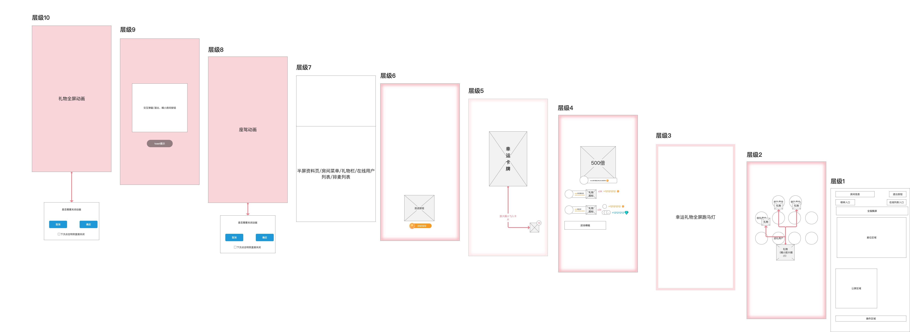

### 4.3 通道治理模型

> 下图表示**并行分流**，不是单选分支。同一业务事件可同时命中多个通道；每个通道独立创建展示项并维护队列、槽位、合并或去重状态。

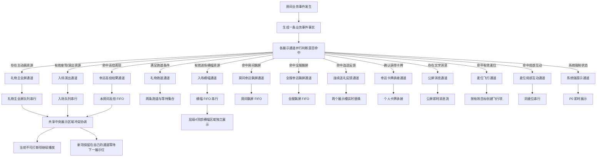

跨通道治理原则：

- 通道是否命中分别判断；一个通道未命中或播放失败，不取消其他已命中的通道。
- 礼物主全屏、入场演出、入场横幅和幸运高倍结果拥有各自队列；
- 房间飘屏、全服飘屏、公屏消息属于四套独立调度单元，不能因为展示位置接近而合并。
- 幸运连送使用固定展示槽和替换规则，不得改成等待队列。
- 入场横幅固定展示在层级4顶部横幅区域，低于层级8座驾入场演出；同一入场事件的横幅与座驾允许并行出现，但各自按自己的队列、时长和结束状态处理。
- P0-P10 只解决冲突顺序；层级10至层级1只解决视觉覆盖顺序。

### 4.3.1 客户端礼物动画实现口径

- 一次批量送礼请求只生成一条本地礼物事件；事件携带本次批量的合计礼物数量和收礼人列表。
- 一条礼物事件进入礼物主全屏通道后，只创建一个全屏播放项；当前播放器默认播放一轮，礼物数量不会自动转换为全屏重复次数。
- 连送按钮每次重新提交当前批量送礼请求；连续点击 N 次才形成 N 个请求和 N 条独立本地事件，之后由礼物主全屏队列逐条消费。
- 礼物跑道固定同时承载两条展示项。同一送礼用户与同一礼物在展示中时累加数量；两条跑道均占用时进入等待集合，同键继续累加。
- 麦位飞行按收礼人列表逐个检查当前麦位，只为有效目标创建飞行项；多收礼人时，全屏不按人数拆分，麦位飞行按有效目标拆分。
- 礼物主全屏、礼物跑道、麦位飞行及幸运各表现通道分别消费同一业务事件；不能用其中一个通道的展示次数替代另一个通道的展示次数。
- 请求数量、业务事件数量、各通道展示项数量、队列项数量和实际播放次数分别计算，不得混为同一指标。

### 4.3.2 事件到展示通道的路由表

| 业务事件 | 可同时命中的展示通道 | 各通道创建条件 | 不得推导的错误关系 |
|---|---|---|---|
| 普通礼物送礼成功 | 礼物主全屏、礼物跑道、麦位飞行、公屏消息 | 分别判断主动画资源、跑道开关、有效麦位和消息规则 | 进入全屏通道不代表跳过跑道或麦位通道 |
| 高单价常规礼物送礼成功 | 礼物主全屏、礼物跑道、麦位飞行、公屏消息 | 与普通礼物相同，主动画在礼物主全屏通道内按 P2 调度 | 高单价只影响主动画调度，不把其他轻量反馈并入主队列 |
| 幸运礼物送礼成功及结果确认 | 礼物主全屏、礼物跑道、麦位飞行、幸运高倍结果、房间/全服幸运飘屏、连续送礼反馈、幸运卡牌承接、公屏消息 | 送礼基础反馈与服务端确认的各幸运表现分别判断；未命中的表现不创建 | “幸运礼物”不是一条万能通道，也不是一个统一等待队列 |
| 用户携带有效座驾/身份资源进房 | 入场演出、入场横幅、公屏普通进房消息 | 分别判断座驾/演出资源、横幅资源和消息规则；同一入场事件可同时创建座驾播放项与横幅播放项 | 横幅与座驾可以同时展示，但不共用播放项、资源或队列；座驾全屏展示不进入礼物主全屏通道 |
| 麦位互动事件 | 麦位局部互动 | 目标麦位有效且存在对应互动表现 | 麦位局部互动不自动等同于礼物飞行落点 |
| 系统强制状态 | 系统强提示 | 命中房间关闭或强制提示状态 | 系统强提示不因层级9低于层级10而被礼物动画遮挡 |

### 4.4 用户确认的十级视觉层级

| 视觉层级 | 该层需要展示的内容 | 关键状态 / 承接关系 | 主要资源映射 |
|---:|---|---|---|
| 层级10 | 礼物全屏动画 | 点击时弹出关闭确认窗口；本地已启用直接关闭时结束当前动画 | 高单价常规礼物主动画、普通全屏礼物主动画 |
| 层级9 | 交互弹窗、退出/缩小房间按钮、Toast 提示、全屏动画关闭确认窗口、系统强提示 | 关闭确认窗口不改变当前动画队列；系统强提示按 P0 抑制其他普通动画 | 交互弹窗与房间操作、Toast提示、系统强提示 |
| 层级8 | 座驾全屏动画、入场信息 | 点击时按关闭确认规则处理；不进入礼物主全屏队列 | 座驾与入场演出 |
| 层级7 | 半屏资料页、房间菜单、礼物栏、在线用户列表、排麦列表 | 五类页面均属于房间操作浮层；关闭后返回层级1房间基础页面 | 半屏资料页、房间菜单、礼物栏、在线用户列表和排麦列表 |
| 层级6 | 连送按钮、连续数量、连送状态反馈、礼物跑道 | 连送按钮是操作入口；数量刷新和 PAG 连送表现是展示反馈，二者共层但资源独立 | 连送按钮、礼物跑道、连续送礼反馈动画反馈 |
| 层级5 | 幸运卡牌、卡牌放大/缩小、卡牌飞入右下入口、卡牌固定入口、个人卡牌页 | 卡牌获得后从大态缩小并飞入右下入口；卡牌入口不放在顶部信息区 | 幸运卡牌获得承接、卡牌固定入口、个人卡牌页 |
| 层级4 | 500 倍等高倍中奖结果、中奖明细、奖励数量与结果说明、入场横幅 | 高倍结果与入场横幅处于层级4的不同展示区域；横幅固定在顶部，不占用座驾中央演出区域；两者各自维护队列 | 幸运礼物高倍结果、进场横幅 |
| 层级2 | 礼物从送礼用户飞向收礼用户、缩放过程、目标麦位落点、麦位局部互动 | 必须先确认目标用户所在麦位；目标失效时不得落到错误麦位 | 麦位礼物飞行动画、麦位落点反馈、麦位局部互动 |
| 层级1 | 房间信息、退出入口、榜单入口、在线列表入口、麦位区域、公屏区域、底部操作区域 | 房间常驻基础页面；上层关闭或播放结束后均回到该层 | 房间底图、动态背景、房间主体、固定信息、基础操作、公屏消息皮肤和公屏消息 |

层级使用边界：

- 层级10到层级1是**页面视觉覆盖顺序**，不是动画播放优先级；不得据此改写 P0-P10 的排队与打断规则。
- 层级5右下卡牌入口与层级6连送按钮分别维护点击、禁用、数量和未读状态；不得因都位于操作区而合并为一个资源。
- 层级3的房间飘屏和全服飘屏分别归属独立通道；层级1公屏文字可以即时出现，不等待、不阻塞层级3-5的幸运表现。
- 层级4高倍结果、层级5幸运卡牌与层级3房间/全服幸运飘屏可以由同一幸运事件触发，但每种表现按事件标识、当前用户和展示范围去重，业务结果始终以服务端确认事实为准。
- 层级4入场横幅与层级8座驾入场演出可由同一入场事件同时触发；横幅固定在顶部横幅区域，座驾占用中央演出区域，二者不因可并行展示而共享队列。
- 层级9系统强提示到来时，可按 P0 暂停、隐藏或结束普通上层动画后展示；不得让礼物全屏动画遮挡房间关闭等强制提示。

### 4.5 资源与责任分配总表

| 资源/动画单元 | 具体资源拆分 | 用户视觉层级 / 页面位置 | 展示范围 | 资源格式 | 队列/并发规则 | 主要责任边界 |
|---|---|---|---|---|---|---|
| 房间底图资源 | 静态背景图、主题背景、房间装饰底图 | 层级1 / 房间最底层 | 当前房间 | 图片 | 常驻，不进入动画队列 | 设计提供底图；客户端挂载；运营配置主题 |
| 房间动态背景资源 | 动态背景、氛围粒子、循环背景 | 层级1 / 房间背景 | 当前房间 | PAG/图片 | 常驻循环，不阻塞业务动画 | 设计制作；客户端循环播放；运营配置开关 |
| 房间主体页面资源 | 房间主体、麦位区、公屏区、操作区布局基座 | 层级1 / 房间主体 | 当前房间 | 页面组件/图片 | 常驻；上层结束后恢复可见 | 客户端页面实现；产品定义区域边界 |
| 房间麦位基础资源 | 麦位卡片、头像、麦克风、上麦状态 | 层级1 / 麦位区域 | 当前房间 | 页面组件/图片 | 承接层级2空间动画；不进入公屏流 | 设计拆状态；客户端定位；测试麦位切换 |
| 公屏消息容器 | 消息列表、文字内容、滚动容器 | 层级1 / 公屏区域 | 当前房间 | 页面组件/文字 | 承接公屏消息通道；独立于房间/全服幸运飘屏通道 | 产品定义排序；客户端渲染；服务端提供事实 |
| 房间固定信息 | 房间名、热度、房主、状态标签 | 层级1 / 顶部房间信息区 | 当前房间 | 图片/配置 | 常驻，局部更新 | 设计拆图；客户端布局；运营配置 |
| 房间基础操作 | 退出、聊天、礼物、榜单、在线列表入口 | 层级1 / 顶部与底部操作区 | 当前用户 | 页面组件/图片 | 常驻；不含连送按钮和卡牌入口 | 客户端交互；产品定义状态；测试可用性 |
| 公屏消息皮肤 | 气泡、消息背景、头像、昵称、等级标识 | 层级1 / 公屏区域 | 当前房间 | 图片/.9图/文字 | 随消息流独立刷新 | 设计提供皮肤；客户端渲染 |
| 麦位礼物飞行动画 | 礼物图标、起点、轨迹、终点、缩放过程 | 层级2 / 送礼用户到目标麦位 | 当前房间 | PAG/VAP/图片序列 | P7；按目标麦位定位 | 客户端定位播放；设计提供轨迹；服务端提供目标 |
| 麦位落点反馈 | 收礼反馈、目标麦位落点特效 | 层级2 / 目标麦位附近 | 当前房间 | PAG/SVGA/PNG | 同麦位串行，不同麦位可并行 | 设计制作；客户端定位；测试边界 |
| 房间幸运飘屏 | 房间范围背景、文案、图标、动效 | 层级3 / 当前房间飘屏区域 | 当前房间 | PAG | 房间幸运飘屏通道：P9；按服务端触发时间升序 FIFO；不进入公屏消息队列 | 服务端返回命中结果与稳定顺序；设计制作；客户端队列 |
| 全服幸运飘屏 | 全服范围背景、文案、图标、动效 | 层级3 / 全服曝光区域 | 命中全服门槛用户 | PAG | 全服幸运飘屏通道：P10；按服务端触发时间升序 FIFO；不与房间飘屏共用队列 | 服务端返回命中结果与稳定顺序；客户端按范围去重 |
| 幸运礼物高倍结果 | 高倍结果、结果明细、奖励数量、说明入口 | 层级4 / 高倍结果区域 | 当前用户/当前房间 | PAG/页面组件 | 幸运高倍结果通道：P4；同一房间按服务端触发时间升序 FIFO；不并行叠放、不后到覆盖先到 | 服务端确认命中高倍表现；客户端展示；测试资产一致性 |
| 幸运卡牌获得承接 | 卡牌放大、缩小、飞入右下入口、完成态 | 层级5 / 卡牌过程区至右下入口 | 当前用户/当前房间可见 | PAG | 幸运卡牌承接通道：独立个人承接，不进入公共全屏队列 | 设计制作；客户端承接；服务端提供获得事实 |
| 卡牌固定入口 | 右下入口、数量角标、未读态、点击态 | 层级5 / 房间右下 | 当前用户 | 页面组件/图片 | 常驻；与连送按钮分离 | 客户端维护入口状态；服务端同步数量 |
| 个人卡牌页 | 卡牌页面、翻转、结果、关闭态 | 层级5 / 当前用户卡牌页 | 当前用户 | 页面组件/PAG | P1；不进入房间公共队列 | 产品定义状态；客户端交互；服务端提供中奖事实 |
| 连送按钮 | 按钮图标、可用/禁用态、冷却态、点击态 | 层级6 / 房间操作区 | 当前用户 | 页面组件/图片 | 操作资源，不进入动画队列 | 产品定义状态；客户端交互；服务端校验可送状态 |
| 礼物跑道 | 礼物图标、用户、数量、累计态、背景 | 层级6 / 连送信息区域 | 当前房间 | 图片/文字 | 礼物跑道通道：P8；两条跑道；同用户同礼物累计 | 客户端累计排队；服务端提供事实 |
| 连续送礼反馈动画反馈 | 连送主体、`xN`、金币/钻石尾部、送礼动效 | 层级6 / 连送按钮附近 | 当前房间 | PAG | 连续送礼反馈通道：P8；不排队，最多2个展示槽；实时取最近触发的2位不同发起方 | 服务端提供确认结果；客户端按用户聚合、刷新与替换 |
| 半屏资料页 | 用户资料、关系与操作项 | 层级7 / 半屏区域 | 当前用户 | 页面组件 | 互斥打开，关闭回层级1 | 产品定义字段；客户端页面交互 |
| 房间菜单 | 房间管理与常用操作 | 层级7 / 房间菜单浮层 | 当前用户 | 页面组件 | 与其他层级7页面互斥 | 产品定义权限；客户端交互 |
| 礼物栏 | 礼物分类、列表、选择与数量 | 层级7 / 底部礼物面板 | 当前用户 | 页面组件 | 打开时覆盖层级1操作区 | 产品定义礼物状态；客户端交互 |
| 在线用户列表 | 在线用户、排序与用户操作 | 层级7 / 半屏列表 | 当前用户 | 页面组件 | 与其他层级7页面互斥 | 服务端提供在线事实；客户端列表展示 |
| 排麦列表 | 排麦用户、顺序与状态 | 层级7 / 半屏列表 | 当前用户 | 页面组件 | 与其他层级7页面互斥 | 服务端提供排麦事实；客户端展示 |
| 座驾与入场演出 | 座驾主动画、身份信息、结束态 | 层级8 / 中央入场演出区域 | 当前房间 | PAG/VAP/图片 | 入场演出通道：P5；独立入场队列；不进入礼物主全屏队列 | 运营配置身份；设计制作；客户端播放 |
| 进场横幅 | 横幅底图、头像、昵称、等级、欢迎语、结束态 | 层级4 / 顶部横幅区域 | 当前房间 | PAG底图或图片底图 + 可替换信息层 | 入场横幅通道：P5；独立横幅 FIFO 串行；同一入场事件可与座驾同时展示；不进入座驾或礼物主全屏队列 | 运营配置横幅资源与展示条件；设计提供底图和信息层规范；客户端维护横幅队列 |
| 交互弹窗与房间操作 | 交互弹窗、退出/缩小房间按钮、关闭特效确认窗口 | 层级9 / 居中弹窗与房间控制区 | 当前用户 | 页面组件 | 普通交互，不进入公共动画队列 | 产品定义触发；客户端交互 |
| Toast提示 | 轻提示文案、出现与消失态 | 层级9 / Toast区域 | 当前用户 | 文字/页面组件 | 短时展示，不阻塞业务动画 | 产品定义文案；客户端展示 |
| 系统强提示 | 房间关闭、强制提示、操作按钮 | 层级9 / 系统强提示区 | 当前房间/当前用户 | 页面组件 | P0；出现时抑制普通上层动画 | 产品定义触发；客户端强提示；服务端提供状态 |
| 高单价常规礼物主动画 | 主体、背景、前景、音效、结束态 | 层级10 / 全屏动画区域 | 当前房间 | PAG/配置格式 | 礼物主全屏通道：P2；完整播放，不被幸运结果打断 | 运营标记档位；设计制作；客户端主队列 |
| 普通全屏礼物主动画 | 主体、结束态 | 层级10 / 全屏动画区域 | 当前房间 | PAG/配置格式 | 礼物主全屏通道：P3；低于高单价常规礼物主动画 | 运营配置；设计制作；客户端排队 |
| 公屏消息 | 中奖文字、图标、普通送礼文案 | 层级1 / 公屏区域 | 当前房间 | 文字/图片 | 公屏消息通道：P10；即时展示，不等待层级3-5幸运表现 | 服务端提供事实；客户端渲染 |

资源分配以具体资源/动画单元为最小交付单元；视觉层级相同不代表使用同一资源或同一队列。同一事件可关联多个资源/动画单元，但格式、展示范围、队列和责任人必须分别配置。
## 5. 核心业务对象

| 对象 | 业务定义 | 关键字段 / 信息 | 主要使用场景 |
|---|---|---|---|
| 房间事件 | 房间内触发动画的原始业务事件 | 事件类型、触发人、目标人、触发时间、房间ID | 统一分流到各动画通道 |
| 礼物事件 | 用户送礼后产生的展示事件 | 送礼人、收礼人、礼物、数量、价值、是否定向、幸运事件标识、表现档位 | 全屏、跑道、麦位、幸运事件 |
| 幸运视觉表现项 | 幸运事件派生出的高倍结果、房间/全服飘屏、连送反馈、卡牌承接或公屏文字记录 | 幸运事件标识、表现类型、展示范围、资源、展示状态、是否已展示 | 各表现项分别进入所属通道并按事件+表现类型+范围去重，不组成统一幸运队列 |
| 展示通道 | 独立承载一类展示调度的消费单元 | 通道类型、当前项/展示槽、FIFO/替换/合并/即时流状态、过期状态 | 分别控制串行、并发、合并、替换和跨通道冲突；并非所有通道都有等待队列 |
| 礼物跑道项 | 跑道内展示的轻量礼物记录 | 用户、礼物、累计数量、展示剩余时间 | 高频送礼累计展示 |
| 全屏播放项 | 需要抢占视觉焦点的礼物动画事件 | 动画资源、优先级、播放时长、关闭状态 | 高单价常规礼物、普通全屏礼物 |
| 入场横幅播放项 | 入场事件在顶部横幅区域的独立展示记录 | 入场事件标识、进房用户、横幅资源、触发时间、展示时长、展示状态、过期状态 | 与座驾播放项并行创建；横幅 FIFO、去重、离房和降级处理 |
| 页面资源项 | 房间页面或个人弹窗中的静态/交互资源 | 资源层级ID、页面位置、展示状态、资源格式、责任角色 | 房间底图、固定入口、公屏、抽卡页面 |
| 资源责任项 | 单个动画或页面资源的交付责任记录 | 资源层级ID、设计责任、客户端责任、服务端事实、运营配置、测试范围 | 资源拆分、联调、验收 |
| 麦位对象 | 房间内可承接局部动画的用户位置 | 麦位编号、用户、是否有人、是否静音/锁定、礼物值 | 定向礼物、局部互动 |
| 特效偏好 | 用户对特效/声音和点击关闭的控制状态 | 是否开启特效、是否开启音效、是否直接关闭全屏动画 | 本地偏好 |

---

## 6. 核心功能需求

### 6.1 座驾入场演出与进场横幅

**通道归属：** 座驾/坐骑/身份演出进入入场演出通道，使用独立入场队列；进场横幅进入独立入场横幅通道，使用独立横幅 FIFO。两者可由同一入场事件并行创建，但不共用资源、播放项或队列。

#### 触发条件

用户携带有效坐骑、座驾、身份演出资源或进场横幅资源进入当前房间时，生成一条入场事件；座驾演出和横幅分别判断是否创建对应播放项。

#### 前置条件

- 用户进入的是当前房间。
- 用户具备可展示的入场资源或身份资源。
- 当前观看用户未关闭对应特效展示。

#### 字段与数据来源

| 字段 | 说明 | 数据来源 |
|---|---|---|
| 进房用户 | 触发入场特效的用户 | 房间进房事件 |
| 座驾演出资源 | 坐骑、座驾或身份演出资源 | 用户装扮/身份配置 |
| 进场横幅资源 | 横幅底图及头像、昵称、等级、欢迎语等信息层规则 | 用户装扮/身份配置与横幅资源配置 |
| 展示范围 | 默认全房间可见 | 房间展示规则 |
| 座驾播放状态 | 空闲、等待、播放中、跳过 | 入场演出通道 |
| 横幅播放状态 | 空闲、等待、展示中、结束、过期、跳过 | 入场横幅通道 |
| 用户特效开关 | 当前观看用户是否允许播放 | 用户本地偏好 |

#### 交互逻辑

**入口与触发**
1. 用户进入房间后，系统生成一条入场事件，并分别判断座驾/身份演出资源与进场横幅资源是否有效。
2. 座驾/身份演出资源有效时，创建入场演出播放项；横幅资源有效时，创建入场横幅播放项。
3. 同一入场事件同时具备两类资源时，两个播放项分别进入各自队列；允许在各自取得展示位后同时出现。
4. 两类资源均不存在或当前观看用户关闭对应特效时，按“入场事件 + 当前房间 + 当前观看端”仅展示一条普通进房消息。

**座驾演出播放处理**
1. 系统判断入场演出通道是否空闲；空闲时播放座驾/身份演出，忙时进入独立入场等待队列。
2. 礼物主全屏动画正在播放时，座驾演出默认等待，不抢占礼物主全屏队列。
3. 用户点击正在播放的座驾全屏动画时，按 9.2 的关闭确认与直接关闭规则处理。

**进场横幅播放处理**
1. 系统判断入场横幅通道是否空闲；空闲时在层级4顶部横幅区域展示，忙时按入场事件触发时间进入独立横幅 FIFO。
2. 横幅 FIFO 只管理横幅项，不占用座驾入场演出队列，也不等待座驾播放结束；同一入场事件的横幅与座驾可以同时展示。
3. 横幅展示期间不遮挡层级8座驾中央演出区域；横幅展示结束后只清理本横幅项，不影响同一事件的座驾播放状态。
4. 横幅不适用座驾全屏动画的点击关闭确认。

#### 业务处理规则

- 座驾/身份演出使用入场演出通道的独立下载队列和入场等待队列；进场横幅使用独立横幅 FIFO。
- 横幅固定在层级4顶部横幅区域，座驾固定在层级8中央演出区域；同一入场事件可同时展示两者，但任何一方的播放次数、结束回调或资源失败不得替代另一方。
- 横幅和座驾均不进入礼物主全屏队列；座驾不覆盖当前高单价常规礼物主动画，横幅不因座驾等待而被迁入座驾队列。
- 两类队列项均必须有过期时间；播放前若进房用户已离开，丢弃该项，不重复生成普通进房消息。

#### 边界情况

| 场景 | 处理规则 |
|---|---|
| 用户快速进出房间 | 若播放前用户已离开，丢弃对应动画项；普通进房消息若已创建则不重复补发。 |
| 多个携带可展示入场资源的用户同时进房 | 座驾演出按入场等待队列串行；横幅按独立横幅 FIFO 串行。两个队列分别按触发时间排序，不互相占位。 |
| 用户关闭特效 | 不播放入场动画，仅保留文字消息。 |
| 全屏礼物正在播放 | 入场特效等待，不打断高单价常规礼物主动画。 |
| 同一用户同时具备座驾与横幅资源 | 为同一入场事件分别创建座驾播放项与横幅播放项；横幅在层级4顶部区域、座驾在层级8中央区域，可同时展示。 |
| 横幅资源失败、超时或用户离房 | 仅清理或降级该横幅项；同一事件的座驾演出及普通进房事实不受影响。 |

---

### 6.2 全屏礼物特效

**通道归属：** 礼物主全屏通道，使用礼物主全屏队列；与礼物跑道、麦位飞行、公屏消息及已命中的幸运轻量表现分别消费同一事件。

#### 触发条件

礼物事件进入全屏消费者且存在有效动画资源时，创建一个全屏播放项。

#### 前置条件

- 礼物事件已成功产生。
- 礼物事件携带有效动画资源地址。
- 当前用户未关闭对应特效展示。
- 当前房间仍处于可展示状态。

#### 字段与数据来源

| 字段 | 说明 | 数据来源 |
|---|---|---|
| 礼物事件 | 一次送礼成功后产生的展示事件 | 本地送礼成功事件或房间实时消息 |
| 礼物数量 | 本次事件的合计礼物数量 | 批量送礼请求的收礼人数 × 单次数量 |
| 收礼人列表 | 本次事件涉及的收礼用户 | 批量送礼请求 |
| 动画资源 | 当前礼物的主动画地址 | 礼物信息 |
| 动画类型 | 是否进入当前客户端礼物动画分支 | 礼物信息 |
| 播放优先级 | 播放项在等待队列中的排序依据 | 礼物事件/客户端队列 |
| 点击关闭方式 | 未启用直接关闭偏好时展示确认窗口；启用后点击直接关闭当前动画 | 本地偏好 |
| 播放重复次数 | 当前播放项实际循环次数 | 当前客户端默认一轮，不由礼物数量自动计算 |

#### 交互逻辑

**事件生成**

1. 用户确认批量送礼。
2. 客户端校验本次总数量对应的消费余额。
3. 批量送礼成功后，若礼物属于当前客户端本地动画分支，则只生成一条礼物事件。
4. 该事件携带合计礼物数量和收礼人列表，不按单个礼物数量拆成多条事件。
5. 用户连续点击连送按钮时，每次重新提交一次批量请求；每次成功后分别生成一条事件。

**播放处理**

1. 客户端读取礼物事件中的动画资源；没有资源时不创建全屏播放项。
2. 当前没有播放项时直接播放；已有播放项时进入等待队列。
3. 所有礼物主全屏播放项按进入队列的顺序先进先出等待；不按高单价或礼物价值插队。
4. 一个播放项只播放一轮；动画结束或播放异常后清理当前项并消费下一项。
5. 播放项支持 PAG、SVGA、VAP 等当前播放器已实现的资源分支，资源加载失败时跳过当前播放项并继续队列。
6. 音效独立于画面播放；关闭音效只停止声音，不改变画面队列。

**点击关闭规则**

1. 用户点击当前全屏礼物或座驾动画时，先读取当前客户端的“下次点击特效直接关闭”本地缓存。
2. 本地缓存未启用时，展示“关闭特效确认窗口”；确认结束当前动画，取消仅关闭确认窗口并继续播放当前动画。
3. 用户勾选“下次点击特效直接关闭”并点击确认时，结束当前动画并将该偏好写入当前客户端本地缓存。
4. 本地缓存已启用时，用户点击当前全屏礼物或座驾动画，直接结束当前动画，不再展示确认窗口。

#### 业务处理规则

- 礼物数量只用于礼物事件、跑道累计和麦位飞行数量分摊；当前客户端不使用礼物数量控制全屏重复播放。
- 一次批量请求与连续点击连送是两个不同的业务场景，后台和测试不得混写。
- 全屏播放项不按收礼人数拆分；收礼人数拆分只发生在麦位飞行通道。
- 全屏播放项与跑道、麦位飞行可以由同一礼物事件分别触发，各自维护展示状态和结束回调。
- 当前客户端常规礼物播放项默认优先级相同并按队列顺序消费；不能仅凭礼物价值字段推断客户端一定产生更高优先级播放项。

#### 边界情况

| 场景 | 处理规则 |
|---|---|
| 一次 `count=N` 批量送礼 | 创建一条本地礼物事件和一个全屏播放项，默认播放一轮，不播放 N 轮。 |
| 连续点击连送 N 次 | 产生 N 个批次、N 次请求和 N 条本地事件，按礼物主全屏队列逐条播放。 |
| 动画资源为空 | 不创建全屏播放项，继续由跑道、麦位或消息通道承接。 |
| 资源下载或播放失败 | 清理当前播放项并消费下一项；是否降级由其他通道实际收到的事件决定。 |
| 用户关闭特效 | 不播放画面，但送礼业务结果和其他未关闭通道按各自规则处理。 |
| 用户关闭音效 | 只关闭声音，画面继续按队列播放。 |
| 用户点击全屏动画 | 未启用直接关闭偏好时展示确认窗口；取消后继续当前播放。 |

---

### 6.3 礼物跑道

**通道归属：** 礼物跑道通道，使用两条展示跑道和等待集合；不进入礼物主全屏队列，可与其他通道并行。

#### 触发条件

礼物事件进入跑道消费者时，按送礼用户和礼物生成合并键；当前客户端同时维护两条跑道。

#### 前置条件

- 礼物事件存在有效送礼用户和礼物信息。
- 礼物不是当前客户端明确排除的关注礼物类型。
- 房间存在礼物跑道展示区域。

#### 字段与数据来源

| 字段 | 说明 | 数据来源 |
|---|---|---|
| 合并键 | 送礼用户 + 礼物 | 礼物消息中的用户与礼物标识 |
| 当前跑道项 | 正在第一或第二跑道展示的礼物 | 客户端跑道状态 |
| 累计数量 | 同合并键事件的数量累加 | 礼物事件数量 |
| 等待项 | 两条跑道都占用时的待展示项 | 客户端等待集合 |
| 展示结束 | 当前跑道动画结束回调 | 跑道展示组件 |

#### 交互逻辑

1. 礼物事件进入跑道消费者。
2. 生成“送礼用户 + 礼物”合并键。
3. 若第一条跑道已经展示相同合并键，直接累加数量并刷新该跑道。
4. 若第二条跑道已经展示相同合并键，直接累加数量并刷新该跑道。
5. 若没有相同合并键且存在空闲跑道，占用空闲跑道展示。
6. 若两条跑道都被占用，将事件放入等待集合；等待集合中相同合并键继续累加。
7. 任一跑道动画结束后清空该跑道，再按等待项进入顺序取下一项。

#### 业务处理规则

- 跑道合并键必须同时包含送礼用户和礼物；不同用户送同一礼物不得合并。
- 跑道展示数量是累计展示数量，不代表全屏播放次数，也不代表请求次数。
- 两条跑道独立维护当前项；等待集合按合并键累计，避免重复排队。
- 跑道与全屏、麦位飞行由同一礼物事件分别触发，任何通道都不能代替其他通道的播放口径。

#### 边界情况

| 场景 | 处理规则 |
|---|---|
| 同一用户连续送同一礼物 | 当前跑道或等待项累计数量，不新增同键展示项。 |
| 不同用户送同一礼物 | 按不同合并键分别展示或排队，不混合数量。 |
| 两条跑道均占用 | 进入等待集合；相同合并键继续累计。 |
| 关注礼物 | 当前跑道消费者不创建跑道项。 |
| 一次批量请求数量较大 | 跑道只累计该事件数量，不按数量创建多条动画。 |

---

### 6.4 幸运礼物表现展示链路

**通道归属：** “幸运礼物”是事件家族，不是单一通道。高倍结果、房间飘屏、全服飘屏、连送反馈、卡牌承接和公屏消息分别进入独立通道。

#### 触发条件

客户端只消费服务端确认的幸运表现命中结果，不本地用中奖倍数、礼物价值或消息到达顺序推导是否展示。除卡牌获得消息外，每个中奖表现元素均在“已确认中奖结果且中奖倍数达到该元素当前配置门槛”时独立命中；卡牌获得动画与公屏消息只以系统确认获得卡牌为条件。

#### 前置条件

- 服务端返回幸运事件标识、已确认结果、命中的表现类型、展示范围、触发时间和稳定事件顺序。
- 当前客户端处于命中的展示范围且本端对应特效未关闭；关闭特效时仍保留文字结果、资产状态和已确认业务记录。

#### 字段与数据来源

| 字段 | 说明 | 数据来源 |
|---|---|---|
| 幸运事件与最终结果 | 送礼事件、中奖倍数、奖励方向、奖励数量、发奖状态 | 服务端确认的幸运结果 |
| 命中表现类型 | 房间/全服飘屏、本房间高倍、连送动画、公屏、卡牌动画等 | 服务端表现命中结果 |
| 展示范围 | 当前房间、全服命中范围、当前用户或房间公屏 | 服务端确认字段 |
| 触发时间与稳定顺序 | 同类队列排序依据；相同时间使用稳定顺序 | 服务端确认字段 |
| 连送聚合信息 | 送礼用户、礼物、收礼对象范围、10 秒窗口、`xN`、已确认金币/钻石尾部 | 已成功受理事件和已确认结果 |

#### 交互逻辑

1. 同一幸运事件可同时命中房间飘屏、全服飘屏、本房间高倍、公屏文字和卡牌/连送等多个表现；每类表现独立消费，互不改写。
2. **房间飘屏**按服务端触发时间升序进入 房间幸运飘屏 FIFO；前一条结束后播放下一条。全服飘屏进入 全服幸运飘屏 独立 FIFO，范围之间互不阻塞。
3. **本房间高倍动画**按服务端触发时间升序进入 幸运礼物高倍结果 队列；同一房间不并行叠放、不以后到动画覆盖先到动画；触发时间相同按服务端稳定事件顺序播放。
4. **连续送礼反馈动画不排队。**当前房间最多同时展示 2 条，实时选择最近触发的 2 位不同发起方；第三位到达时替换触发时间较早的一条，不等待、不补播。
5. 同一送礼用户在当前 10 秒聚合窗口继续连送时，只刷新其原动画的 `xN`、金币/钻石尾部及最近触发时间；不得新增第二条展示位。双边单份事件金币与钻石仍互斥，但同一聚合动画可汇总不同单份事件的两类已确认结果。
6. 房间公屏文字在结果确认后独立展示，不等待飘屏、高倍、连送或礼物主全屏动画；卡牌获得消息不受中奖倍数门槛拦截。
7. 高单价常规礼物主全屏播放中，不打断当前主演出；幸运表现仍按各自资源层、队列和文字降级规则处理。排队、替换、关闭只影响本端可见动效，不影响业务事实。

#### 业务处理规则

- 客户端不生成开奖结果、不本地计算门槛、不预填未确认奖励，也不以礼物数量拆成多个中奖表现。
- 同一表现元素只按事件标识、展示范围和表现类型去重一次；同一事件可生成多个不同表现元素。
- 连送 `xN` 只累计聚合单元内成功受理礼物总份数；金币/钻石尾部只累计对应方向已确认中奖结果，未知、未中奖、发放中的未确认资产不得预填。
- 连送动画结束后迟到结果不得重新拉起或补播；原事件仍按本人结果、公屏、飘屏、资产与历史恢复规则独立承接。
- 动效排队、资源失败、切后台、切房、特效开关、上滑关闭或连送展示位替换，均不得改变受理、开奖、发奖、退款、撤销、补发、历史查询或卡牌状态。

#### 边界情况

| 场景 | 处理规则 |
|---|---|
| 消息未返回命中表现类型 | 不创建对应幸运动效；已确认的本人结果、资产与公屏按各自事实处理。 |
| 多条房间飘屏或高倍动画连续到达 | 按服务端触发时间升序 FIFO；相同时间按稳定事件顺序，不按客户端收包顺序重排。 |
| 飘屏/高倍资源加载失败 | 以文字、倍率、数量和状态降级展示后继续队列；不重排、不重播。 |
| 连送动画第三位用户到达 | 替换当前两条中触发时间较早的一位；被替换项不等待、不补播，原始事件事实照常保留。 |
| 连送动画结束后结果迟到 | 不重开连送动画；更新本人结果、发奖状态、资产和仍可消费的事件级表现。 |
| 用户切房、切后台或关闭特效 | 停止旧房间动效或本端降级；不带入新房间，不影响业务结果与其他端展示。 |
| 卡牌获得动画失败 | 直接刷新卡牌入口数量并给出文字提示；不得重复生成卡牌或再次发卡。 |

---

### 6.5 麦位飞行动效与局部互动

**通道归属：** 麦位飞行通道与麦位局部互动通道。二者均位于层级2，但分别维护飞行项与同麦位局部队列。

#### 触发条件

礼物事件满足麦位飞行分支时，按收礼人列表检查实时麦位，并为每个有效目标创建一条飞行项。

#### 前置条件

- 礼物事件携带送礼用户和收礼人列表。
- 礼物动画类型满足当前客户端麦位飞行分支。
- 目标收礼用户仍在当前房间麦位上。

#### 字段与数据来源

| 字段 | 说明 | 数据来源 |
|---|---|---|
| 送礼用户 | 飞行动画起点用户 | 礼物消息用户信息 |
| 收礼人列表 | 本次事件的目标用户列表 | 批量送礼事件 |
| 实时麦位 | 用户当前所在麦位和坐标 | 房间实时麦位状态 |
| 礼物图片 | 飞行项使用的礼物图 | 礼物信息 |
| 飞行时长 | 单条飞行项的展示时长 | 当前客户端播放规则 |
| 飞行项数量 | 当前飞行项展示的礼物数量 | 服务端返回的该收礼人实际分配数量 |

#### 交互逻辑

1. 客户端收到礼物事件并读取送礼用户、收礼人列表和动画类型。
2. 若动画类型不满足当前麦位飞行分支，直接结束本通道处理。
3. 查找送礼用户当前麦位；送礼用户不在麦位时，起点使用观众位置。
4. 遍历收礼人列表，逐个查找其当前麦位。
5. 只有找到有效收礼麦位时，才创建一条飞行项。
6. 每条飞行项从送礼用户或观众位置，经房间中心位置，沿抛物线飞向目标麦位，单条飞行时长约 1 秒。
7. 多收礼人场景按有效目标创建多条飞行项；每条飞行项展示服务端返回的该目标实际分配数量。无效麦位不创建飞行项，但其分配数量不得转给其他目标。
8. 飞行项结束后移除；全部飞行项结束后清空当前飞行状态。

#### 业务处理规则

- 麦位飞行按有效收礼麦位拆分，不按全屏播放项拆分。
- 目标用户已下麦或不在当前房间麦位时，不创建错误落点；全屏或跑道是否展示由其他消费者独立决定。
- 多收礼人时，全屏仍是一条播放项；麦位飞行项数量与全屏播放次数不能互相替代。
- 当前客户端代码只实锤飞行项和落点路径，不应额外写成“飞行结束后必然进入麦位局部互动队列”，除非另有独立代码证据。

#### 边界情况

| 场景 | 处理规则 |
|---|---|
| 目标收礼人不在麦位 | 不创建该目标的飞行项。 |
| 送礼用户不在麦位 | 起点使用观众位置，仍可飞向有效收礼麦位。 |
| 多收礼人 | 按有效收礼麦位分别创建飞行项；全屏不按人数拆分。 |
| 收礼人列表为空 | 不创建麦位飞行项。 |
| 礼物数量无法平均分配 | 不创建该目标飞行项，不重分其服务端已分配数量。 |

---

## 7. 优先级规则

### 7.1 动画优先级总表

| 优先级 | 事件类型 | 用户视觉层级 | 正式通道 | 点击关闭处理 | 说明 |
|---:|---|---|---|---|---|
| P0 | 系统强提示页面 | 层级9 | 系统强提示通道 | 否 | 可暂停、隐藏或结束其他普通动画后展示；视觉层级与调度优先级分开。 |
| P1 | 个人卡牌页 | 层级5 | 当前用户卡牌页面 | 否 | 个人页面独立展示，不进入房间公共动画队列。 |
| P2 | 高单价常规礼物主动画 | 层级10 | 礼物主全屏通道 | 确认关闭/直接关闭 | 当前演出不被幸运表现打断。 |
| P3 | 普通全屏礼物主动画 | 层级10 | 礼物主全屏通道 | 确认关闭/直接关闭 | 在礼物主全屏通道内排在高单价常规礼物之后。 |
| P4 | 幸运礼物高倍结果 | 层级4 | 幸运高倍结果通道 | 按表现类型 | 按房间 FIFO；不进入礼物主全屏队列。 |
| P4 | 幸运卡牌获得承接 | 层级5 | 幸运卡牌承接通道 | 按表现类型 | 只按确认获得事实承接；不进入房间公共动画队列。 |
| P5 | 座驾入场 / 入场特效 | 层级8 | 入场演出通道 | 确认关闭/直接关闭 | 独立入场队列，不归礼物主全屏队列。 |
| P5 | 进场横幅 | 层级4 | 入场横幅通道 | 不适用 | 独立横幅 FIFO；排序、过期和离房处理参考座驾入场演出，但不共用入场演出队列；同一入场事件可与座驾同时展示。 |
| P6 | 麦位局部互动 | 层级2 | 麦位局部互动通道 | 不适用 | 同麦位串行，不同麦位可并行。 |
| P7 | 麦位礼物飞行 / 落点 | 层级2 | 麦位飞行通道 | 不适用 | 按有效收礼麦位创建飞行项。 |
| P8 | 礼物跑道 | 层级6 | 礼物跑道通道 | 不适用 | 两条跑道；同用户同礼物累计。 |
| P8 | 连续送礼反馈反馈 | 层级6 | 连续送礼反馈通道 | 不适用 | 不排队；最多2个展示槽；第三位发起方替换较早项。 |
| P9 | 房间幸运飘屏 | 层级3 | 房间幸运飘屏通道 | 上滑仅关闭本端当前项 | 按服务端触发时间 FIFO；不进入公屏消息流。 |
| P10 | 全服幸运飘屏 | 层级3 | 全服幸运飘屏通道 | 按表现类型 | 独立全服 FIFO；不阻塞房间飘屏。 |
| P10 | 公屏消息 | 层级1 | 公屏消息通道 | 不适用 | 结果确认后即时进入消息流，不等待任何动画。 |

> P0-P10 决定冲突时的处理顺序，**P 数值越小，调度优先级越高**；它不等于层级10-1的页面 z 轴。更高调度优先级事件可以先抑制其他动画，再在其确认的视觉层级展示。

### 7.2 插队与打断规则

| 当前状态 | 新到通道 / 事件 | 处理规则 |
|---|---|---|
| 礼物主全屏通道正在播放 | 入场演出通道新项 | 当前礼物主动画继续；座驾/入场项进入独立入场队列等待，不进入或抢占礼物主全屏队列。 |
| 同一入场事件的座驾与横幅均已取得展示位 | 入场横幅通道新项 | 横幅在层级4顶部横幅区域展示，座驾继续在层级8中央区域展示；两者同时可见，不合并为同一播放项。 |
| 入场横幅通道正在展示 | 座驾入场演出通道新项 | 横幅继续按自身时长展示；座驾按入场演出通道规则取得中央演出展示位，二者不互相打断。 |
| 入场演出通道正在播放 | 幸运高倍结果通道新项 | 当前入场演出继续；高倍结果保留在高倍 FIFO，当前入场演出结束后再取得共享区域展示位。 |
| 高单价常规礼物主动画正在播放 | 幸运高倍结果通道新项 | 不打断当前礼物演出；公屏文字可先展示，高倍结果保留在自身 FIFO，当前演出结束后播放。 |
| 幸运高倍结果正在播放 | 高单价常规礼物主动画到来 | 不截断已开始的高倍结果；当前结果结束后，高单价礼物在礼物主全屏通道取得下一共享展示位。 |
| 普通全屏礼物正在播放 | 幸运高倍结果通道新项 | 不强制打断已开始的普通礼物；高倍结果在自身 FIFO 等待当前中央演出结束。 |
| 任一主全屏/入场/高倍结果正在播放 | 房间飘屏、全服飘屏、幸运连送或公屏消息到来 | 各通道按自己的层级、FIFO、展示槽或即时消息流并行，不进入中央演出队列。 |
| 任一主全屏动画正在播放 | 礼物跑道或麦位动效到来 | 跑道与麦位通道按自身规则并行，不等待主全屏队列。 |
| 礼物主全屏队列已有等待项 | 高单价常规礼物主动画到来 | 按进入礼物主全屏队列的顺序等待；不截断当前不可打断项，也不按礼物价值插队。 |
| 任意普通动画正在展示 | 系统强提示到来 | 系统强提示按 P0 展示，可抑制普通动画；不得因礼物位于层级10而遮挡层级9强提示。 |

跨通道冲突只决定“谁先获得共享展示区域”，不会把新项迁移到另一个通道，也不会改写该事件在公屏、跑道、麦位、飘屏或资产侧的事实。

## 8. 相同礼物并发处理规则

### 8.1 总原则

| 通道 | 同用户同礼物连续触发 | 不同用户同礼物连续触发 | 调度规则 |
|---|---|---|---|
| 礼物主全屏通道 | 每条礼物事件创建一个播放项；数量不转为重复播放 | 每条事件独立排队 | 在礼物主全屏队列串行消费。 |
| 幸运高倍结果通道 | 同一事件+表现类型+范围只消费一次 | 不同事件按服务端触发时间 FIFO | 不并行叠放，不以后到覆盖先到。 |
| 房间幸运飘屏通道 | 同一事件+房间范围只消费一次 | 不同事件按服务端触发时间 FIFO | 只在房间飘屏队列排队。 |
| 全服幸运飘屏通道 | 同一事件+全服范围只消费一次 | 不同事件按服务端触发时间 FIFO | 只在全服飘屏队列排队，不阻塞房间队列。 |
| 连续送礼反馈通道 | 同一用户在10秒同礼物同收礼范围内聚合刷新 | 最多展示最近触发的2位不同发起方 | 不排队；第三位发起方替换较早展示项，不补播。 |
| 幸运卡牌承接通道 | 同一卡牌获得事实只承接一次 | 不同用户仅在各自客户端承接 | 独立个人承接，不进入公共动画队列。 |
| 入场横幅通道 | 同一入场事件只创建一个横幅播放项 | 不同入场事件按触发时间 FIFO | 独立横幅 FIFO 串行；与座驾演出队列独立，可同时展示。 |
| 礼物跑道通道 | 同用户同礼物累计数量 | 不同用户分开展示 | 两条跑道；等待集合按同键继续累计。 |
| 麦位飞行通道 | 按有效收礼麦位拆分飞行项 | 不同目标分别创建 | 不代替礼物主全屏或跑道展示项。 |
| 麦位局部互动通道 | 同麦位同动画类型串行，不累计业务数量 | 不同麦位可并行 | 只控制局部视觉冲突。 |
| 公屏消息通道 | 按消息规则展示，不与动画合并 | 按消息流排序 | 结果确认后即时展示。 |

### 8.2 合并与去重定义

| 展示对象 | 合并 / 去重依据 | 处理方式 | 说明 |
|---|---|---|---|
| 跑道展示项 | 送礼用户 + 礼物 | 允许累计 | 同一个人连续送同一个礼物时刷新当前跑道数量。 |
| 跑道等待项 | 送礼用户 + 礼物 | 允许累计 | 等待中继续累计，减少重复项。 |
| 礼物主全屏播放项 | 不合并 | 每事件一项 | 保留每条礼物事件对应的一轮主动画。 |
| 幸运高倍结果项 | 幸运事件 + 高倍表现类型 + 房间范围 | 只去重，不合并 | 重复推送恢复原状态，不新建第二项。 |
| 房间幸运飘屏项 | 幸运事件 + 房间飘屏类型 + 房间范围 | 只去重，不合并 | 只进入房间飘屏 FIFO。 |
| 全服幸运飘屏项 | 幸运事件 + 全服飘屏类型 + 全服范围 | 只去重，不合并 | 只进入全服飘屏 FIFO。 |
| 连续送礼反馈项 | 送礼用户 + 礼物 + 10秒窗口；收礼方不参与槽位键 | 允许聚合刷新 | 使用两个展示槽，不建立等待队列。 |
| 幸运卡牌承接项 | 幸运事件 + 卡牌获得事实 + 当前用户 | 只去重，不合并 | 动画失败只刷新入口，不重复发卡。 |
| 入场横幅播放项 | 入场事件 + 当前房间 + 当前观看端 | 只去重，不合并 | 同一事件只进入一次横幅 FIFO；与同事件座驾播放项独立。 |
| 麦位局部互动项 | 目标麦位 + 动画类型 | 只串行，不累计 | 保证目标麦位反馈清楚。 |
| 公屏消息项 | 消息事件标识 | 只去重，不参与动画合并 | 不等待任何动画通道。 |

### 8.3 并发流程

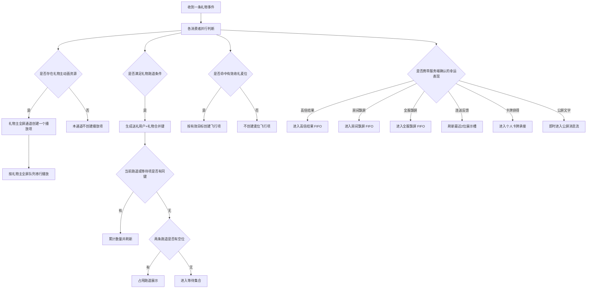

> 四组判断相互独立。礼物主全屏未命中或失败，不代表跑道、麦位或幸运表现不处理；反之亦然。

### 8.4 高单价常规礼物与各幸运表现并发矩阵

| 当前展示项 | 新到通道 / 表现 | 处理规则 |
|---|---|---|
| 高单价常规礼物主动画 | 幸运高倍结果通道新项 | 当前礼物完整播放，不打断；高倍结果保留在自身 FIFO，公屏文字可先展示。 |
| 幸运高倍结果动画 | 高单价常规礼物主动画 | 当前高倍结果不截断；结束后高单价礼物取得下一中央展示位。 |
| 普通全屏礼物 | 幸运高倍结果通道新项 | 不强制打断已开始的普通礼物；高倍结果等待当前中央演出结束。 |
| 礼物主全屏 / 入场 / 高倍结果 | 房间幸运飘屏 | 房间飘屏在层级3按独立 FIFO 展示，不进入中央演出队列。 |
| 礼物主全屏 / 入场 / 高倍结果 | 全服幸运飘屏 | 全服飘屏在层级3按独立全服 FIFO 展示，不阻塞房间飘屏。 |
| 礼物主全屏 / 入场 / 高倍结果 | 连续送礼反馈 | 使用层级6两个展示槽实时刷新或替换，不排队。 |
| 任意动画 | 公屏消息 | 公屏文字独立即时展示，不等待、不阻塞动画。 |
| 任意公共动画 | 幸运卡牌承接 | 当前用户独立承接；动画失败时刷新卡牌入口，不进入公共队列。 |
| 幸运高倍结果等待超过配置时长 | 无 | 降级为该事件已具备资格的文字结果或轻提示；不得由等待失败新增房间/全服飘屏资格。 |

> 规则核心：高单价常规礼物保障付费演出完整性；每种幸运表现按自己的通道保障结果可见性。冲突只协调共享区域，不合并队列、不改写业务事实。

## 9. 用户控制能力

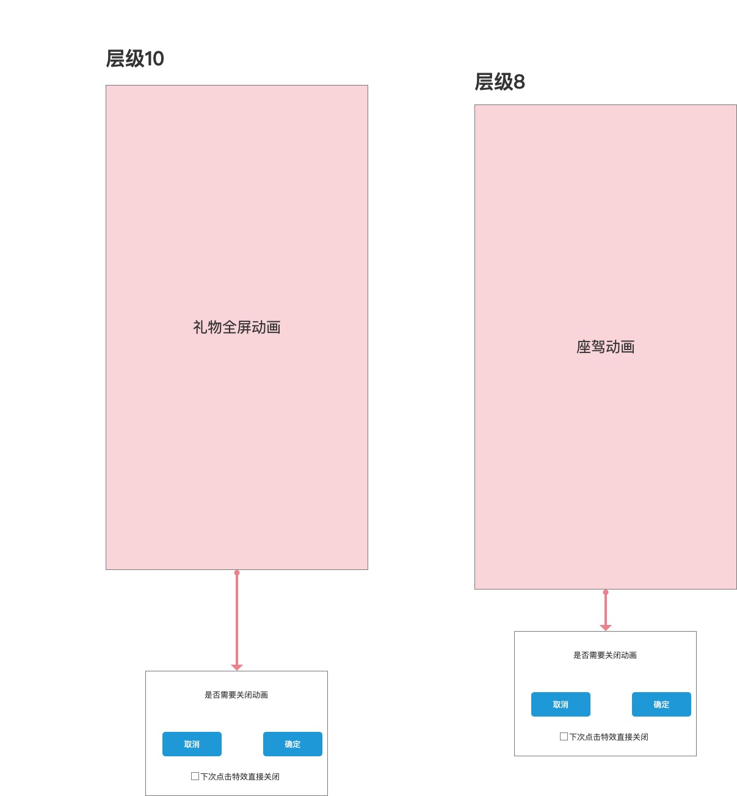

### 9.1 特效开关

| 控制项 | 控制范围 | 关闭后表现 |
|---|---|---|
| 礼物动画开关 | 礼物主全屏通道与幸运高倍结果通道 | 不播放对应礼物动画；跑道、公屏、房间/全服飘屏按各自开关保留。关闭开关不合并队列，也不改变既定冲突顺序。 |
| 座驾动画开关 | 座驾/身份入场演出通道 | 不播放对应座驾或身份入场演出；入场横幅与普通进房消息按各自规则处理。 |
| 幸运礼物飘屏开关 | 房间、全服幸运礼物飘屏 PAG 动画 | 不播放本端幸运礼物飘屏，保留本人结果、公屏文字及资产状态。 |
| 音效开关 | 礼物音效、入场音效 | 仅关闭声音，不影响画面。 |
| 跑道展示开关 | 礼物跑道 | 可降级为聊天区送礼消息。 |
| 麦位局部动效开关 | 飞行动画、局部互动 | 不影响礼物值变化。 |

### 9.2 全屏动画关闭确认

#### 适用范围

礼物全屏动画和座驾全屏动画。

#### 交互规则

| 规则项 | 处理规则 |
|---|---|
| 首次点击动画 | 本地未启用“下次点击特效直接关闭”时，弹出关闭特效确认窗口。 |
| 确认 | 关闭确认窗口并结束当前动画播放项；队列继续消费下一项。 |
| 取消 | 仅关闭确认窗口；当前动画继续播放。 |
| 勾选直接关闭 | 用户勾选“下次点击特效直接关闭”并点击确认时，将偏好写入当前客户端本地缓存，同时结束当前动画。 |
| 后续点击动画 | 本地缓存已启用时，直接结束当前动画，不再弹出确认窗口。 |

#### 边界情况

| 场景 | 处理规则 |
|---|---|
| 动画播放结束前未点击 | 按原播放生命周期结束并继续队列。 |
| 确认窗口展示时动画自然结束 | 关闭确认窗口，不再执行关闭动作。 |
| 本地已启用直接关闭时新动画到达 | 新动画取出播放后，点击直接结束该新动画；不继承已关闭动画的状态。 |
| 切换房间或销毁页面 | 关闭当前动画和确认窗口；不跨房间延续播放。 |

## 10. 状态设计

### 10.1 礼物主全屏通道状态

> 下列状态只描述礼物主全屏队列。座驾/入场演出在独立入场通道维护同类播放生命周期；二者仅共用点击关闭确认规则，不共用队列状态。

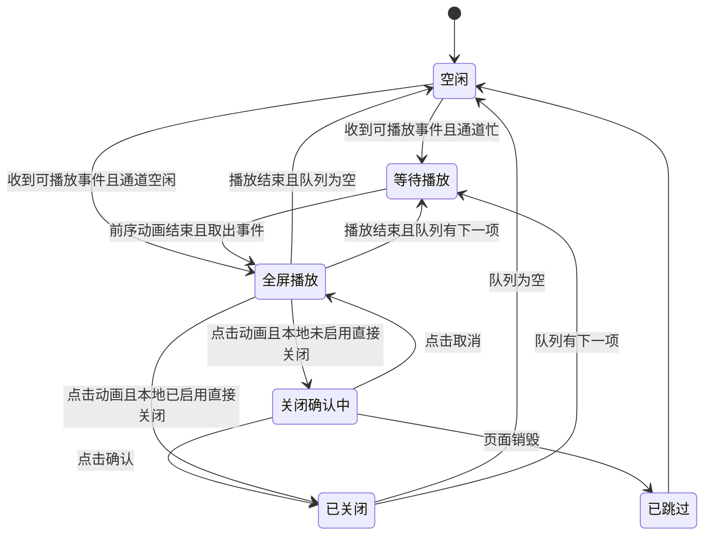

### 10.2 跑道展示状态

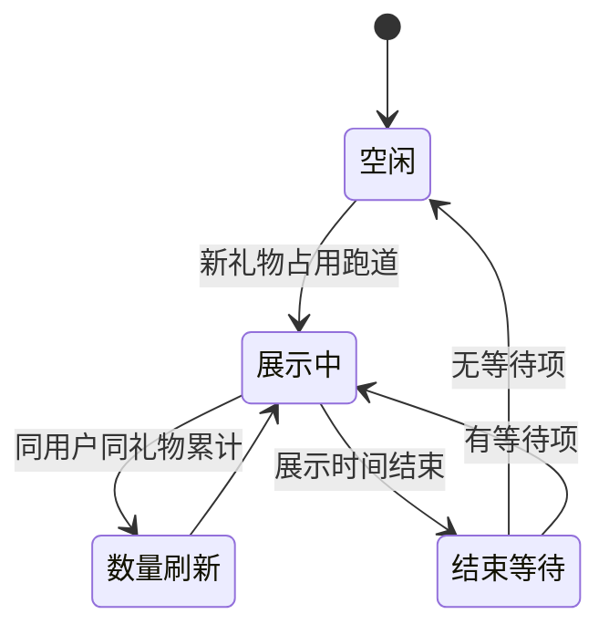

### 10.3 麦位飞行通道状态

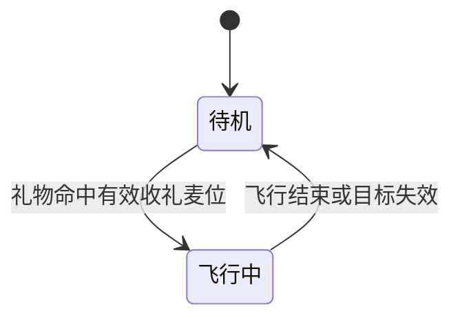

### 10.4 麦位局部互动通道状态

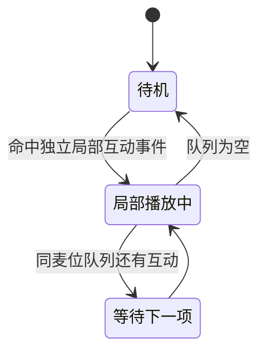

---

## 11. 配置需求

### 11.1 礼物展示配置

| 配置项 | 说明 | 是否必填 | 默认值 |
|---|---|---:|---|
| 礼物价值档位 | 用于配置礼物展示档位；客户端实际是否创建播放项以礼物事件、动画资源和各消费者分流为准 | 是 | 按礼物配置 |
| 全屏资源 | 礼物主动画资源；有资源且事件进入全屏消费者时创建播放项 | 否 | 无 |
| 跑道展示开关 | 是否进入跑道 | 是 | 开启 |
| 麦位落点开关 | 是否触发麦位飞行 | 否 | 按礼物类型配置 |
| 局部互动资源 | 麦位局部播放资源 | 否 | 无 |
| 音效资源 | 播放时使用的声音资源 | 否 | 无 |
| 幸运礼物全屏动画资源 | 幸运礼物结果进入全屏/高倍展示时使用的资源；统一为 PAG 格式 | 按幸运礼物表现档位配置 | 无 |
| 连续送礼反馈动画资源 | 幸运礼物连续送礼时的送礼飘窗/连送表现资源；统一为 PAG 格式 | 可连送幸运礼物必填 | 无 |
| 幸运礼物房间飘屏资源 | 幸运礼物房间飘屏使用的资源；统一为 PAG 格式 | 命中房间飘屏档位时必填 | 无 |
| 幸运礼物全服飘屏资源 | 幸运礼物全服飘屏使用的资源；统一为 PAG 格式 | 命中全服曝光档位时必填 | 无 |
| 公屏消息模板 | 幸运中奖、金币/钻石/卡牌和普通送礼文字消息模板 | 结果或消息事件触发时必填 | 默认模板 |
| 优先级 | 动画队列排序依据 | 是 | 普通 |
| 点击关闭确认 | 全屏动画点击时是否展示关闭确认窗口；是否跳过确认由本地偏好决定 | 是 | 展示确认窗口 |

### 11.1.1 资源级配置与责任拆分规则

- 房间麦位基础资源（层级1麦位区域）与 公屏消息容器（层级1公屏区域）必须分别配置和验收；不得因同处房间基础页面而合并成“房间主体资源”。
- 麦位礼物飞行动画、麦位落点反馈和麦位局部互动统一在层级2完成送礼用户到收礼用户麦位的飞行、缩放、落点与局部互动；公屏消息固定写入层级1公屏区域；房间幸运飘屏固定进入层级3房间飘屏区域。
- 连送按钮与卡牌固定入口分别位于层级6和层级5，必须独立维护可用、禁用、数量、未读和点击状态。
- 房间/全服幸运飘屏、幸运礼物高倍结果和幸运卡牌获得承接可由同一幸运事件触发，但分别进入房间飘屏、全服飘屏、高倍结果和卡牌承接通道；资源、展示范围、去重记录和失败降级分别配置。
- 房间幸运飘屏、全服幸运飘屏和幸运礼物高倍结果必须消费服务端触发时间与稳定顺序：房间/全服飘屏分别按展示范围 FIFO，高倍结果按房间 FIFO；客户端不得按收包时间重排。
- 连续送礼反馈动画反馈必须配置为“不排队、最多2位不同发起方”；同一用户只刷新原聚合动画，第三位发起方替换触发时间更早的展示项。

- 每个资源配置必须关联唯一的资源/动画单元；一个资源/动画单元只代表一个动画单元或一个页面资源单元。
- 动画主体、背景、前景、音效、文案模板、用户信息层、数量角标、结束态需要分别说明是否为独立资源；不能默认打成一个不可拆分资源包。
- 页面资源与动画资源分开配置：房间底图、固定信息、礼物入口、公屏消息、卡牌入口、抽卡弹窗不能挂到礼物全屏动画配置下。
- 房间飘屏与公屏消息必须分别配置展示位置、展示范围、队列、开关、降级方式和责任角色。
- 每个资源配置至少明确：资源格式、加载失败降级、展示时长、是否可并行、是否可打断、去重范围、责任角色和验收场景。
- 优先级必须按 P0-P10 显式配置：P0 系统强提示、P1 个人卡牌页、P2 高单价常规礼物、P3 普通全屏礼物、P4 幸运高倍结果/卡牌承接，其余通道按优先级表执行；不得由资源格式或文件名隐式推断。
- 同一业务事件关联多个资源层级时，服务端只负责提供业务事实和展示范围；客户端分别消费对应资源，不得把一次事件合并成一个无法拆分的播放项。

### 11.2 通道配置

| 展示通道 | 调度模型 | 并发 / 槽位 | 合并或去重依据 | 等待、过期或展示时长 | 资源失败承接 |
|---|---|---|---|---|---|
| 礼物主全屏通道 | 优先级队列串行 | 同时1个主播放项 | 不合并；每条礼物事件一个播放项 | 队列最大长度与动画展示时长按物料；阈值暂定 15 秒 | 结束失败项并继续队列；其他已命中通道独立处理 |
| 入场演出通道 | 独立入场队列串行 | 同时1个入场演出 | 不合并；播放前校验用户仍在房间 | 动画展示时长按物料；阈值暂定 15 秒 | 降级为普通进房消息 |
| 入场横幅通道 | 独立横幅 FIFO 串行 | 同时1个顶部横幅项 | 入场事件+当前房间+当前观看端去重；不合并 | 展示时长与动画展示时长按物料；阈值暂定 15 秒；播放前校验用户仍在房间 | 降级为普通进房消息；不影响同一事件座驾播放项 |
| 礼物跑道通道 | 两条跑道+等待集合 | 跑道数量2 | 送礼用户+礼物 | 动画展示时长按物料；阈值暂定 15 秒；同键累计时延长 | 保留该事件原有公屏送礼消息 |
| 幸运高倍结果通道 | 房间 FIFO | 同时1个高倍结果 | 事件+高倍表现类型+范围 | 动画展示时长按物料；阈值暂定 15 秒 | 降级为倍率、数量和状态文字/轻提示 |
| 全服幸运飘屏通道 | 全服范围 FIFO | 同时1个全服飘屏项 | 事件+全服飘屏类型+全服范围 | 动画展示时长按物料；阈值暂定 15 秒 | 保留该事件原有结果承接，不重复公共曝光 |
| 连续送礼反馈通道 | 固定槽位实时替换 | 2个展示槽，无等待队列 | 用户+礼物+10秒窗口；收礼方不参与槽位键 | 第三位到达时替换较早项；不补播 | 停止动效，保留结果、公屏与资产状态 |
| 幸运卡牌承接通道 | 当前用户独立承接 | 当前用户1个承接过程 | 事件+卡牌获得事实+当前用户 | 不进入公共等待队列 | 刷新卡牌入口并展示文字提示 |
| 公屏消息通道 | 即时消息流 | 按公屏容器能力 | 消息事件标识 | 不等待动画 | 使用基础文字消息 |
| 麦位飞行通道 | 按有效目标创建并行项 | 不同有效目标可并行 | 事件+目标麦位 | 单条约1秒；目标失效立即跳过 | 不创建错误落点 |
| 麦位局部互动通道 | 同麦位串行 | 不同麦位可并行 | 目标麦位+动画类型 | 展示时长按互动资源 | 跳过失败项，不影响其他麦位 |
| 系统强提示通道 | P0 即时处理 | 同时按系统状态展示 | 系统状态事件 | 不进入普通等待队列 | 使用可操作基础提示，不得被普通动画遮挡 |

通道配置边界：

- 资源格式只决定资源如何加载，不决定通道归属、队列或优先级。
- 同一业务事件命中多个通道时，各通道分别记录展示状态；一个通道关闭、失败或过期不改写其他通道。
- 未命中房间飘屏、全服飘屏条件的事件，不得因其他动画加载失败而获得新的公共曝光资格。

### 11.3 用户偏好配置

| 配置项 | 说明 | 默认值 |
|---|---|---|
| 是否开启全屏特效 | 控制礼物主全屏通道的高单价/普通礼物主动画，以及幸运高倍结果通道 | 开启 |
| 是否开启音效 | 控制动画声音 | 开启 |
| 是否开启跑道展示 | 控制礼物跑道 | 开启 |
| 是否开启麦位局部动效 | 控制麦位飞行和局部互动 | 开启 |
| 下次点击特效直接关闭 | 勾选确认后写入本地缓存；后续点击礼物/座驾全屏动画直接关闭 | 关闭 |

### 11.4 动画格式改造明细

#### 11.4.1 逐项改造明细

| 业务物料项 | 目标格式 | 改造明细 |
|---|---|---|
| 头像框 | PAG 优先；SVGA / PNG / WebP 兼容 | 动态头像框改为 PAG 资源；需要循环播放的头像框标记循环属性；旧图片头像框作为静态降级资源保留。 |
| 麦位声浪 / 说话波纹 | PAG | 声浪独立为麦位物料，不并入头像框；旧 WebP 波纹需改成 PAG 声浪动画，配置触发条件为用户开麦/说话/音量变化。 |
| 进场座驾 / 坐骑 | PAG / VAP(mp4) / SVGA | 大面积进场动画优先改为 PAG 、 VAP(mp4)；如资源需要透明通道或视频表现，使用 VAP；如需要图层替换，使用 PAG。 |
| 进场特效横幅 | PAG 底图或图片底图 + 信息层 | 横幅独立于座驾动画，固定在层级4顶部横幅区域；底图可用 PAG 或图片，头像、昵称、等级、欢迎语保持为可替换信息层；进入独立横幅 FIFO，可与同一入场事件的层级8座驾演出同时展示。 |
| 聊天气泡 | `.9.png` / 图片背景 + 边距/颜色配置 | 气泡按左右气泡、九宫格背景、内边距、文字颜色拆字段；不作为动画播放器处理。 |
| 房间/派对背景 | 图片；动态背景另定 PAG / MP4 能力 | 静态背景保留图片格式；如需要动态背景，单独配置动态背景资源，不混入礼物或进场动画队列。 |
| 房间框 | 图片 / PAG | 普通房间框保持图片；需要动态边框时改为 PAG，并明确挂载位置、展示层级和循环方式。 |
| 礼物全屏主动画 | PAG / VAP(mp4) / SVGA | 高单价常规礼物主动画改为 PAG 或 VAP；中轻量复杂礼物可用 SVGA；旧 WebP 仅做降级或低价值轻动画。 |
| 礼物跑道 | 图片 + 文案 + 用户信息配置 | 跑道不是全屏动画；旧图片资源拆成礼物图标、用户头像、数量、累计态、展示文案和背景配置。 |
| 幸运礼物高倍结果动画 | PAG | 命中本房间高倍表现时统一使用 PAG；进入幸运高倍结果通道的房间 FIFO，可复用中央展示区域但不进入礼物主全屏队列。 |
| 连续送礼反馈动画 | PAG | 连送送礼飘窗、连续数量刷新及对应送礼动效统一使用 PAG；展示可按同送礼人、同礼物、同收礼范围累计，但每份中奖事件独立保留。 |
| 幸运礼物房间飘屏 | PAG | 统一使用 PAG；进入房间幸运飘屏通道的独立 FIFO，不进入公屏消息队列。 |
| 幸运礼物全服飘屏 | PAG | 统一使用 PAG；进入全服幸运飘屏通道的独立 FIFO，仅按全服曝光门槛分发；同一事件在同一客户端、同一展示范围只播放一次对应档位。 |
| 礼物飞行 / 麦位飞行动效 | PAG / VAP / 图片序列 | 飞行轨迹作为独立物料配置，需定义起点、终点、目标麦位、播放时长和与全屏动画的先后关系。 |
| 麦位局部落点特效 | PAG / SVGA / PNG | 命中麦位后的局部反馈改为 PAG / SVGA；轻量静态效果可用 PNG；需要支持同麦位串行、不同麦位并行。 |
| 麦位互动表情 | PNG / SVGA / PAG / 内置互动 PAG | 普通表情保留 PNG；复杂表情改 SVGA / PAG；石头剪刀布、骰子、老虎机等玩法使用内置互动 PAG。 |
| VIP / 勋章动效 | PAG / 图片，支持图层替换 | VIP 背景、勋章展示可改为 PAG；如涉及用户等级、头像、昵称等动态内容，需要按图层替换字段配置。 |
| 活动入口 / 充值活动动效 | PAG / WebP | 活动入口主推 PAG 轻动效；WebP 仅做兼容展示；入口动效不进入礼物主全屏队列。 |
| 靓号徽章 | PAG / PNG + 颜色配置 | 靓号需要拆成号码颜色和徽章资源；动态徽章用 PAG，普通徽章用 PNG。 |

#### 11.4.2 落地要求

1. 后台配置动画物料时，必须选择具体业务物料项，再展示对应可选格式；不要直接给一个“动画格式”下拉框让运营乱填。
2. 每个物料项都要配置**主格式、降级格式、播放位置、播放层级、循环方式、触发条件、展示时长**。
3. Android 旧包资源迁移时，必须逐条标记“保留 / 转 PAG / 转 SVGA / 转 VAP / 仅降级 / 废弃”，并给出对应的新资源上传要求。
4. 客户端播放层按 Stay Flutter 能力识别资源，不再用 Android 旧包类名判断格式；尤其不能因为旧类名包含 SVGA 就直接按 SVGA 处理。
5. PRD、后台字段和资源验收表必须使用同一套格式口径，避免产品文档写 PAG，后台配置仍写 WebP/MP4，客户端又按旧包逻辑播放。

---

## 12. 业务流程图

### 12.1 房间幸运礼物动画总流程

- 一次批量送礼成功后，客户端先形成一条礼物事件；事件中的合计数量不直接转换成全屏重复次数。
- 同一礼物事件由各展示通道并行判断；全屏、跑道、麦位和幸运各表现的展示项数量分别计算。
- “幸运礼物”不是单一通道；客户端只消费服务端确认的各具体表现，不在本地增加二次结果生成流程。

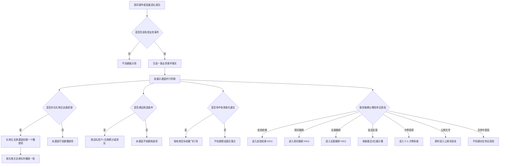

> 每条分支只控制自己的展示项。某一分支未命中、关闭或加载失败，不会取消其他已命中分支，也不会自动生成新的公共曝光分支。

### 12.2 礼物主全屏通道流程

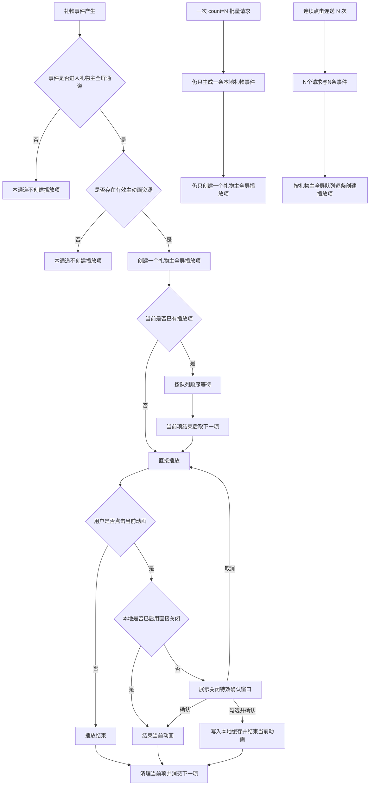

> 礼物主全屏通道只描述礼物主动画。座驾/入场演出属于独立入场演出通道，不进入本流程的礼物主全屏队列。

### 12.3 跑道合并流程

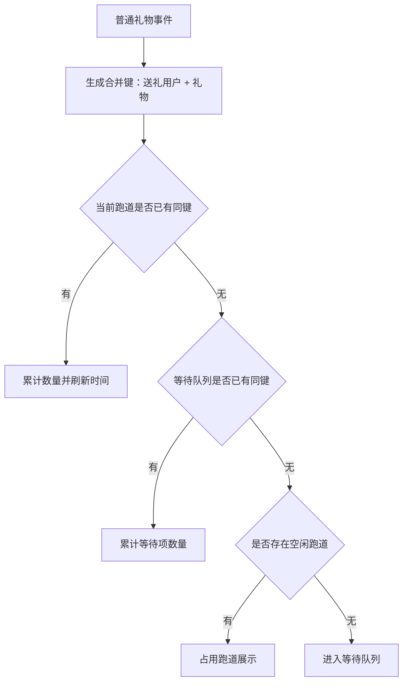

### 12.4 麦位飞行流程

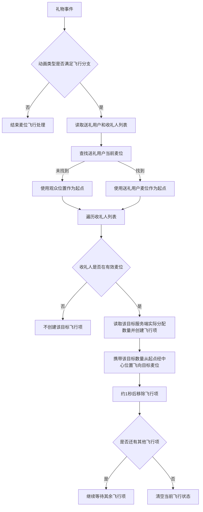

---

## 13. 边界与异常规则

| 编号 | 场景 | 处理规则 | 优先级 |
|---|---|---|---|
| E01 | 动画资源加载失败 | 仅结束失败通道的当前展示项，并使用该事件已经具备资格的文字、基础消息或轻提示承接；不得因礼物主动画、入场、高倍、连送或飘屏资源失败而新生成跑道、房间/全服飘屏资格。业务结果及其他已命中通道不受影响。 | P1 |
| E02 | 用户关闭特效 | 不播放动画，但送礼、入场等业务结果照常生效。 | P0 |
| E03 | 用户关闭音效 | 仅关闭声音，不关闭画面。 | P1 |
| E04 | 礼物主全屏、入场演出或入场横幅队列过长 | 超过各自等待时间的低优先级项可丢弃或降级；横幅过期不影响同一事件的座驾项，座驾过期也不影响横幅项。 | P1 |
| E05 | 同一用户连续送相同普通礼物 | 跑道累计数量，不重复新增多条。 | P0 |
| E06 | 不同用户送相同礼物 | 不合并，分别展示或排队。 | P0 |
| E07 | 礼物命中用户但用户已下麦 | 取消麦位落点，保留全屏/跑道反馈。 | P1 |
| E08 | 房间布局变化 | 动画定位必须读取最新麦位位置。 | P1 |
| E09 | 点击全屏礼物或座驾动画且未启用直接关闭 | 展示关闭特效确认窗口；取消后继续播放，确认后结束当前动画并继续队列。 | P0 |
| E15 | 本地已启用直接关闭时点击新动画 | 直接结束该新动画，不展示确认窗口；队列继续消费下一项。 | P1 |
| E12 | 幸运事件重复消息 | 同一中奖事件不得因重复消息重复创建同一客户端展示项。 | P0 |
| E13 | 高单价常规礼物播放中收到幸运表现 | 不打断当前高单价常规礼物主动画；高倍结果保留在高倍 FIFO，房间/全服飘屏、连送反馈和公屏消息按各自通道并行，等待超时只降级对应展示项。 | P0 |
| E14 | 幸运高倍结果播放中收到高单价常规礼物 | 不截断已开始的高倍结果；当前结果结束后，高单价常规礼物从礼物主全屏通道取得下一中央展示位。 | P1 |
| E16 | 多条房间/全服幸运飘屏或本房间高倍结果并发 | 三个通道分别按服务端触发时间升序维护独立 FIFO；同一时间按稳定事件顺序，不按本地收包时间重排，也不跨通道互相阻塞。 | P0 |
| E17 | 第三位幸运连送送礼用户到达 | 房间只保留最近触发的 2 位不同发起方；替换触发时间较早展示项，不排队、不补播。 | P1 |
| E18 | 幸运表现排队、替换、关闭或资源失败 | 仅影响对应通道的本端可见表现；文字/资产状态按原事件继续，禁止重开奖、重发奖、把未命中事件升级为公共曝光或重复播放既有公共曝光。 | P0 |

---

## 14. 暂定 15 秒项

当前版本无暂定 15 秒项。

## 15. 验收标准

### 15.1 通道验收

| 验收域 | 标准 |
|---|---|
| 事件分流与计数 | 一条礼物事件可按条件并行创建全屏、跑道、麦位和幸运表现项；事件数、各通道展示项数、队列项数与实际播放次数分别计算。服务端确认的高倍、飘屏、连送、卡牌与公屏文字分别进入所属通道；客户端不得二次生成幸运结果。 |
| 礼物与入场通道 | 礼物主全屏与座驾/入场演出使用独立队列，只可复用中央展示区域和点击关闭交互；一条礼物事件仅创建一个主全屏播放项并串行消费。入场横幅固定在层级4顶部横幅区域、使用独立 FIFO，可与层级8座驾并行；任一项结束、失败、过期或离房不影响另一项。 |
| 跑道与麦位 | 同一用户连续送同一普通礼物时跑道累计，不同用户不合并。麦位基础区域位于层级1；飞行、缩放、落点与局部互动仅在层级2定位到有效收礼麦位，不得进入公屏；同麦位局部互动不重叠。 |
| 幸运表现 | 同一幸运事件可独立触发层级3房间/全服飘屏、层级4高倍结果、层级5卡牌和层级6连送反馈，并按事件、用户与展示范围去重。房间飘屏和高倍结果按服务端触发时间 FIFO，相同时间按稳定顺序；连送实时保留最近两位不同发起方，第三位发起方替换较早项且不补播。卡牌入口固定在层级5房间右下，连送按钮固定在层级6；两者点击区域、状态与资源不得合并。 |
| 视觉层级与资源 | 十级视觉层级、功能点和资源映射与确认原型一致；视觉层级不替代调度优先级。页面资源、空间动画、全屏演出、卡牌、飘屏、公屏与入场资源均有独立资源单元、格式、队列和责任边界。P0 系统强提示在层级9展示时不得被层级10礼物遮挡。 |
| 控制与关闭 | 关闭特效仅停止动画，不影响业务结果；关闭音效不关闭画面。未启用直接关闭时，点击礼物或座驾全屏动画需确认；确认结束当前项，取消继续播放。勾选后写入本地缓存，后续直接结束当前项；关闭后按原队列消费下一项。 |
| 资源与业务事实 | 礼物主动画按当前客户端已实现的 PAG、SVGA、VAP 分支加载，不按旧包命名推断格式。排队、替换、关闭、切房、切后台和资源失败仅影响对应表现，不得改变开奖、发奖、退款、撤销、补发、卡牌、历史或公屏事实。 |

### 15.2 边界验收

| 验收项 | 标准 |
|---|---|
| 资源加载失败 | 不阻断送礼或房间事件，降级展示。 |
| 用户离开房间 | 不继续播放旧房间动画。 |
| 入场横幅离房或过期 | 用户离房、横幅项过期或资源失败时，仅丢弃/降级横幅项；不得继续在旧房间展示，也不得结束同一事件的座驾演出。 |
| 目标用户下麦 | 不继续播放错误麦位落点。 |
| 队列过长 | 低优先级旧动画不会无限滞后播放。 |
| 幸运事件重复消息 | 同一中奖事件不会重复创建同一客户端展示项。 |
| 幸运礼物 PAG 加载失败 | 高倍、房间/全服飘屏或连送 PAG 加载失败时，只保留该事件原有文字结果、公屏消息、资产或轻提示承接；不得新增跨范围曝光或重复公共曝光。 |
| 高单价礼物与高倍结果冲突 | 高单价常规礼物完整演出未被幸运高倍结果打断；高倍结果最终完成展示或按等待上限降级。 |

---
