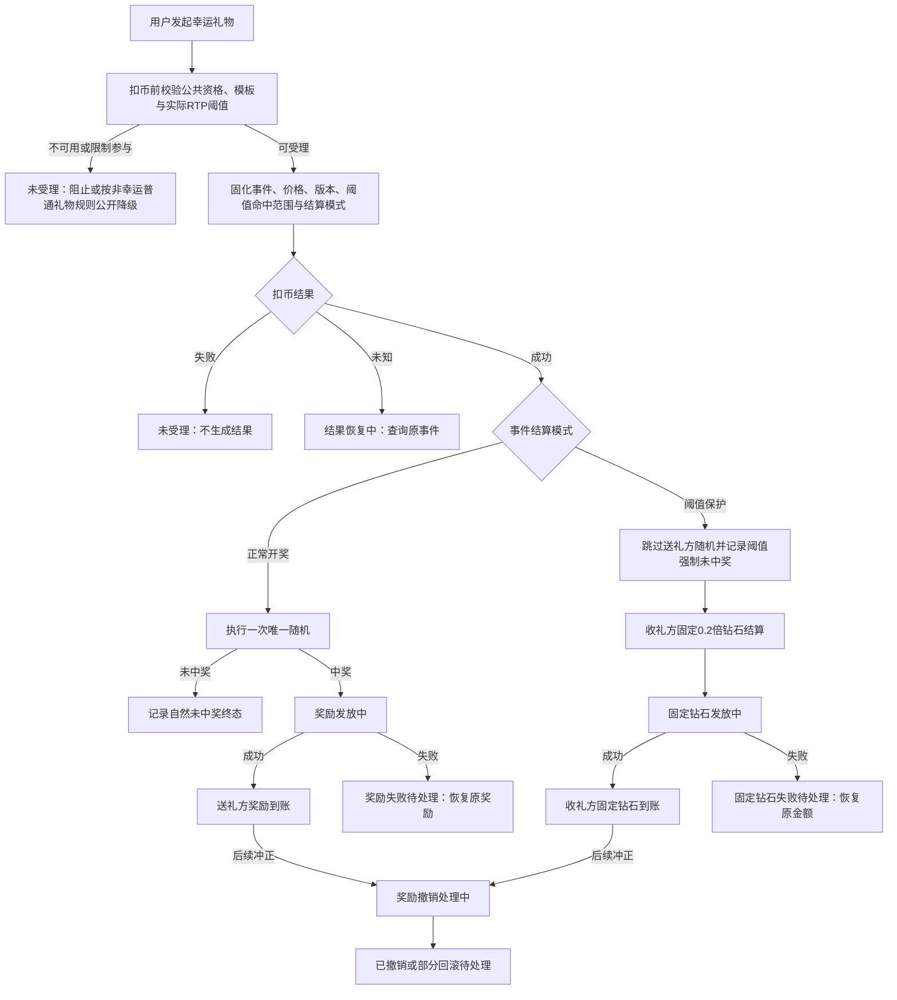
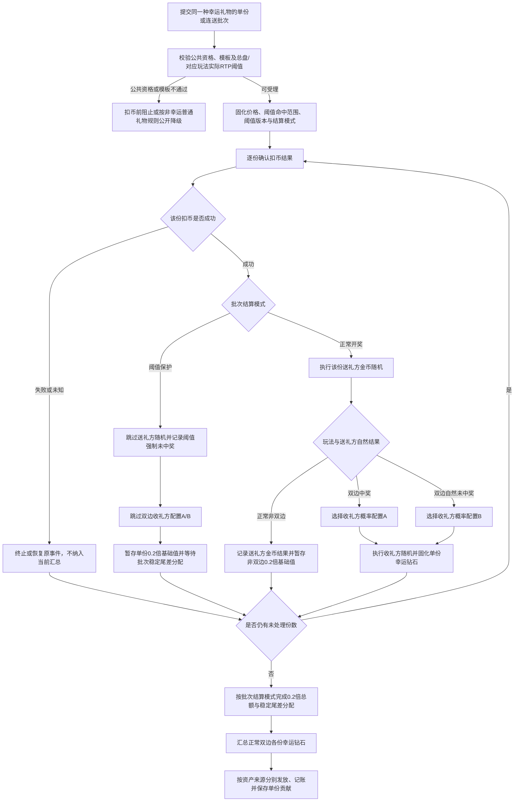
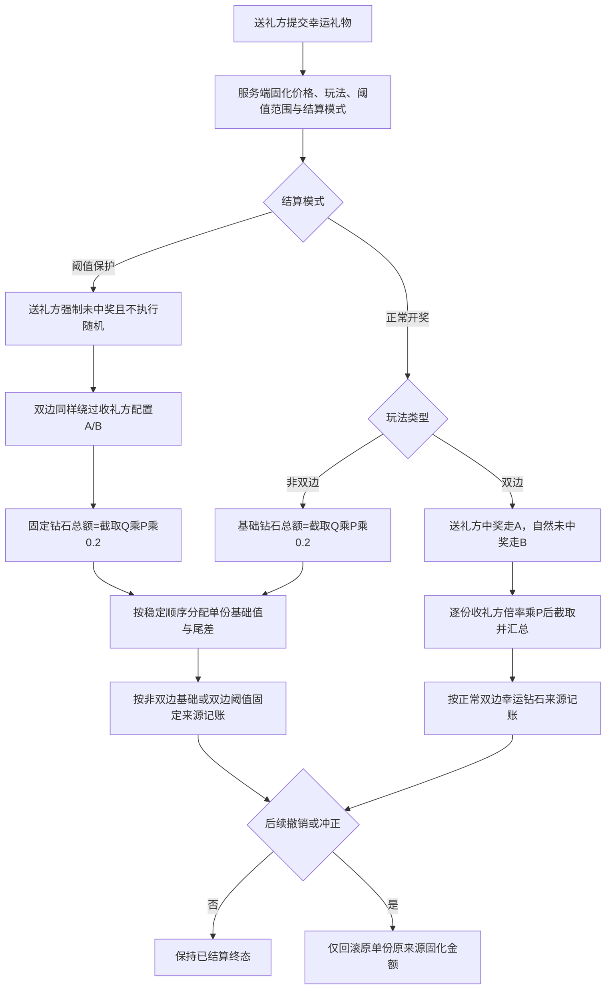
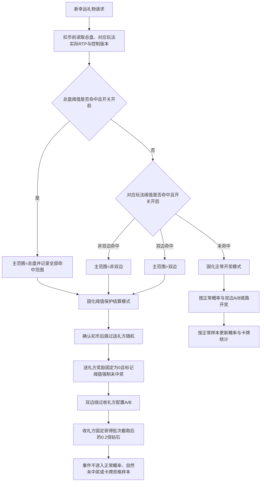
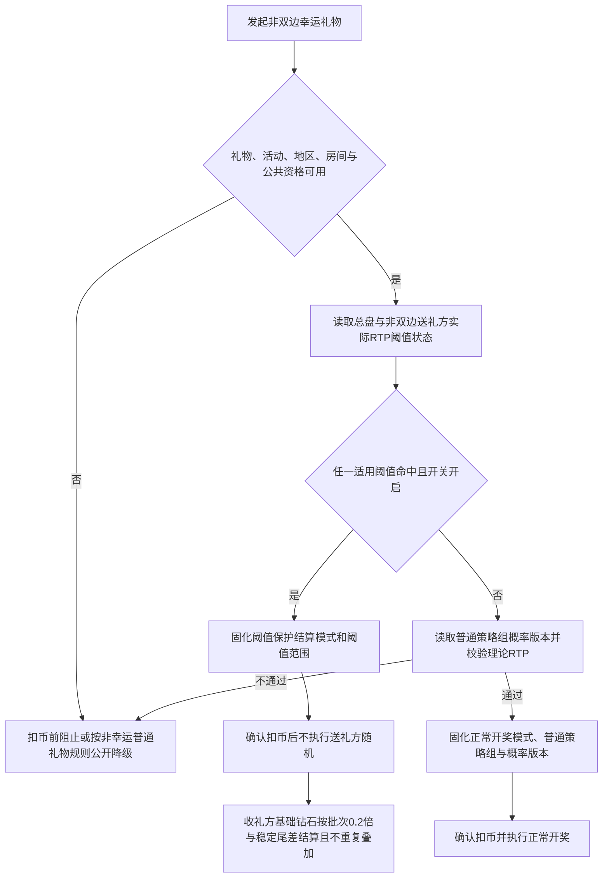
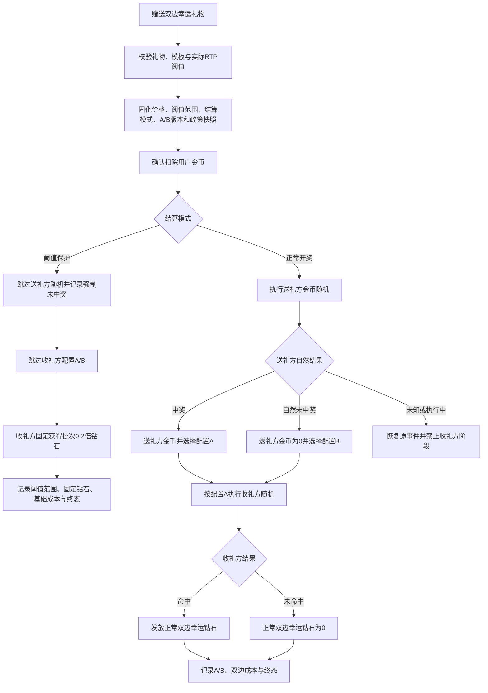
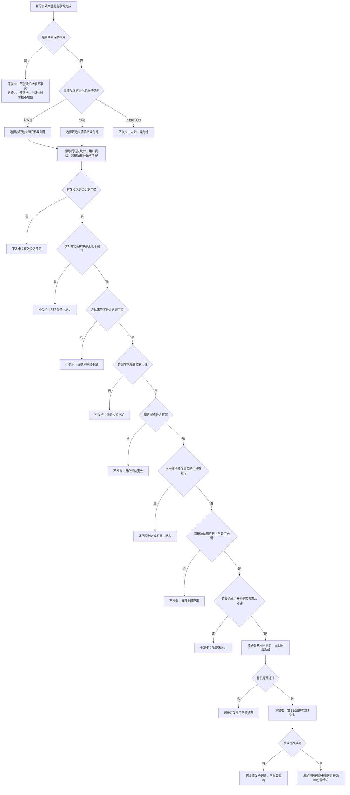

# 幸运礼物 1.0 核心逻辑需求文档（正式精简版）

> 本文件定义幸运礼物 1.0 的核心业务规则。页面字段、动效、原型图和文案以《幸运礼物1.0_客户端需求文档_正式精简版.md》为准；页面不得重新定义本文件中的状态、资产、路由、版本或异常规则。

---

## 一、范围与业务主线

### 1.1 一句话主线

用户赠送幸运礼物后，系统先在扣币前完成礼物可用性、公共资格、理论 RTP 配置校验、实际 RTP 阈值判定与版本快照固化；确认扣币后，正常开奖模式只生成一次随机结果，阈值保护模式不执行送礼方随机并按固定 0.2 倍结算收礼方；所有结算在失败、配置变化、断线重试和后续工资处理下保持可追溯。

### 1.4 首期范围与禁止项

MVP 首期的非双边幸运礼物仅包含一个普通策略组，所有用户共用同一组规则；同时包含正常开奖与阈值保护两种结算模式、理论 RTP 配置校验、实际 RTP 阈值控制、倍率过滤与权重随机、幸运卡牌、正常双边 A/B 分流、保护模式固定 0.2 倍钻石、真实结果表现、完整事件快照、撤销回滚与工资冲正。

---

## 二、核心对象、角色与资产口径

### 2.1 核心对象

| 对象 | 业务定义 | 核心规则 |
|---|---|---|
| 幸运礼物 | 礼物配置类型为“幸运礼物”或“双边幸运礼物”的礼物 | “幸运礼物”进入非双边幸运玩法；“双边幸运礼物”进入双边幸运玩法；以受理时实际支付金币单价为准。 |
| 礼物类型 | 普通、幸运礼物、双边幸运礼物三类中的实际玩法配置类型 | 普通礼物不创建幸运事件；幸运礼物进入非双边幸运；双边幸运礼物进入双边幸运；以受理时固化类型为准。 |
| 礼物类别 | 礼物在客户端礼物栏中的展示类别 | 配置为“幸运礼物”进入客户端“幸运礼物”栏目；配置为“VIP礼物”进入“VIP礼物”栏目；配置为“国旗礼物”进入“国旗礼物”栏目。礼物类别只决定展示栏目，不替代礼物类型的玩法路由。 |
| 是否连送礼物 | 礼物配置中控制该礼物能否发起连送行为的字段 | 配置为“是”时，当前礼物可发起连送批次；配置为“否”时仅允许单份送礼，不得创建连送批次。 |
| 幸运事件 | 单份礼物消费对应的一次不可重复结算事实 | 一次事件只能固化一种结算模式；正常模式最多执行一次送礼方随机，阈值保护模式不执行该随机；资产终态唯一 |
| 连送批次 | 用户一次明确提交且被系统确认的同一种幸运礼物计划份数 | 同一批次仅允许同一幸运礼物、同一玩法类型和同一实际支付单价；每份礼物仍为独立幸运事件 |
| 普通策略组 | MVP 唯一的非双边幸运礼物规则组 | 所有用户共用统一规则与概率版本；不生成差异化开奖结果 |
| 概率模板 | 普通策略组在有效版本下、按礼物配置使用的倍率和概率分布 | 必须版本化；历史事件永久保留其使用版本 |
| RTP 阈值保护结算 | 全服平台 RTP、非双边送礼方 RTP 与双边平台 RTP 的运行中控制规则 | 对应服务端开关开启且指定成本指标触达阈值时，新事件继续按幸运礼物受理，但在扣币前固化为阈值保护结算：送礼方不执行随机且奖励为 0，收礼方固定获得 0.2 倍钻石 |
| 双边事件阶段 | 正常模式按送礼方自然结果选择收礼方概率配置 A/B；阈值保护模式直接进入固定结算 | 正常模式同份可双中奖；保护模式绕过 A/B，收礼方固定获得 0.2 倍钻石 |
| 幸运卡牌 | 由连续未中奖体验补偿产生的虚拟抽卡权益 | 不直接发放可提现资产；资格、抽取、权益和回滚独立追溯 |
| 奖励记录 | 金币、幸运钻石或虚拟权益的生成与发放事实 | 结果已生成不等于已到账；失败只恢复原奖励，不重抽 |
| 成本记录 | 用户奖励、主播奖励、礼物基础收益、工资、公会与渠道成本 | 原始值、回滚值和最终净值同时保留 |

### 2.2 角色与资产归属

| 角色 | 可获得的幸运资产 | 不得混淆的资产 |
|---|---|---|
| 送礼用户 | 非双边或双边送礼方阶段产生的金币奖励；符合条件的幸运卡牌与虚拟权益 | 金币奖励不等于礼物基础收益，不等于主播幸运钻石 |
| 收礼主播 | 正常非双边基础钻石、正常双边 A/B 产生的幸运钻石，以及阈值保护模式固定 0.2 倍钻石 | 各来源分开记账；保护固定钻石不得伪装成配置 B 概率中奖 |
| 公会 | 按双边事件支付成功时固化的主播、公会和政策快照参与后续结算或冲正 | 主播后续转会不得改写历史事件归属 |
| 房间观众/首页用户 | 只接收真实已确认事件的公共表现 | 不得获取策略、概率、RTP 阈值状态、资格或内部成本信息 |

### 2.3 统一金额与结果口径

```text
体验亏损金额
= 统计窗口内有效投入金币 × 目标体验 RTP
  - 统计窗口内实际有效产出金币
```

- 体验亏损金额小于 0 时按 0 处理。
- 有效投入不包含已撤销、测试、运营赠送等无真实消费事件。
- 非双边送礼方实际有效产出只计最终有效的金币奖励；已回滚的金币、虚拟权益、主播幸运钻石和礼物基础收益均不计入。
- 双边送礼方实际有效产出同样只计该送礼方最终有效的金币奖励；收礼主播的幸运钻石、礼物基础钻石收益、虚拟权益和已回滚奖励均不计入送礼方实际有效产出。
- 幸运卡牌资格统计必须按触发事件的玩法类型隔离：非双边事件只读取非双边有效投入、送礼方实际 RTP、连续未中奖次数和体验亏损；双边事件只读取双边送礼方对应统计。不得用一种玩法的低 RTP、亏损或未中奖历史触发另一种玩法的卡牌资格。
- 目标体验 RTP 仅是策略判断指标，不构成向用户等额补差或固定返还承诺；双边与非双边的目标体验 RTP、实际 RTP 上限及其他卡牌资格阈值由各自卡牌资格规则组独立配置。

```text
策略内净奖励金额
= 用户在该策略内获得的有效金币奖励
  - 用户在该策略内的有效礼物投入
```

该指标同时保留当前策略周期、最近 X 日、历史累计、已冲正和最终净值，禁止用最终净值覆盖原始投入或原始奖励事实。

---

## 三、全局事件生命周期与状态规则

### 3.1 三段事实：受理、开奖、发奖

1. **送礼已受理**：唯一幸运事件已创建，且本次金币扣费已确认成功。正常模式进入等待开奖；阈值保护模式进入固定结算，不等待送礼方随机。
2. **结算已确定**：正常模式已生成唯一中奖或自然未中奖结果；阈值保护模式已生成唯一“强制未中奖 + 固定钻石”结算事实。结算确定不代表资产已经到账。
3. **奖励已到账**：金币、基础钻石、正常双边幸运钻石、阈值保护固定钻石或虚拟权益已完成实际发放并形成最终可用资产状态。

请求已收到但扣费未确认时，仍是“送礼请求处理中/结果恢复中”；不得开奖、展示中奖结果或允许同一次操作生成新事件。扣费最终失败时，事件终止且不生成开奖结果。

### 3.2 状态维度

为避免“中奖”和“到账”被混成同一种状态，单个事件同时维护以下独立状态维度。

| 状态维度 | 状态 | 规则 |
|---|---|---|
| 受理状态 | 请求处理中 / 已受理 / 未受理 / 结果恢复中 | 已受理必须同时满足事件创建与扣费成功；未知时只恢复原事件 |
| 开奖状态 | 未生成 / 中奖 / 未中奖 / 无法恢复 | 同一事件只能生成一次结果；无法恢复时走失败待处理，不重新随机 |
| 奖励状态 | 无奖励 / 发放中 / 已到账 / 失败待处理 / 已取消 | 中奖与到账分离；补发只补原奖励 |
| 奖励撤销状态 | 无需撤销 / 撤销处理中 / 已撤销 / 部分回滚待处理 | 原中奖事实保留，当前资产终态必须真实更新 |
| 双边阶段 | 阈值判定中 / 阈值保护固定结算 / 送礼方处理中 / 已选收礼方配置A / 已选收礼方配置B / 收礼方处理中 / 双方结果已确定 / 恢复中 | 阈值保护模式直接绕过送礼方随机与收礼方配置 A/B；仅正常模式下，送礼方结果确定后才选择且只选择 A 或 B |

### 3.3 主状态流转



### 3.4 必须遵守的终态竞争规则

- 事件结果一旦生成，后续超时、重试、切房、重进页面和发奖失败均不得重新随机。
- 扣币成功但结果未生成时，优先恢复原事件；最终确认无可恢复结果时，按实际扣费金额撤销，不生成替代性中奖/未中奖结果。
- 奖励已到账后发生冲正时，保留原中奖事实，同时独立更新为撤销处理中、已撤销或部分回滚待处理；不得继续显示“当前奖励已到账”。
- 动画、飘屏、资源加载和页面跳转失败只影响表现，不得改变业务结果和资产状态。

---

## 四、幸运事件创建、幂等、连送与版本边界

### 4.1 唯一操作身份

| 操作 | 唯一边界 | 重试规则 |
|---|---|---|
| 单份送礼 | 单次送礼请求对应一份幸运事件 | 超时、断线重连和结果恢复均复用原请求身份 |
| 连送 | 批次身份 + 批次内序号唯一对应每份礼物 | 批次中已受理份数恢复原状态；未受理份数不能伪装成功 |
| 单抽卡牌 | 一次抽卡请求 | 处理或恢复期间不重复扣卡、不重复抽取 |
| 十连抽卡牌 | 抽卡请求身份 + 第 1～10 次抽取序号 | 十次独立保留结果和奖励状态；部分失败只处理失败项 |

只有用户主动发起的新操作才能生成新的操作身份。客户端与服务端均不得把网络重试当成新操作。

### 4.2 连送批次规则

1. 仅礼物配置“是否连送礼物 = 是”时，用户一次明确提交且系统确认的计划份数才能形成连送批次；连续点击追加、自动续送、断线后新增提交均为新批次。
2. 同一批次仅允许同一种幸运礼物连送，且所有份数必须属于同一玩法类型（均为非双边或均为双边）、同一实际支付单价；不得在同一批次混入双边、非双边或不同单价礼物。
3. 批次受理时固化本批次礼物类型、是否连送礼物、规则版本、概率模板版本，以及总盘与对应玩法实际 RTP 阈值判定版本。同一批次在扣币前只固化一种结算模式：正常开奖或阈值保护；批次内各份仍独立校验公共资格和扣币结果。
4. 批次内所有成功受理份数使用同一版本；不因单份礼物的创建、开奖、发奖时间跨越版本生效点而切换。
5. 每份礼物仍独立生成幸运事件、独立开奖、独立结果记录和独立回滚；批次仅可汇总同一资产接收方的发放金额，视觉表现可以合并，但账本和状态不得合并丢失。
6. 批次中未受理、扣币失败或扣币结果未知的份数不得参与结算或汇总；扣币结果未知时仅恢复原事件。阈值保护批次属于已受理幸运事件，不执行随机，但成功扣币份数必须进入固定 0.2 倍钻石汇总。
7. 未受理份数不得沿用旧批次继续处理；用户再次提交时按新批次重新读取当前阈值状态。已受理批次即使后续阈值恢复或再次触达，也必须按受理时固化的原结算模式完成。
8. 礼物配置“是否连送礼物 = 否”时，客户端不展示或触发该礼物的连送入口；服务端收到多份连送请求时必须拒绝整个请求，不得静默拆成多个单份事件或创建部分批次。

### 4.3 版本生效边界

| 对象 | 固化时点 | 新版本影响范围 |
|---|---|---|
| 礼物类型、礼物类别、是否连送礼物、非双边普通策略组、概率、理论 RTP 校验规则 | 连送批次受理成功；单送为事件受理成功 | 仅影响新受理批次或新事件；已受理批次继续读取原快照。 |
| 双边礼物概率、用户/主播/公会/政策归属 | 事件受理并确认扣币时 | 已受理事件按原快照完成 |
| 抽卡奖励规则 | 抽卡请求受理时 | 已发且未过期的卡牌不静默清零；处理中按原版本完成 |
| 礼物可用状态、活动与地区开关 | 新事件创建前 | 已受理事件继续完成；新事件按关闭/降级规则处理 |
| 体验表现、飘屏门槛与 H5 说明 | 事件使用的正式版本 | 规则页、入口和实际奖励必须使用同一有效版本 |

已生效概率、奖励或成本规则的修改必须发布为新版本，禁止直接覆盖历史版本。历史版本必须支持客服、财务、运营和争议事件查询。

### 4.4 基础中奖实现与批次汇总发放流程

#### 4.4.1 单份开奖与金额规则

1. 礼物配置“是否连送礼物 = 是”时，一次送礼可包含单份或多份同一种幸运礼物；配置为“否”时一次仅允许单份。每一份成功受理且确认扣币的礼物均形成独立幸运事件。
2. 送礼方本次金币消耗 = 已成功受理且确认扣币的每份礼物实际支付金币单价之和；实际支付金币单价 `P` 以事件受理时固化值为准，后续礼物改价不追溯。
3. **正常非双边：**批次基础钻石总额 = 截取（成功受理礼物数量 `Q` × `P` × 0.2），不四舍五入；送礼方是否中金币不改变该基础钻石。单份基础值 = 截取（`P` × 0.2）；尾差 = 批次总额 − `Q` × 单份基础值；按成功受理时间升序、同一时间按稳定事件 ID 升序，前“尾差”份各加 1 钻石并固化。
4. **正常开奖模式：**非双边和双边均执行送礼方金币随机。单份中奖金币 = `P` × 送礼方中奖倍率；自然未中奖时送礼方奖励为 0。双边在送礼方中奖时读取收礼方概率配置 A，自然未中奖时读取配置 B；配置命中后的单份幸运钻石 = 截取（收礼方倍率 × `P`），未命中为 0。
5. **阈值保护结算模式：**总盘或当前玩法任一适用实际 RTP 阈值命中时，不执行送礼方随机，送礼方奖励固定为 0，并将结果来源记录为“阈值强制未中奖”。双边不得据此走配置 B，也不得执行配置 A/B 中任一收礼方随机。
6. **阈值保护固定钻石：**同一受理批次的固定钻石总额 = 截取（阈值保护成功受理数量 `Q` × `P` × 0.2），不四舍五入；按与非双边基础钻石相同的单份基础值和稳定尾差规则固化到每一份。单送时 `Q=1`，单份金额即截取（`P` × 0.2）。多个阈值同时命中只结算一次，不叠加多份 0.2 倍钻石。
7. 非双边阈值保护事件复用“非双边收礼方基础钻石”资产来源，但必须保留阈值保护结算模式；该固定钻石替代而不是叠加正常非双边基础钻石。双边阈值保护事件使用独立的“双边阈值保护固定钻石”来源，不得混入正常双边幸运钻石。
8. 送礼方金币、非双边基础钻石、正常双边幸运钻石、双边阈值保护固定钻石必须按来源分别记账。每份事件保存价格、玩法、阈值命中范围、结算模式、送礼方结果来源、A/B 配置类型（阈值保护时为空）、收礼方金额、尾差分配、版本与终态。

#### 4.4.2 批次汇总与发放规则

1. 仅纳入成功受理、确认扣币并已形成最终结算事实的份数。扣币失败、扣币结果未知、未受理或仍在恢复中的份数不参与当前汇总。
2. 正常非双边批次按 `截取（Q × P × 0.2）` 形成基础钻石总额，并以稳定尾差规则固化到单份。
3. 正常双边批次逐份读取 A/B 收礼方最终倍率并先单份截取，再汇总各份正常双边幸运钻石。
4. 阈值保护批次按 `截取（Q × P × 0.2）` 形成固定钻石总额，并复用稳定尾差规则固化到单份；不得执行送礼方随机、不得执行双边 A/B、不得与正常非双边基础钻石重复叠加。
5. 当批次内全部成功受理份数均已终态后，按送礼方金币、非双边基础钻石、正常双边幸运钻石、双边阈值保护固定钻石分别汇总发放和记账。
6. 同一批次、同一接收方、同一资产类型及同一来源只允许一个汇总发放身份。超时、断线或恢复复用原身份，不再次随机、不重复发放。
7. 单份撤销或冲正只回滚该份固化金额；不得重新读取当前阈值、改走正常开奖或 A/B、重算批次总额、重新分配尾差或整批回滚。

#### 4.4.3 业务流程图



#### 4.4.4 收到幸运礼物：送礼方金币消耗至收礼方钻石增加流程

本流程描述收礼方钻石折算、来源与回滚。客户端和下游账务只能消费服务端固化的最终结算事实。

1. `P` 为礼物成功受理时固化的实际支付金币单价，`Q` 为同一批次成功受理并确认扣币的份数。
2. **正常非双边：**收礼方基础钻石 = 截取（`Q × P × 0.2`），按稳定尾差规则固化到单份；送礼方中奖倍数不参与。
3. **正常双边：**送礼方中奖走配置 A，自然未中奖走配置 B；单份幸运钻石 = 截取（收礼方最终倍率 × `P`），配置未命中为 0。
4. **阈值保护：**送礼方不执行随机且奖励为 0，双边绕过 A/B；收礼方固定钻石总额 = 截取（`Q × P × 0.2`），并按稳定尾差规则固化。非双边不在原基础钻石之外再叠加一份；多个阈值同时命中也只结算一次。
5. 撤销或冲正使用原事件阈值命中范围、结算模式、价格和单份固定金额快照；不重新判断阈值、不改走 A/B、不重开概率、不重分尾差。



#### 4.4.5 RTP 阈值保护结算流程图



---

## 五、非双边幸运：MVP 单一普通策略组

### 5.1 适用范围

MVP 版本的所有非双边幸运礼物事件均进入唯一的普通策略组；所有用户不区分用户画像，共用同一组规则。系统不得按用户新旧、价值、充值、投入、RTP、连续未中奖、体验亏损、设备、账号或任何用户画像切换策略组、概率模板或中奖倾向。

| 项目 | MVP 规则 |
|---|---|
| 策略组数量 | 1 个：普通策略组 |
| 用户范围 | 所有满足礼物、活动、地区、房间等公共资格的用户 |
| 用户画像 | 不采集、不配置、不参与策略选择 |
| 概率模板 | 按礼物配置读取普通策略组当前有效版本；同一礼物、同一版本下所有用户共用同一概率分布 |
| RTP 阈值保护 | 理论 RTP 在配置发布前校验；运行中按全服平台 RTP 与非双边送礼方 RTP 的阈值及开关，在扣币前决定新事件使用正常开奖或阈值保护结算 |
| 成本控制 | 实际 RTP 阈值命中时统一进入阈值保护结算；不得切换低成本策略、按用户定向调整概率，或把阈值强制未中奖伪装成自然未中奖 |

### 5.2 扣币前处理流程



### 5.3 MVP 边界

1. 所有非双边事件仅使用普通策略组；一次事件只使用一个已固化的概率模板版本。
2. 产品能力仅覆盖单组统一概率配置；非双边事件全程固定使用已固化的普通策略组和概率版本。
3. 单个用户的历史投入、产出、RTP、连续未中奖、价值等级和设备信息不得影响本次非双边开奖。
4. 全服平台 RTP 或非双边送礼方 RTP 达到各自保护阈值且开关开启时，必须在扣币前固化阈值保护结算模式；模板不适配仍按模板失败规则扣币前阻止或公开降级。阈值保护不得切换策略或临时降低概率，且不得在扣币后把正常事件改判为保护事件。
5. 普通策略组、礼物概率模板、理论 RTP 校验规则和 RTP 阈值控制配置修改必须按各自发布规则生效；新配置仅影响新事件，已受理事件按原快照完成。

---

## 六、概率、倍率、RTP 与成本控制

### 6.1 概率模板与权重随机

普通策略组使用版本化的概率模板。模板内配置中奖倍率、未中奖结果及其对应概率；同一礼物、同一版本下所有用户使用同一概率分布。

处理顺序：

1. 读取普通策略组及本次礼物对应的有效概率版本。
2. 校验概率模板的倍率集合、概率分布与理论 RTP 是否满足当前配置限制。
3. 对模板内结果按已配置概率执行一次权重随机。
4. 保存倍率集合、概率版本、概率分布与最终结果。

- 概率模板内全部结果概率之和必须为 100%。
- 理论 RTP 超过普通策略组目标或双边平台理论成本超过当前配置限制时，模板不可用。
- 概率模板不适配时，必须在扣币前终止幸运事件或按公开规则降级普通礼物。
- 执行超时只能恢复原事件，不能第二次随机。

### 6.2 理论 RTP 配置校验

理论 RTP 用于在概率、倍率、礼物价格与双边钻石经济价值发生变化时，校验当前配置的期望成本；它不按用户分层，也不在事件处理中临时改写随机结果。

1. 非双边理论 RTP = 各送礼方中奖倍率 × 对应概率的总和。
2. 双边单份期望值 RTP 必须按“送礼方结果 → 收礼方配置 A/B → 收礼方额外成本”两层条件概率计算；同一份事件中送礼方中奖走配置 A，送礼方明确未中奖走配置 B，二者均可产生收礼方幸运钻石成本。
3. 设 `P` = 单份事件受理时实际支付金币单价，`pA` = 送礼方中奖概率，`pB` = 送礼方明确未中奖概率，且 `pA + pB = 1`。对配置 A/B 中每个收礼方结果 `i`，以该配置内归一化条件概率 `qAi` / `qBi` 和收礼方倍率 `mAi` / `mBi` 计算：

```text
单份 0.2 倍基准钻石 B = 截取（P × 0.2）
单个收礼方结果的额外幸运钻石 = MAX（截取（P × m）− B，0）

配置 A 条件期望额外幸运钻石等价金币成本
= Σ（qAi × MAX（截取（P × mAi）− B，0））× V

配置 B 条件期望额外幸运钻石等价金币成本
= Σ（qBi × MAX（截取（P × mBi）− B，0））× V

双边单份期望值 RTP
= 送礼方金币理论 RTP
  + pA ×（配置 A 条件期望额外幸运钻石等价金币成本 ÷ P）
  + pB ×（配置 B 条件期望额外幸运钻石等价金币成本 ÷ P）
```

未命中结果按倍率 `0` 参与各自配置的条件概率分布。必须先分别截取 `P × m` 与 `P × 0.2`，再取正差额；不得改写为“截取（P ×（m − 0.2））”，也不得用未受理价格、当前配置或当前单钻石价值回算历史事件。

4. **双边期望值 RTP 算法验证示例（EG，不是后台默认配置）：**
   - 前提：`P = 100` 金币，`V = 0.5` 金币/钻石；送礼方以 `30%` 概率命中 `2` 倍金币，明确未中奖概率为 `70%`，故送礼方金币理论 RTP = `30% × 2 = 60%`。
   - 配置 A（仅在送礼方中奖时使用）：`1` 倍概率 `40%`、`0.5` 倍概率 `20%`、未命中概率 `40%`。`B = 截取（100 × 0.2）= 20`；条件期望额外钻石 = `40% × MAX（100−20，0）+20% × MAX（50−20，0）+40% × 0 = 38` 钻石；条件等价金币成本 = `38 × 0.5 = 19` 金币；配置 A 条件成本 RTP = `19 ÷ 100 = 19%`。
   - 配置 B（仅在送礼方明确未中奖时使用）：`2` 倍概率 `10%`、`0.5` 倍概率 `30%`、未命中概率 `60%`。条件期望额外钻石 = `10% × MAX（200−20，0）+30% × MAX（50−20，0）+60% × 0 = 27` 钻石；条件等价金币成本 = `27 × 0.5 = 13.5` 金币；配置 B 条件成本 RTP = `13.5 ÷ 100 = 13.5%`。
   - 该单份双边期望值 RTP = `60% + 30% × 19% + 70% × 13.5% = 75.15%`。

5. 统计期双边期望值 RTP = `Σ（单份有效投入价值 × 单份双边期望值 RTP 快照）÷ Σ（单份有效投入价值）× 100%`。单份期望值快照必须固化：送礼方概率分布与理论 RTP、配置 A/B 的倍率集合/原始概率/归一化条件概率/未命中概率、P、B、V、两类条件期望额外成本及最终双边期望值 RTP。
6. 概率模板发布前，系统必须校验倍率集合、概率分布、理论 RTP 及资产折算版本；校验不通过的模板不得生效。
7. 概率、倍率、资产折算等任一配置变更必须形成新版本，仅影响新受理事件；已受理事件继续按原快照完成。

### 6.3 实际 RTP 阈值保护结算

运行中按指定实际指标监控成本：总盘读取**全服平台 RTP**；非双边读取**非双边送礼方 RTP**；双边读取**双边平台 RTP**。三类指标不得互相替代。阈值数值、统计窗口、样本量、数据延迟容忍、恢复阈值、观察期和开关权限须上线前冻结。

| 判定范围 | 服务端开关与指定指标条件 | 新事件处理 |
|---|---|---|
| 总盘 | 总盘保护开关开启，且全服平台 RTP 触达阈值 | 所有双边、非双边新事件进入阈值保护结算 |
| 非双边 | 总盘未命中；非双边保护开关开启，且非双边送礼方 RTP 触达阈值 | 仅非双边新事件进入阈值保护结算 |
| 双边 | 总盘未命中；双边保护开关开启，且双边平台 RTP 触达阈值 | 仅双边新事件进入阈值保护结算 |
| 未命中 | 对应开关未开启，或指定指标未触达阈值 | 按当前有效概率版本进入正常开奖 |

1. 阈值判定在扣币前完成并固化。阈值命中不阻止幸运礼物受理、不降级普通礼物；确认扣币后按已固化的保护模式结算。
2. 多个阈值同时命中时只结算一次固定 0.2 倍钻石；记录全部命中范围。总盘作为主范围优先，未命中总盘时再以对应玩法作为主范围。
3. 阈值保护事件不执行送礼方随机，送礼方奖励固定为 0；该结果必须标记为阈值强制未中奖，不得计作自然未中奖。
4. 双边阈值保护事件绕过收礼方配置 A/B；不得因送礼方奖励为 0 而进入配置 B。其固定钻石不进入配置 A/B 开奖数、命中数、条件概率或正常理论 RTP 样本。
5. 阈值保护事件的有效投入进入送礼方实际 RTP 分母，送礼方奖励按 0 进入分子；但不增加、不清零连续未中奖次数，不进入卡牌体验亏损统计，也不触发卡牌资格判断。
6. 固定 0.2 倍钻石属于基础商业成本；相对同份 0.2 倍基准的额外幸运钻石为 0，不进入双边额外幸运钻石、双边平台 RTP 或全服平台 RTP 的增量成本分子。资产、基础商业成本和阈值原因仍须独立记录与对账。
7. 并发请求必须基于同一最终阈值状态按顺序判定并固化；前一请求更新控制状态后，后一请求不得继续使用过期正常模式快照穿透阈值。
8. 指标回到恢复阈值内且满足观察期后，仅后续新事件恢复正常开奖；已受理事件始终按原结算模式完成。

### 6.4 成本核算分层

```text
用户奖励 RTP
= 用户有效金币奖励价值 ÷ 用户有效礼物投入价值
```

```text
双边平台 RTP
=（双边送礼方最终有效金币奖励价值
  + 双边收礼方额外幸运钻石等价金币成本）
  ÷ 双边有效投入价值
```

```text
全服平台 RTP
=（全服送礼方最终有效金币奖励价值
  + 全服双边收礼方额外幸运钻石等价金币成本）
  ÷ 全服幸运礼物有效投入价值
```

```text
双边单份额外幸运钻石
= MAX（双边单份幸运钻石结算值 − 双边单份 0.2 倍基准钻石，0）
```

双边单份 0.2 倍基准钻石按 `实际支付金币单价 × 0.2` 单份直接截取整数计算。额外幸运钻石的最终净值 = 原始额外值 − 已生效回滚值；单份额外幸运钻石等价金币成本 = 单份额外幸运钻石最终净值 ÷ 400000。实际结算钻石未高于该 0.2 倍基准时，额外幸运钻石为 0；卡牌不纳入 RTP。金币与钻石不能按数量直接相加。

---

## 七、双边幸运：送礼方结果分流至收礼方概率配置 A/B 的开奖与结算

### 7.1 基础规则

正常双边先执行送礼方金币开奖，再按送礼方自然结果选择收礼方概率配置 A/B。阈值保护模式优先级更高，直接绕过送礼方随机和收礼方 A/B。

| 结算模式 / 送礼方结果 | 收礼方路径 | 收礼方结果 | 本次幸运奖励 |
|---|---|---|---|
| 正常开奖 / 中奖 | 配置 A | 命中或未命中 | 送礼用户金币；收礼方命中时另有幸运钻石 |
| 正常开奖 / 自然未中奖 | 配置 B | 命中或未命中 | 收礼方命中时有幸运钻石 |
| 阈值保护 / 强制未中奖 | 跳过 A/B，固定 0.2 倍 | 固定结算 | 送礼方 0 金币；收礼方固定钻石 |
| 结果未知或执行中 | 不新建后续阶段 | 不生成 | 恢复原事件，禁止重抽 |

正常模式下同一份双边礼物允许送礼方金币与收礼方幸运钻石同时成立。阈值保护的固定钻石是确定性结算，不得伪装成收礼方概率中奖。

### 7.2 双边主流程



### 7.3 概率与成本

- 送礼方倍率和概率由双边礼物概率版本配置，受礼物实际支付价、双边送礼方 RTP 与双边平台理论成本上限约束。
- 收礼方概率配置 A、B 分别配置候选倍率、未命中结果、条件概率、单笔上限和版本；仅正常开奖事件参与 A/B 理论与实际概率样本。
- 主播幸运钻石候选倍率可在 **0.5～50 倍**配置空间内设置，实际档位与条件概率由后台版本管理。
- 阈值保护事件不读取 A/B 概率，其送礼方理论 RTP、A/B 条件期望成本和正常理论 RTP 样本均记为不适用；固定 0.2 倍钻石的额外幸运钻石为 0。

```text
正常双边收礼方某奖励的全事件发生概率
= 送礼方中奖概率 × 配置A中该奖励条件概率
  + 送礼方自然未中奖概率 × 配置B中该奖励条件概率
```

```text
正常双边平台理论成本
= 送礼方中奖结果的期望金币成本
  + 送礼方中奖概率 × 配置A条件期望额外幸运钻石等价金币成本
  + 送礼方自然未中奖概率 × 配置B条件期望额外幸运钻石等价金币成本
```

### 7.4 主播、公会与工资归属

1. 礼物基础主播钻石收益与幸运钻石必须分别记录、分别对账。
2. 幸运钻石是否计入主播工资和公会政策，必须按来源独立配置并在事件受理时固化政策快照。
3. 主播后续转会不改变历史双边事件归属。
4. 冲正优先记入事件发生时固化的主播与原公会；原公会解约、无后续结算或余额不足时，不得把历史扣回转嫁给新公会。
5. 未自动扣回部分进入平台待追缴账，保留最终未回滚金额，直至人工核销或追缴完成。
6. 正常双边收礼方开奖笔数应等于正常模式下送礼方自然结果已确定的双边单份数；送礼方中奖分支使用配置 A，自然未中奖分支使用配置 B。阈值保护事件必须排除在 A/B 开奖、命中和概率分母外，并单独与固定钻石流水对账。

---

## 八、幸运卡牌：资格、抽取、权益与回滚

### 8.1 业务定位

幸运卡牌用于改善连续未中奖用户的体验，仅提供 VIP 时长、头像框、气泡、座驾等虚拟权益或主题卡牌。

### 8.2 获得资格与发卡

#### 8.2.1 玩法类型与资格规则组

1. 每个新的有效幸运礼物事件必须先根据事件受理时固化的玩法类型，命中唯一的幸运卡牌资格规则组：
   - **非双边幸运事件**：命中非双边卡牌资格规则组，只读取非双边送礼方统计；
   - **双边幸运事件**：命中双边卡牌资格规则组，只读取双边送礼方统计；收礼主播幸运钻石属于双边平台成本与双边平台 RTP 管控事实，不计入送礼方实际 RTP。
2. 两个规则组均包含最近 X 日有效投入、送礼方实际 RTP 上限、连续未中奖次数、体验亏损金额、用户资格等条件；各项阈值可独立配置、独立发布并在触发时固化版本快照。
3. 双边卡牌资格规则组中的**送礼方实际 RTP 上限必须低于非双边卡牌资格规则组对应上限**，用于为收礼主播可能获得的幸运钻石预留双边成本空间。两套规则组的具体数值按各自活动策略配置并随版本快照固化。
4. 单用户每日获得卡牌数量上限与 30 分钟发卡冷却均不按玩法拆分：双边和非双边成功发卡次数合并计入同一用户当前业务日数量，且任一玩法的成功发卡均开始同一用户的 30 分钟冷却。单用户单日上限是唯一成本控制；30 分钟冷却仅用于发卡节奏。
5. 阈值保护事件不创建卡牌资格触发事实：该事件的投入仍进入对应玩法实际 RTP 分母，但不写入卡牌规则组的有效投入、体验亏损或连续未中奖统计；连续未中奖次数保持原值，不增加也不清零。

#### 8.2.2 获得资格与发卡

事件命中对应玩法的规则组后，用户必须按该规则组同时满足以下体验资格条件，才进入发卡判定：

- 对应玩法统计窗口内的最近 X 日有效投入达到门槛；
- 对应玩法统计窗口内的送礼方实际 RTP 低于该规则组阈值；
- 对应玩法统计窗口内的最近连续未中奖次数达到门槛；
- 对应玩法统计窗口内的体验亏损金额达到最低要求；
- 用户资格有效。

上述条件只用于正常开奖事件的卡牌资格判断，不改变已确认的礼物结果、奖励或历史事实。阈值保护事件在进入条件链之前即以“不发卡—阈值保护事件不参与资格”终态结束。

**发卡判定与限制规则：**

1. 卡牌资格必须按“玩法类型与规则组选择 → 同玩法体验资格 → 同一资格触发事实幂等判断 → 跨玩法合并单用户日上限 → 跨玩法共用 30 分钟冷却”的顺序逐项判断；任一项不满足即结束当前事件的发卡判断，并记录对应原因。
2. 幸运卡牌的唯一成本控制是跨双边、非双边合并计算的**单用户单日获得卡牌数量上限**。当前虚拟物料不设置库存上限、不设置全服卡牌总量上限、不做库存扣减或库存返还；虚拟物料库存不得成为不发卡条件。
3. 服务端必须在同一原子处理过程中读取当前业务日的跨玩法合并已获卡牌数量、单日上限、同一资格触发事实既有判定以及 30 分钟冷却状态。只有日上限和冷却均满足、且该触发事实不存在既有判定时，才允许创建唯一发卡记录；并发请求以该最终判定为准。
4. 日上限已满时，系统为该资格触发事实记录“不发卡—当日上限已满”终态：不生成卡牌、不进入待补发队列。新业务日只允许**新的有效幸运礼物事件**重新进入完整判断；同一触发事实的重复提交、断线恢复或跨日恢复均返回原终态。
5. 30 分钟冷却保留为跨玩法共用的发卡节奏规则，不属于成本控制。首次发卡不受冷却限制；每次成功发卡后，从服务端记录的成功发卡时间起计算 30 分钟。客户端动画、通知到达、打开卡牌入口或抽卡时间不得作为冷却起点。
6. 冷却未结束时，即使用户仍满足体验资格且日上限未满，也记录“不发卡—冷却未满足”终态：不加卡、不排队、不自动补发。冷却结束后不自动发卡，只有后续新的有效幸运礼物事件才可重新触发完整判断。
7. 同一资格触发事实只创建一次发卡记录；重复事件、重试和通知恢复不得重复发卡或重复计入当日数量。发卡失败时仅恢复原发卡记录和原卡牌，不重新计算资格、不重新随机、不重置日上限或冷却判定。
8. 发卡成功后，确认增加跨玩法合并的用户当日已获卡牌数量、记录成功发卡时间与冷却结束时间。卡牌撤销或权益回滚按既有回滚规则处理，但不得借此清空已开始的冷却或绕过单用户每日上限。
9. 单用户每日上限按业务日独立统计；跨业务日仅重置该用户跨玩法合并的当日已获卡牌次数，不清空尚未结束的 30 分钟冷却。玩法类型、资格规则组、资格判断、单用户每日上限、冷却规则和权益规则均使用发卡时/抽卡时对应版本快照。
10. 虚拟权益必须配置有效期及重复获得后的叠加、覆盖或转换规则。

### 8.3 幸运卡牌资格与发放业务流程图

本流程仅描述幸运卡牌资格判定与发放；阈值保护事件不进入资格条件链。



### 8.4 抽卡与十连

| 场景 | 处理规则 |
|---|---|
| 抽 1 张 | 消耗 1 张卡牌，生成 1 次独立抽取结果和独立奖励状态 |
| 抽 10 张 | 消耗 10 张卡牌，生成 10 次独立抽取结果；每次均有自身结果与发奖状态 |
| 重复点击/超时恢复 | 复用原抽卡请求，不重复扣卡、不重复抽取 |
| 结果已生成 | 只恢复原结果并补发原奖励，绝不重抽 |
| 已受理但最终无可恢复结果 | 退回实际扣除的卡牌数量，不生成新的抽奖机会 |
| 十连部分不可恢复 | 已生成项继续发奖；未生成且最终不可恢复的抽取次数逐次退卡；不得整单重抽 |
| “收下”按钮 | 只关闭结果承载，不是发奖或领取触发器 |

十连展示允许按同物料、同有效期类型、同有效期值进行合并；但合并不得覆盖原始抽取序号与单项发奖状态。无论页面最终采用滚动、分页或扩格，必须能反推并完整承接 10 次抽取事实。

### 8.5 结果排序与显示口径

卡牌结果按以下规则排序：先按中奖物料数量降序；数量相同则按中奖物料天数降序；物料数量与天数均相同则按最早原始抽取序号升序。该排序以功能结构脑图为准，页面承载方案不得用“9 宫格”限制十连结果数量。

### 8.6 卡牌撤销与权益回滚

|---|---|
| 卡牌已发但未使用 | 撤销未使用资格并更新数量 |
| 抽卡已扣卡但结果无法恢复 | 退回实际扣除卡牌，不产生随机替代结果 |
| 权益已发但未使用 | 按规则撤销权益 |
| 权益已使用 | 记录无法自动回滚部分，进入人工处理并保留最终净状态 |
| 礼物撤销影响发卡资格 | 已使用卡牌/权益按关联事件处理；不得用本地状态伪造回滚完成 |

---

## 十、公共表现、通知与跨页面一致性

### 10.1 真实事件消费原则

- 震动、全屏表现、房间动画、房间飘屏、首页飘屏、全服飘屏和公屏消息只能消费真实且已确认的事件结果。
- 同一事件在同一展示范围最多触发一次；断线恢复、页面重进和资源重载不得重复震动、飘屏或播报。
- 用户关闭本端震动或特效只影响本端表现，不影响开奖、发奖、其他用户展示和账本。
- 资源失败必须降级为文字、倍率、数量和处理状态，不能吞掉业务结果或误显示为未中奖。
- 不得伪造中奖事件，不得将非随机结果伪装为普通随机大奖，不得重复播放同一事件虚增中奖频率。

### 10.2 公开范围与信息边界

| 展示范围 | 可展示内容 | 不可展示内容 |
|---|---|---|
| 当前房间 | 真实事件、公开昵称、奖励方向、真实倍率/数量、房间表现 | 策略组、概率、RTP 阈值状态、资格、成本状态 |
| 首页/一级页面 | 达到对应门槛的真实事件 | 目标房间、活动跳转等未确认能力不得预设 |
| 全服 | 达到全服门槛的真实事件 | 任何内部判断或非公开身份信息 |

门槛、表现档位、素材与时长均为后台配置。客户端按系统返回的有效表现档位展示，不在本地推断策略或概率；公共表现的播放顺序和连送展示位按下列固定业务规则执行。

### 10.2.1 多幸运事件公共表现调度

1. 房间飘屏、主页飘屏、全服飘屏按各自展示范围维护独立队列；同一事件可分别进入其命中的范围队列，范围之间不互相阻塞。
2. 同一范围内多个幸运礼物飘屏，按系统确认可公开展示的触发时间升序依次播放；同一触发时间按服务端稳定事件顺序升序播放。客户端不得按本地收包、恢复或资源完成时间重排。
3. 同一房间内多个本房间高倍动画，按系统确认触发时间升序进入房间高倍动画队列，先触发先播；高倍动画不并行叠放、不以新动画覆盖正在播放或已排队的先到动画。
4. 连送动画不使用等待队列。一个房间同时最多展示 2 条连送动画，按每个送礼用户当前连送行为的最近触发时间降序，实时展示最近的 2 个不同送礼用户。新的第三位用户进入最近两人时，替换当前展示中触发时间较早的一位；被替换的动画不等待、不补播。
5. 同一送礼用户在其 5 秒连送聚合窗口内继续触发时，只刷新其原连送动画数据并更新最近触发时间，不新增展示位；礼物或收礼对象范围切换仍按既定规则结束旧聚合单元并创建新单元。
6. 飘屏、高倍动画和连送动画的排队、替换、主动关闭、资源失败、切房或切后台只影响本端可见表现。不得改变幸运事件受理、随机结果、奖励发放、撤销、补发、历史查询、公屏或本人结果；未展示或被替换的连送动画不产生补播。

### 10.3 数值显示统一口径

- 用户名公开展示最多 10 个字符，超出部分显示 `...`。
- 金币、钻石和卡牌使用不同图标/颜色/单位，且送礼方金币、主播幸运钻石、礼物基础收益必须分别表述。
- 金额单位换算遵循功能结构脑图：绝对值**大于等于** 1,000,000 时显示 M；绝对值**大于等于** 1,000,000,000 时显示 B；换算值保留两位小数并截取，不四舍五入。
- 倍率、数量和币种必须来自同一最终事件结果；单位换算只改变展示，不改变资产精度和到账值。

### 10.4 跨页面恢复

仍处于扣费结果未知、结果恢复中、奖励发放中、奖励失败待处理处理中、奖励撤销处理中或部分回滚待处理的事件，必须通过现有系统消息/通知能力提供持久化状态追踪，不依赖用户返回原房间、原弹窗或原卡牌入口。

通知至少承接事件类型、处理状态、最终结果、奖励类型和数量；终态后更新原通知，不重复创建开奖结果、奖励或通知事件。本期不新增独立开奖记录页面。

---

## 十一、后台配置、发布与历史查询

### 11.1 配置域

| 配置域 | 主要内容 |
|---|---|
| 礼物与玩法 | 礼物类型（普通 / 幸运礼物 / 双边幸运礼物）、礼物类别（幸运礼物 / VIP礼物 / 国旗礼物）、是否连送礼物（是 / 否）、可用状态、适用礼物范围、降级规则 |
| 非双边普通策略组 | 唯一策略组标识、适用礼物范围、概率模板版本、理论 RTP 校验规则 |
| 概率模板 | 倍率集合、未中奖结果、概率、理论 RTP、生效/失效时间 |
| RTP 阈值保护 | 总盘、非双边、双边实际 RTP 阈值；对应开关；命中范围、保护结算、恢复阈值与观察期规则 |
| 双边幸运 | 送礼方概率、主播条件概率、双边成本上限、工资/公会归属开关 |
| 卡牌资格规则组 | 非双边/双边适用玩法、同玩法统计范围、有效投入、送礼方实际 RTP 上限、连续未中奖、体验亏损、用户资格、规则版本；双边送礼方 RTP 上限必须低于非双边对应上限 |
| 卡牌 | 发放条件、主题、虚拟物料、跨玩法合并的单用户单日获得卡牌数量上限、跨玩法共用的固定 30 分钟发卡冷却、有效期、叠加规则；卡牌发放仅以单用户每日上限控制，虚拟物料不设库存上限、不做库存校验，也不设置全服卡牌当日总发放上限 |
| 公共表现 | 震动、动画、房间/首页/全服门槛、表现档位、防打扰规则；飘屏按范围独立 FIFO 队列、高倍动画按房间 FIFO 队列、连送动画按最近触发的 2 个送礼用户实时展示 |

**对应原型：礼物配置新增 / 编辑**


- 礼物类型下拉框包含“普通”“幸运礼物”“双边幸运礼物”：分别进入普通、非双边幸运、双边幸运主链。
- 礼物类别下拉框包含“幸运礼物”“VIP礼物”“国旗礼物”：分别决定客户端礼物栏中的对应展示栏目；礼物类别不改变礼物类型对应的玩法主链。
- 是否连送礼物使用“是 / 否”单选配置：该字段只决定该礼物能否创建连送批次，不改变单份礼物的价格、开奖概率、资产结算或已受理历史事件。

### 11.2 发布规则

1. 配置状态至少区分草稿、待审核、已生效、已停用。
2. 同一适用条件、同一时点只能命中一个有效版本。
3. 已生效概率或奖励规则修改必须产生新版本；禁止覆盖旧版本或改写处理中事件。
4. 新版本仅影响其生效后的新受理事件/批次/抽卡请求；历史事件永久保留原版本查询能力。
5. 礼物类型或是否连送礼物变更必须按发布版本生效，仅影响变更后新受理的单送或连送请求；已受理批次继续按原礼物类型和原连送资格快照完成，不得中途拆批、改玩法或取消。
6. 地区或正式版本不允许幸运玩法时，正式关闭该范围入口；同一正式版本与地区下，普通用户和审核用户使用一致规则。

### 11.3 必须可查询的数据

| 查询维度 | 必须支持的事实 |
|---|---|
| 大盘 | 总盘/双边/非双边实际 RTP、有效投入、有效奖励、净成本、阈值状态、保护模式事件数、固定钻石原始值/回滚值/净值及恢复状态 |
| 用户 | 总 RTP、双边/非双边 RTP、有效投入/产出、事件数量、跨玩法合并的单用户卡牌日上限使用、最近成功发卡时间、冷却结束时间和结算状态；这些数据仅用于查询与对账，不参与非双边策略组选择 |
| 事件 | 事件身份、批次、价格、玩法、结算模式、阈值命中范围、送礼方结果来源、A/B类型或绕过原因、固定钻石与尾差、奖励、冲正和时间轴 |
| 双边 | 正常送礼方中奖/自然未中奖笔数、A/B开奖及命中笔数、双方同时中奖数、阈值保护强制未中奖笔数、A/B绕过数、固定钻石与正常幸运钻石、工资与公会归属 |
| 卡牌 | 触发玩法类型、命中资格规则组与版本、资格来源、资格判定时间、同玩法统计结果、发卡结果与不发卡终态、跨玩法合并的单用户当日已获卡牌数量、最近成功发卡时间、冷却结束时间、冷却拒绝原因、卡牌数量、抽取序号、奖励状态、有效期、撤销与退卡 |

### 11.4 监控与预警

必须监控并告警：总盘、非双边和双边实际 RTP 达到对应阈值后保护模式未生效；阈值事件仍执行送礼方随机或双边 A/B；多个阈值导致固定钻石重复发放；保护事件污染正常概率、自然未中奖或卡牌资格统计；固定钻石原始值、回滚值和净值不平；恢复条件未满足却恢复正常开奖；以及模板失效、A/B正常分流错误、卡牌冷却绕过、奖励失败未回滚、工资未冲正和待追缴长期未关闭。

---

## 十二、事件快照与全链路对账

### 12.1 必须固化的事件快照

| 信息组 | 必须保留的事实 |
|---|---|
| 事件身份 | 幸运事件、操作身份、连送批次、批次内序号、用户、主播、公会 |
| 礼物事实 | 礼物类型、是否连送礼物、非双边/双边、礼物数量、实际支付金币单价、实际扣费金额 |
| 普通策略组事实 | 唯一普通策略组标识、礼物对应概率模板版本、公共参与资格状态 |
| 版本事实 | 策略条件、概率、成本、卡牌、表现、工资和公会政策版本 |
| 概率事实 | 倍率集合、概率分布、最终倍率、随机结果 |
| RTP 阈值与保护结算事实 | 扣币前的总盘及对应玩法实际 RTP、全部命中范围、主范围、规则版本、开关状态、结算模式、送礼方结果来源、A/B绕过和概率/卡牌样本排除结果 |
| 卡牌资格、日上限与冷却事实 | 触发玩法类型、命中卡牌资格规则组与版本、同玩法资格条件判定结果、同一资格触发事实判定、跨玩法合并的单用户日上限版本与已获数量、最近成功发卡时间、30 分钟冷却起止、冷却判定结果、不发卡终态、资格/发卡记录与对应版本 |
| 奖励事实 | 用户金币、主播幸运钻石、虚拟权益、发放状态与到账时间 |
| 结算事实 | 基础收益、幸运收益、主播工资资格、公会政策资格、待结算/已结算状态 |
| 回滚事实 | 奖励扣回、工资冲正、待追缴、未回滚金额、最终净成本 |
| 时间事实 | 创建、扣币、结果生成、奖励到账、冲正和完成时间 |

### 12.2 对账必须能回答的问题

对任一幸运事件，系统必须能够回答：

1. 本次是否满足公共参与资格；是否使用唯一普通策略组及对应礼物概率版本。
2. 本次使用哪一版概率；倍率集合与概率分布为何；最终随机结果是什么。
3. 本次扣币前总盘与对应玩法实际 RTP 命中了哪些阈值，为何进入正常开奖或阈值保护结算；保护事件是否只结算一次固定钻石。
4. 随机结果是否已生成；奖励是否真正到账；失败是否只恢复原奖励。
5. 撤销后哪些金币、钻石、卡牌、虚拟权益、工资和公会成本已回滚，哪些仍待处理。
6. 正常双边事件是否按送礼方中奖/自然未中奖选择 A/B；阈值保护事件是否绕过 A/B、排除正常概率样本并按固定 0.2 倍结算。
7. 主播幸运钻石是否计入工资和公会政策，以及其对应的历史归属与政策版本。
8. 卡牌资格为何通过或被拒绝；同一资格触发事实是否已有原判定；该用户当日已获得几张、最近成功发卡时间和 30 分钟冷却是否满足。

---

## 十三、核心异常裁决表

| 场景 | 优先裁决 | 必须结果 |
|---|---|---|
| 礼物维护、活动关闭、地区关闭 | 扣币前阻止或公开降级 | 不创建幸运事件；降级时不出现等待开奖或幸运结果 |
| 总盘实际 RTP 触达阈值且总盘保护开关开启 | 总盘保护模式优先，覆盖双边与非双边 | 新事件扣币前固化保护模式；送礼方不随机，收礼方只结算一次固定 0.2 倍 |
| 非双边实际 RTP 触达阈值且非双边保护开关开启 | 仅非双边进入保护模式 | 不影响双边正常模式；非双边基础钻石不重复叠加 |
| 双边实际 RTP 触达阈值且双边保护开关开启 | 仅双边进入保护模式 | 不影响非双边；双边绕过 A/B，不计入 A/B 概率分母 |
| 参与资格限制 | 扣币前阻止幸运玩法或公开降级 | 不以扣币后篡改概率替代资格限制 |
| 概率模板无可用结果 | 视为模板不适配 | 切换已审核模板或扣币前终止 |
| 扣币状态未知 | 恢复原事件 | 不允许用户盲目重复提交，不重新开奖 |
| 双边送礼方结果未知 | 送礼方恢复优先 | 不得创建或重跑收礼方阶段 |
| 奖励发放失败 | 原结果优先 | 补发原奖励，不重抽、不换奖励 |
| 撤销与奖励到账竞争 | 原结果保留、资产净值单独处理 | 根据事件时序撤销/冲正，不删除历史事实 |
| 连送跨版本 | 批次版本优先 | 本批次原版本；新增提交为新批次使用新版本 |
| 卡牌十连部分失败 | 单项结果优先 | 已生成项继续发放，未生成项逐次退卡，禁止整单重抽 |
| 阈值保护事件完成 | 保护模式隔离优先 | 不创建卡牌资格触发事实；连续未中奖保持，卡牌体验亏损不增加，不自动补判 |
| 卡牌基础资格满足但 30 分钟冷却未结束 | 单用户发卡冷却优先 | 不生成新资格、不加卡、不排队；后续新的正常开奖幸运礼物事件重新判断 |
| 卡牌单用户每日发放上限已满 | 跨玩法合并的单用户日上限优先 | 双边、非双边均不再生成新资格；下一业务日按新日次数重新判断，但仍须遵守未结束的 30 分钟冷却 |
| 双边事件命中非双边卡牌规则组或反向命中 | 事件玩法类型与规则组匹配优先 | 不发卡；必须按受理时固化玩法类型选择对应规则组和同玩法统计，不得跨玩法借用低 RTP、亏损或未中奖历史 |
| 公共表现重复触发 | 事件范围幂等 | 每个范围最多一次；恢复页不重播 |

---

## 十四、待定参数与冻结前决策

以下事项上线前须通过正式配置或产品决策冻结：

| 决策项 | 必须明确的内容 |
|---|---|
| 概率与 RTP | 普通策略组倍率集合、概率模板、理论 RTP 和双边成本上限 |
| RTP 阈值保护 | 总盘、非双边、双边实际 RTP 的统计口径、保护阈值、恢复阈值、观察期、开关与权限规则 |
| 阈值保护公开口径 | 是否在规则说明或客户端公开“送礼方暂停中奖、收礼方固定 0.2 倍”的状态及展示文案，须由产品与合规上线前确认；客户端不得自行推断 |
| 双边结算 | 主播幸运钻石档位、价值换算、是否计入工资/公会政策、礼物价格分级 |
| 卡牌 | 首期主题数、虚拟物料、有效期、重复权益处理、十连结果承载方案、单用户每日发放上限的具体数值与业务日口径；非双边/双边卡牌资格规则组的各项阈值、双边送礼方 RTP 上限与非双边上限的具体数值；当前已确认发卡冷却固定为成功发卡后 30 分钟，虚拟物料不设库存上限，且不设置全服卡牌当日总发放上限 |
| 表现与公开 | 房间/首页/全服门槛、五档表现、队列、素材、时长、隐私范围 |
| 合规与地区 | 玩法说明、概率信息、公平说明、地区关闭与版本同步规则 |

---

## 十五、客户端承接与原型闭环索引

客户端必须按下表承接核心业务终态；页面规格和原型映射统一维护在《幸运礼物1.0_客户端需求文档_正式精简版.md》。

| 核心逻辑 | 客户端必须承接的结果 | 客户端文档范围 |
|---|---|---|
| 受理/扣币/开奖/发奖分离 | 处理中、等待开奖、中奖/未中奖、发放中、到账、失败待处理 | 全局公共规则、送礼总流程、结果恢复 |
| 非双边普通策略组 | 所有用户使用同一策略组；只显示真实金币结果，不显示策略、概率或 RTP 阈值状态 | 非双边幸运、结果展示 |
| 双边 A/B 与阈值保护 | 正常中奖显示 A、自然未中奖显示 B；阈值保护绕过 A/B，送礼方无金币且收礼方显示服务端固定钻石；客户端不暴露内部阈值原因 | 双边幸运体验 |
| 连送与版本 | 批次内单份独立结果，追加为新批次，恢复原批次状态 | 房间送礼与连送 |
| 卡牌 | 数量、抽 1/10、逐项结果、发奖状态、退卡与存量版本 | 幸运卡牌 |
| 撤销与冲正 | 原结果保留，当前资产状态真实更新为撤销/部分回滚 | 结果恢复与异常矩阵 |
| 公共表现 | 真实事件、按门槛触发、单范围最多一次、失败文字兜底 | 中奖表现、房间与首页曝光 |
| 跨页面追踪 | 通过现有通知承接处理中事件，不新增开奖记录页 | 结果恢复与跨页面一致性 |

---

## 十六、最终规则摘要

```text
正常非双边：
扣币前校验公共资格、模板与实际RTP阈值
→ 未命中阈值时固化正常开奖模式
→ 确认扣币并执行一次送礼方随机
→ 收礼方基础钻石=截取Q×P×0.2并稳定分配尾差

正常双边：
未命中阈值时固化送礼方概率与收礼方配置A/B
→ 确认扣币并执行送礼方随机
→ 送礼方中奖走A，自然未中奖走B
→ 收礼方按配置执行一次随机；同份允许金币与钻石同时中奖

阈值保护：
总盘优先，其次对应玩法；记录全部命中范围且只结算一次
→ 扣币前固化保护模式，幸运礼物继续受理
→ 不执行送礼方随机，送礼方奖励为0并标记阈值强制未中奖
→ 双边绕过A/B
→ 收礼方固定钻石=截取Q×P×0.2并稳定分配尾差
→ 有效投入进入实际RTP分母，但不污染正常概率、自然未中奖、卡牌体验亏损或连续未中奖
→ 固定钻石只计基础商业成本，额外幸运钻石为0

统一保障：
原模式快照 + 原价格 + 原单份尾差 + 分来源账本
+ 恢复只影响后续新事件
+ 退款不重判阈值、不重随机、不改走A/B、不重分尾差
```